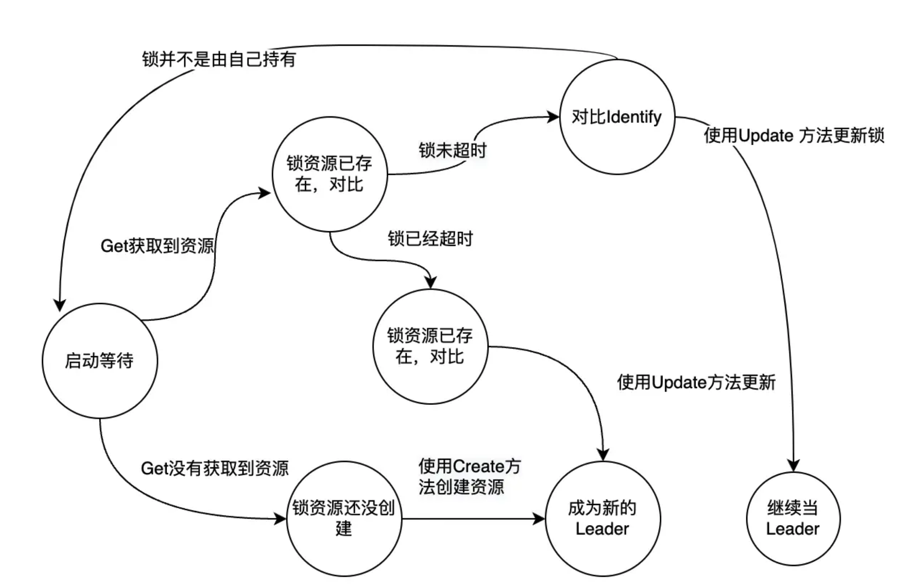

- [[RED/zonesvr]]里的async.Go作用
	- 消除传入ctx里的deadline、aggregated notify holder、change ntf holder、player，打印(DPanicf)执行panic时的堆栈
- [[golang]]里实现interface的时候记得使用`var _ interface {store.HashMapMsgWrap} = (*ExtraPlayerDataWrap)(nil)`
- [[RED/matchsvr]]相关的压测用例在 [mf/red-perf](https://git.woa.com/mf/red-perf/tree/master/Logic/Robot/Pvp)
- [[RED/matchsvr]]代码里match.Mode和matchpb.BusinessType的对应关系
	- match.PvpLadder(1) <-> matchpb.BusinessType_PVP_JDC(1) // 角斗场 / BusinessType_PVP_1V1_PRACTICE(3) // 练习场1v1
	- match.JointBattle(2) <-> matchpb.BusinessType_PVE_JOINT_BATTLE(4) // 同盟协站
	- match.PvpCasual(3) <-> matchpb.BusinessType_PVP_1V1_CASUAL(5) // 决斗场娱乐赛
	- match.SecretField(4) <-> matchpb.BusinessType_PVE_SECRET_FIELD(6) // 秘境
	- ~~match.SeaWar(5)~~  ~~matchpb.BusinessType_PVE_Adventure(2) // 多人冒险~~  ~~matchpb.BusinessType_PVP_SEA_WAR(7) // 海战~~
	- match.IntrepidSeaWar(6) <-> matchpb.BusinessType_PVP_INTREPID_SEAWAR(8) // 无畏海战
	- match.WoodenDummy(7) <-> matchpb.BusinessType_PVP_WOODEN_DUMMY(9) // 木头人竞速
	- match.ACT0040(8) <-> matchpb.BusinessType_PVP_ACT_0040(10) // 火爆球赛
	- 哪些是多人匹配❓
- [[RED/matchsvr]]增加一个匹配模式到底需要哪些改动？#TODO
	- mr例子：
	  [增加无畏海战匹配（!240） - Merge Requests - red/matchsvr - 工蜂内网版 (woa.com)](https://git.woa.com/red/matchsvr/merge_requests/240)
	  [增加 act0040 战斗调试用匹配（!252） - Merge Requests - red/matchsvr - 工蜂内网版 (woa.com)](https://git.woa.com/red/matchsvr/merge_requests/252)
	- {{embed ((661f64a6-b94d-427a-8bfb-07eff0c3f554))}}
	- 分析一下具体改动分散度，看能否在main和具体实现里收敛❓
- [[OpenKruiseGame]]的匹配逻辑依赖 [[OpenMatch]] ，并且提供了一个[[[kruise-game-open-match-director]]模块做中转，核心代码在 [/pkg/allocator.go](https://github.com/CloudNativeGame/kruise-game-open-match-director/blob/main/pkg/allocator.go)
  id:: 68425a0d-eb9b-48ae-b41e-78e707c060bf
	- 对应的是OpenMatch流程图里的Director
		- ((661916f4-e2c9-4578-8d47-46c5491010ba))
	- 使用k8s.io/client-go/tools/leaderelection进行选主
		- 💡其底层实现仍然是基于租约锁选主 ((661e913f-fae2-4d11-830e-b6033dc01236))
	- 通过informer获取k8s gamseset的信息
	- time.Tick定时从OpenMatch里获取匹配结果
		- ((661916f4-4ac7-40bc-ac11-ac95bed1e589))
	- 为每个匹配结果分配一个GameServer
	- 把GameServer地址端口回填给OpenMatch
		- ((661916f4-9bb6-483b-9407-180ec2748542))
	- 💡整个功能看起来对应的是 [[RED/matchsvr]]的匹配结果分发阶段
- [[client-go]]的leaderelection实现原理 #card
  id:: 661e913f-fae2-4d11-830e-b6033dc01236
	- 文章内容很详细，已经加入RReader  [src](https://xiaorui.cc/archives/7331)
	- 
	- #### 为什么从 leader 转变为 candidate 候选者时, 粗暴退出?
	  
	  可以发现 `kube-scheduler 和 kube-manager-controller` 的代码设计, 当 leader 节点出于各种的异常, 导致不是 leader 节点时, 为什么需要进程直接退出, 而没有做到优雅退出?
	  
	  首先 kube-manager-controller 里面的十几个 controller 控制器只是实现了 `Run()` 运行, 但没有 `Stop` 的方法, 其实就算实现了 Stop 退出, 也不好解决优雅退出, 因为在 controller 内部有大量的异步逻辑, 不好收敛.
	  
	  另外各个 controller 的逻辑很严谨, 判断各种的状态, 在 controoler 控制器重启后也可以准确的同步配置, 最后的状态为一致性.
	- #### leaderelection 使用轮询的方式来选主抢锁吗 ?
	  
	  是的, k8s leader election 抢锁选主的逻辑是周期轮询实现的, 相比社区中标准的分布式锁来说, 不仅增加了由于无效轮询带来的性能开销, 也不能解决公平性, 谁抢到了锁谁就是主 leader.
	  
	  leader election 虽然有这些缺点, 但由于 k8s 里需要高可用组件就那么几个, 调度器和控制器组件开多个副本加起来也没多少个实例, 开销可以不用担心, 这些组件都是跟无状态的 apiserver 对接的, apiserver 作为无状态的服务可以横向扩展, 后端的 etcd 对付这些默认 `2s` 的锁请求也没什么问题. 另外, 选主的逻辑不在乎公平性, 谁先谁后无所谓. 总结起来这类选举的场景, 轮询没啥问题, 实现起来也简单.
		- 社区中标准的分布式锁是怎么实现来避免无效轮询的❓
- 阅读[[RED/roomsvr]]重构方案设计想到的 [src](https://iwiki.woa.com/p/4007145167) #重构方案
	- 接口抽象：高度组合的思维，把基础接口和特性接口分割开。每种特性实现只是基础接口和少量特性接口的组合。涉及到开发效率。这里的效率最好能够量化，比如参照就接口设计，在实现接口的时候，需要改动多少文件，添加多少代码，优化后进行对比。
	  id:: 661f64a6-b94d-427a-8bfb-07eff0c3f554
	- 产品需求历史强调的功能是否有遗漏。涉及到业务安全。
	- 时序、幂等、限频（整流、熔断）等功能层面的正确性、可用性问题。涉及到业务安全。
	- 性能问题如非特别突出，可以优先级靠后。好的接口抽象和正确完善的需求实现更重要。
	- 跟历史实现具体功能的同学沟通以上内容。避免闭门造车，及时获得反馈。
	-