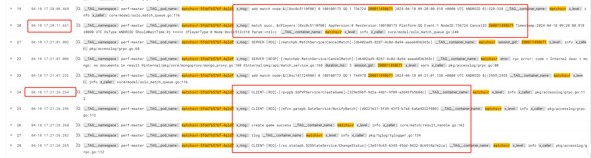
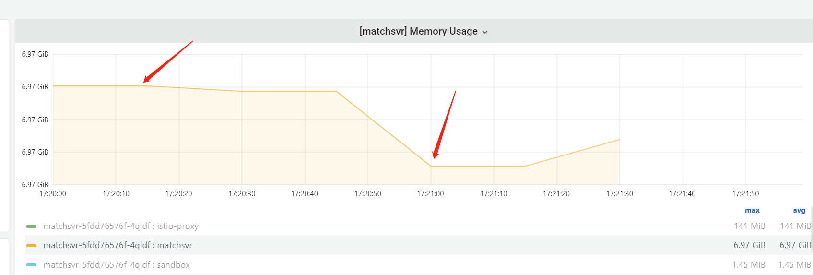
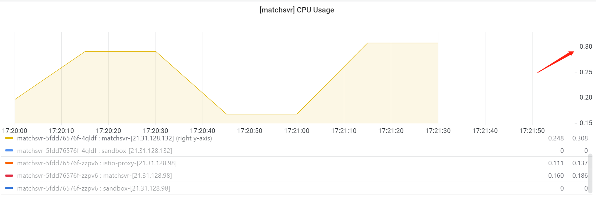

- [[Weekly]]
	- 工作
		- 这周主要在前期跟梁老师沟通新增matchsvr的压测用例，然后初步压了一下，遇到mongo数据堆积、内存oom这些问题
		- 根据matchsvr的queue和shard的一些边界条件，设计了几个e2e的场景，现在正在写代码实现
		- 也顺手看了zonesvr event相关的FIXME和TODO
		- 因为多花了些时间在压测上，就先把matchsvr业务实现抽象设计的事往后顺延一下
		- 下周还是主要跟进matchsvr压测的用例补充和压测问题排查，借着压测的机会更熟悉一下代码
	- 生活
		- 早睡了两天，但是其他几天都睡得几晚
		- 只去了健身房一次，但是半夜会吃太多碳水
		- 先从今天开始早睡再说，健身房优先跳绳和训记的有氧计划
		- 早起坐班车吃早餐！！！多吃鸡蛋喝牛奶！！！
- [[RED/matchsvr]]e2e异常用例的构造
	- queue维度异常
		- DONE [#A] 大批量trymatch和cancelmatch，如果cancelmatch成功的，不应该拿到匹配成功结果
			- ((6622095d-c711-42e7-9f31-4b3ab4ee6ec1))
		- TODO  [#B] 是否会触发临界条件，导致脏数据（比如有matchnode永远不会被消费）
			- 目前看到oom会，搞清楚为什么oom后再看怎么造用例
		- TODO  [#B] matchnode可能会因为版本变更的时候被永久保留
	- shard维度异常
		- 是否会触发临界条件（overlocks，特别是/core/shard/shard.go逻辑）
			- 可能抢锁导致的4种case
				- A持有锁 -> A持有锁【正常case】
				  logseq.order-list-type:: number
				- A持有锁 -> A持有锁(还在统一个tick内) + B抢到锁
				  logseq.order-list-type:: number
				- A持有锁 -> B持有锁 【正常case】
				  logseq.order-list-type:: number
				- A持有锁 -> 锁始终没有被抢
				  logseq.order-list-type:: number
				- **需要assert的是每次匹配不能有多个匹配结果，可以接受没有匹配结果，并且需要观测得不到匹配结果的数量**
			- ((6620c48a-0ed4-49a0-8dd1-73a8e141ad21))
			- ((6620c8e5-13ba-4086-a2ee-671a0c04d97c))
				- 这个参数好像不太能有危害性，只决定failover的平均速度
			- TODO [#A]  直接改mongo里的锁last time，可以增加出现case1、case3、case4的概率
			- TODO [#A] 两个shard同时抢到锁：直接注入mongdb，制造case2
			- DONE [#A] shard全删。验证`LockRentTime`。
				- 监控观测到锁被抢到的耗时曲线才有意义，耗时直接决定了可用性。
			- TODO [#B] shard超时故障：从auditlog里查到队列的锁持有人，然后删除对应的pod，观测抢锁时间长度，跟上面改last time很像，可以直接复用assert部分。同时能验证一下`LockTickTime`
	- 存储异常
		- TODO [#C] mongo网络波动：直接修改mongo svc端口？因为matchsvr的实现强依赖mongo可用性，所以制造mongo异常优先级不高，压测之后再补
	- 场景组合
		- shard维度异常  （  queue维度异常  ）
		- 存储异常 （  queue维度异常  ）
- [[RED/matchsvr]]压测问题记录 #TODO
	- 用例是trymatch，如果超过1分钟没有收到匹配成功的消息就cancelmatch，收到了就abortfight。
	  logseq.order-list-type:: number
	  为什么会出现match成功之后，没有创建对局 [日志](https://console.cloud.tencent.com/cls/search?region=ap-nanjing&topic_id=d11d1f16-2a04-484b-b832-2ed6a28c4239&queryBase64=X19UQUdfXy5wb2RfbmFtZToibWF0Y2hzdnItNWZkZDc2NTc2Zi00cWxkZiIgQU5EIF9fVEFHX18uY29udGFpbmVyX25hbWU6bWF0Y2hzdnIgQU5EIDIwMDAxMTQ5ODY3MQ&time=2024-04-18%2017:19:00.000,2024-04-18%2017:22:00.000)
		- 可能是因为oom重启，去看一下监控容器在这个时间点并没有重启
		  logseq.order-list-type:: number
		- 怀疑可能resulthandler处理匹配结果chan耗时太久，太久导致过了一分钟之后才执行到这个matchnode的create_time
		  logseq.order-list-type:: number
		  
		  日志看起来也有点像这种现象，但是没有直接的关联字段（比如traceid、nodeid）来证明这一点
		  而且如果真的是处理得慢，但是慢的原因也没找到，依赖的mongo、还有下游接口耗时都在正常范围内，那就稍微怀疑是到达memlimit触发频繁gc导致cpu慢
		  
		  可是CPU利用率并不高
		  
		  💡2004/4/22：基本上可以断定是因为大并发请求下，result handler是串行从chan里取结果，然后调fightsvr的接口，这样的话1s内也就只能支撑20+个结果处理。
	- 为什么mongo里会累积这么多matchnode
	  logseq.order-list-type:: number
		-