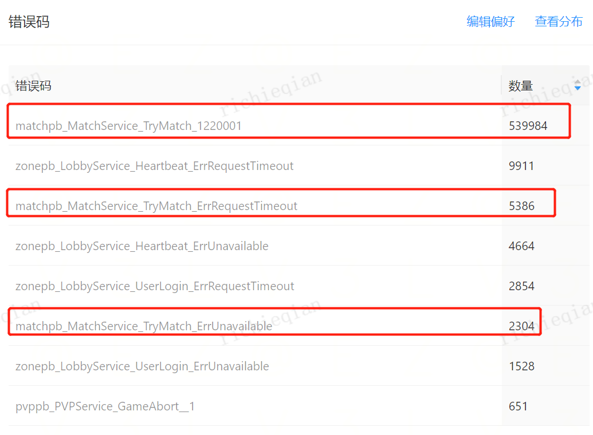
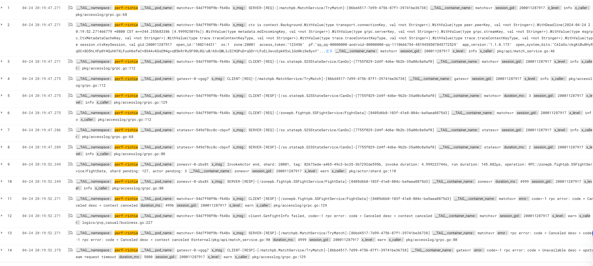
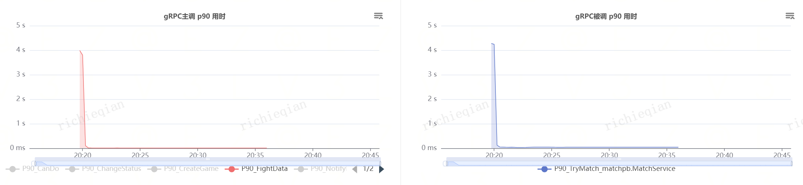
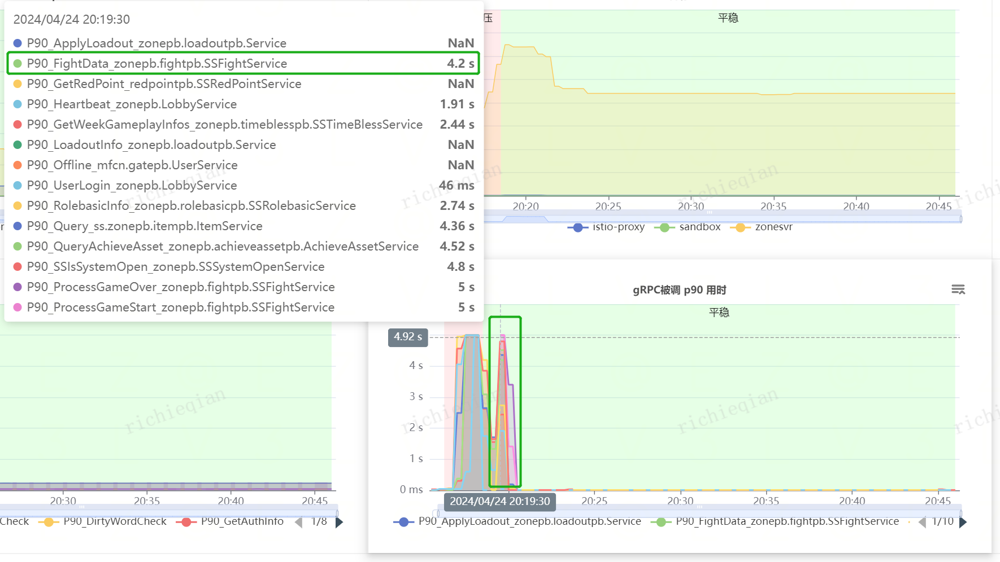

- [[RED/matchsvr]]压测记录 [压测报告](https://mfq.woa.com/project/RedServerPerf/perf-report/report/156125) [日志](https://console.cloud.tencent.com/cls/search?region=ap-nanjing&topic_id=d11d1f16-2a04-484b-b832-2ed6a28c4239&queryBase64=X19UQUdfXy5jb250YWluZXJfbmFtZToibWF0Y2hzdnIiIEFORCBfX1RBR19fLm5hbWVzcGFjZToicGVyZi1yaWNoaWUiIEFORCBSRVNQ&time=2024-04-24%2020:07:15.758,2024-04-24%2020:37:15.758)
	- ```bash
	  04-24 20:37:14.254
	  __TAG__.namespace:perf-richie__TAG__.pod_name:matchsvr-54d7f98f9b-f648xx_msg:SERVER-[RESP]-[/matchpb.MatchService/TryMatch]-[f02d94fe-ea75-45eb-b2e4-c6cabad79745]__TAG__.container_name:matchsvrerror:rpc error: code = InvalidArgument desc = rpc error: code = InvalidArgument desc = code=1220001 cannot enter new state @internal/pkg/state/handle.go:176 @internal/pkg/state/api.go:159 @internal/pkg/api/match_service.go:81duration_ms:4session_gid:200011056622x_level:infox_caller:pkg/accesslog/grpc.go:80
	  ```
	  try match出现大量的code=1220001 cannot enter new state报错，是不是测试用例有问题？ #TODO
	- 同时出现大量5s超时，但是压测报告里还有10s超时的，这就不合理了 #TODO
	   
	  ```bash
	  04-24 20:19:52.271
	  __TAG__.namespace:perf-richie__TAG__.pod_name:matchsvr-54d7f98f9b-f648xx_msg:SERVER-[RESP]-[/matchpb.MatchService/TryMatch]-[86bd4517-7d99-4756-87f1-39741be36738]__TAG__.container_name:matchsvrerror:rpc error: code = Canceled desc = code=-1 rpc error: code = Canceled desc = context canceled @internal/pkg/api/match_service.go:90duration_ms:4999session_gid:200011287917x_level:warnx_caller:pkg/accesslog/grpc.go:80
	  ```
		- 对于5s超时问题，根据traceid查全链路，整个查询卡在了zonsvr的FightDatat这里
		  ```bash
		  traceid:"2b15dfc05e8affc2a98f62bbb7312cf8" AND __TAG__.namespace:"perf-richie"
		  ```
		  
		  {:height 271, :width 1136}
		  
			- 2024/4/25: 日志里有zone的warn log
			  ```bash
			  04-24 20:19:52.249
			  __TAG__.namespace:perf-richie__TAG__.pod_name:zonesvr-0-zbs8tx_msg:InvokeActor end, shard: 20001, tag: 82673ede-a465-49c3-bc35-3b7292de595b, invoke duration: 4.999223744s, run duration: 145.082µs, operation: RPC:/zonepb.fightpb.SSFightService/FightData, shard pending: 127, actor pending: 3__TAG__.container_name:zonesvrsession_gid:200011287917x_level:warnx_caller:pkg/actor/shard.go:110
			  ```
			  咨询了[[curryxie]]，这里 invoke duration: 4.999223744s, run duration: 145.082µs ，是等待actor锁耗时太长导致的。所以根据这段log的特征继续搜了一下
			  ```bash
			  04-24 20:19:32.191
			  __TAG__.namespace:perf-richie__TAG__.pod_name:zonesvr-0-zbs8tx_msg:InvokeActor end, shard: 20001, tag: ca63f969-8be2-402e-8527-4adaf8de3f14, invoke duration: 5.002340369s, run duration: 5.002338935s, operation: EC:adventure.player.pass, shard pending: 5086, actor pending: 3__TAG__.container_name:zonesvrx_level:warnx_caller:pkg/actor/shard.go:110
			  
			  04-24 20:19:32.191
			  __TAG__.namespace:perf-richie__TAG__.pod_name:zonesvr-0-zbs8tx_msg:InvokeActor end, shard: 20001, tag: 13ddf9f2-bce9-45b7-8050-ac9d38f5b420, invoke duration: 4.995913436s, run duration: 147.437µs, operation: RPC:/zonepb.fightpb.SSFightService/FightData, shard pending: 5084, actor pending: 3__TAG__.container_name:zonesvrsession_gid:200011287917x_level:warnx_caller:pkg/actor/shard.go:110
			  ```
			  是`EC:adventure.player.pass`这个事件阻塞了，然后用GID和`InvokeActor end`作为关键词发现`EC:adventure.player.pass`事件阻塞集中在2分钟内。在用GID搜一下zonesvr从创建到出现问题的时间范围内的日志，基本上确认就是让bot主线冒险一键通关发出的事件在actor上加长锁，导致FightData被阻塞。
- [[RED/matchsvr]]的重构思路
	- 以logic实现的视角为主，在main函数里明确logic里queue和business的对应关系，不要向现在一样分开注册。
		- interface相关的，如果可预见的未来只有一种实现的话，直接提供default版就行了，在main函数里不用重复显式传入注册
		- 当然考虑到未来扩展性，logic注册支持传入option函数组，方便替换掉default的inteface和一些参数（可以参考SoloMatchQueue的SetDefaultOption）
		  类似`bizRepo.Register(bizType, bizLogic, config, opts)`
		- logic.business的bizName不用特别定义，直接通过proto的BusinessType定义反射
	- TryMatch里可以考虑通过channel把mongo查询和插入批量操作，通过批量化操作提高mongo单位时间内的并发处理能力，也能减少对mongo连接池数量的依赖
-
-