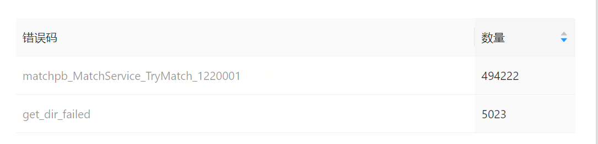

- [[RED/matchsvr]]压测记录 [压测任务](https://mfq.woa.com/project/RedServerPerf/perf-report/report/156556)
	- 进行了新一轮压测，还是发现有大量的matchpb_MatchService_TryMatch_1220001错误 {:height 157, :width 613}
	- 通过[日志](https://console.cloud.tencent.com/cls/search?region=ap-nanjing&topic_id=d11d1f16-2a04-484b-b832-2ed6a28c4239&queryBase64=X19UQUdfXy5jb250YWluZXJfbmFtZToibWF0Y2hzdnIiIEFORCAgIjIwMDAxMTMyMzQ5OCIgIEFORCAgX19UQUdfXy5uYW1lc3BhY2U6InBlcmYtcmljaGllIiBBTkQgVHJ5TWF0Y2g&time=2024-04-25%2018:48:00.000,2024-04-25%2018:50:00.000)看到TryMatch在调用statesvr的CanDO接口时报的错
	  ```bash
	  04-25 18:48:27.764
	  __TAG__.namespace:perf-richie__TAG__.pod_name:matchsvr-54d7f98f9b-75csvx_msg:SERVER-[RESP]-[/matchpb.MatchService/TryMatch]-[46e4da2f-4687-4111-94db-301895700858]__TAG__.container_name:matchsvrerror:rpc error: code = InvalidArgument desc = rpc error: code = InvalidArgument desc = code=1220001 cannot enter new state @internal/pkg/state/handle.go:176 @internal/pkg/state/api.go:159 @internal/pkg/api/match_service.go:81duration_ms:3session_gid:200011323498x_level:infox_caller:pkg/accesslog/grpc.go:80
	  ```
	- 再结合[fightsvr日志](https://console.cloud.tencent.com/cls/search?region=ap-nanjing&topic_id=d11d1f16-2a04-484b-b832-2ed6a28c4239&queryBase64=X19UQUdfXy5jb250YWluZXJfbmFtZToiZmlnaHRzdnIiIEFORCB4X21zZzoiU0VSVkVSLSIgQU5EICIyMDAwMTEzMjM0OTgiICBBTkQgIF9fVEFHX18ubmFtZXNwYWNlOiJwZXJmLXJpY2hpZSI&time=2024-04-25%2018:48:00.000,2024-04-25%2018:50:00.000)和[gm clear-punish日志](https://console.cloud.tencent.com/cls/search?region=ap-nanjing&topic_id=d11d1f16-2a04-484b-b832-2ed6a28c4239&queryBase64=IjIwMDAxMTMyMzQ5OCIgIEFORCAgX19UQUdfXy5uYW1lc3BhY2U6InBlcmYtcmljaGllIiBBTkQgY2xlYXItcHVuaXNo&time=2024-04-25%2018:48:00.000,2024-04-25%2018:50:00.000)梳理时间线
	- |-|-|-|-|
	  |时间区间|matchsvr|fightsvr|zonsvr|
	  |18:48:13.537|TryMatch成功|||
	  |18:48:27.574||CreateGame||
	  |18:48:27.593||NFT_Start||
	  |18:48:27.603||Abort||
	  |18:48:27.711||NFT_Over||
	  |18:48:27.745|||开始ClearPunish|
	  |18:48:27.760|TryMatch失败|||
	- 因为ClearPunish的日志只打印了请求时间，没有打印回包时间，所以稍微怀疑一下：是否ClearPunish比较耗时，同时测试用例里面gm工具是异步调用。但是仔细检查了测试用例代码之后没有找到会异步的地方。
	- 后面 [[silgryndeng]]找到了问题点：通过查看[statesvr日志](https://console.cloud.tencent.com/cls/search?region=ap-nanjing&topic_id=d11d1f16-2a04-484b-b832-2ed6a28c4239&queryBase64=X19UQUdfXy5jb250YWluZXJfbmFtZToic3RhdGVzdnIiIEFORCAgIjIwMDAxMTMyMzQ5OCIgIEFORCAgX19UQUdfXy5uYW1lc3BhY2U6InBlcmYtcmljaGllIg&time=2024-04-25%2018:48:00.000,2024-04-25%2018:50:00.000)发现实际上在18:48:27.921才改变匹配状态为离开。
	  ```bash
	  SERVER-[REQ]-[/ss.statepb.S2SStateService/ChangeStatus]-[69cf8b38-8d63-46fa-b1af-3349d1553452]
	  
	  {"status":[{"gid":200011323498,"doing":{"sys_id":1406,"module_name":2,"action":2,"mtime":1714042107}}]}
	  
	  // DoingModule_MATCH DoingModule = 2 //  匹配模块
	  // DoingAction_LEAVE DoingAction = 2 //  离开某种状态
	  ```
	- 补全statesvr的时间线后是
	  |-|-|-|-|-|
	  |时间区间|matchsvr|fightsvr|zonsvr|statesvr|
	  |18:48:13.537|TryMatch成功||||
	  |18:48:27.574|CreateGame|CreateGame|||
	  |18:48:27.593||NFT_Start|||
	  |18:48:27.603||Abort|||
	  |18:48:27.711||NFT_Over|||
	  |18:48:27.745|||开始GM ClearPunish||
	  |18:48:27.760|TryMatch失败||||
	  |18:48:27.846|[ChangeStatus->]||||
	  |18:48:27.921||||[->ChangeStatus]|
	  |18:48:28.778|TryMatch成功||||
	- 实质上就是ChangeStatus是在CreateGame之后执行的，当对战结束的太快的时候，matchsvr还没来得及修改statesvr的匹配状态，新的匹配请求又来了。
	  为了规避这个问题，就先临时把ChangeStatus放到CreateGame之前执行。