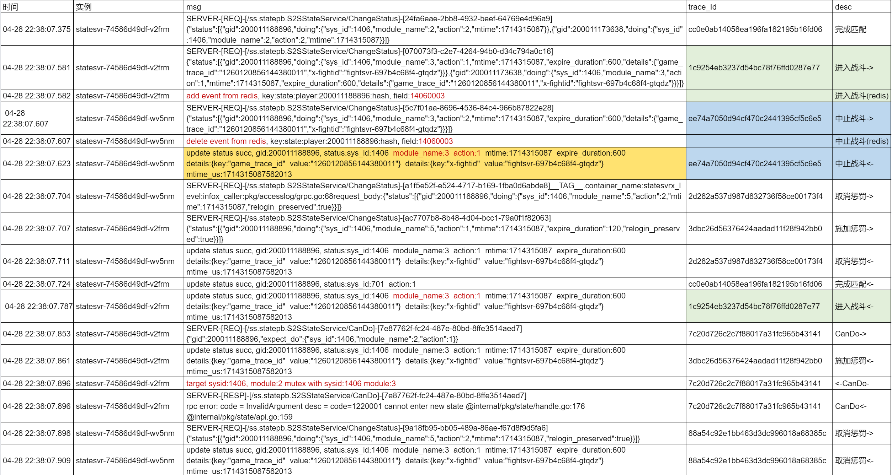

- [[RED/matchsvr]]压测记录
	- 解除惩罚事件延迟导致CanDo失败 [log](https://console.cloud.tencent.com/cls/search?region=ap-nanjing&topic_id=d11d1f16-2a04-484b-b832-2ed6a28c4239&queryBase64=IF9fVEFHX18ubmFtZXNwYWNlOiJwZXJmLXJpY2hpZSIgQU5EIF9fVEFHX18uY29udGFpbmVyX25hbWU6InN0YXRlc3ZyIiBBTkQgCTIwMDAxMTIwMTYxOCA&time=2024-04-28%2022:14:00.000,2024-04-28%2022:16:50.909)
		- |-|-|-|
		  |时间|实例|msg|desc|
		  |04-28 22:14:28.606|statesvr-74586d49df-wv5nm|`SERVER-[REQ]-[/ss.statepb.S2SStateService/ChangeStatus]-[0d50a896-435b-4f6b-bc46-a8e1d3d094de]__TAG__.container_name:==statesvr==x_level:infox_caller:pkg/accesslog/grpc.go:68request_body:{"status":[{"gid":200011078142,"doing":{"sys_id":1406,"module_name":2,"action":2,"mtime":1714313668}},{"gid":==200011201618==,"doing":{"sys_id":1406,"module_name":2,"action":2,"mtime":1714313668}}]}`|匹配成功|
		  |04-28 22:14:28.690|statesvr-74586d49df-v2frm|`SERVER-[REQ]-[/ss.statepb.S2SStateService/ChangeStatus]-[b0241eaf-d97f-44ca-87e7-d68d4edba918]__TAG__.container_name:==statesvr==x_level:infox_caller:pkg/accesslog/grpc.go:68request_body:{"status":[{"gid":200011078142,"doing":{"sys_id":1406,"module_name":3,"action":1,"mtime":1714313668,"expire_duration":600,"details":{"game_trace_id":"1260096477943562272","x-fightid":"fightsvr-697b4c68f4-lk7cl"}}},{"gid":==200011201618==,"doing":{"sys_id":1406,"module_name":3,"action":1,"mtime":1714313668,"expire_duration":600,"details":{"game_trace_id":"1260096477943562272","x-fightid":"fightsvr-697b4c68f4-lk7cl"}}}]}`|进入战斗|
		  |04-28 22:14:28.717|statesvr-74586d49df-wv5nm|`SERVER-[REQ]-[/ss.statepb.S2SStateService/ChangeStatus]-[b2894ced-f1e7-4faa-b137-6920073692c5]__TAG__.container_name:==statesvr==x_level:infox_caller:pkg/accesslog/grpc.go:68request_body:{"status":[{"gid":==200011201618==,"doing":{"sys_id":1406,"module_name":3,"action":2,"mtime":1714313668,"expire_duration":600,"details":{"game_trace_id":"1260096477943562272","x-fightid":"fightsvr-697b4c68f4-lk7cl"}}}]}`|中止战斗|
		  |04-28 22:14:28.836|statesvr-74586d49df-v2frm|`SERVER-[REQ]-[/ss.statepb.S2SStateService/ChangeStatus]-[e057c8b8-4257-4f3e-b05c-248f1a606366]__TAG__.container_name:==statesvr==x_level:infox_caller:pkg/accesslog/grpc.go:68request_body:{"status":[{"gid":==200011201618==,"doing":{"sys_id":1406,"module_name":5,"action":1,"mtime":1714313668,"expire_duration":120,"relogin_preserved":true}}]}`|惩罚|
		  |04-28 22:14:28.852|statesvr-74586d49df-wv5nm|`SERVER-[REQ]-[/ss.statepb.S2SStateService/CanDo]-[a6dfdcfa-3d86-431c-85d8-9b012c710e64]__TAG__.container_name:==statesvr==session_gid:==200011201618==x_level:infox_caller:pkg/accesslog/grpc.go:68request_body:{"gid":==200011201618==,"expect_do":{"sys_id":1406,"module_name":2,"action":1}}`|TryMatch CanDo 客户端为什么这个时候会调？返回的是惩罚中状态|
		  |04-28 22:14:28.859|statesvr-74586d49df-wv5nm|`SERVER-[REQ]-[/ss.statepb.S2SStateService/ChangeStatus]-[2f83b285-59ab-4783-8d78-760118f3e83c]__TAG__.container_name:==statesvr==x_level:infox_caller:pkg/accesslog/grpc.go:68request_body:{"status":[{"gid":==200011201618==,"doing":{"sys_id":1406,"module_name":5,"action":2,"mtime":1714313668,"relogin_preserved":true}}]}`|取消惩罚|
		  |04-28 22:14:28.859|statesvr-74586d49df-wv5nm|`delete event from redis, key:state:player:200011201618:hash, field:14060005`|取消惩罚完成|
		  |04-28 22:14:28.919|statesvr-74586d49df-v2frm|`SERVER-[REQ]-[/ss.statepb.S2SStateService/ChangeStatus]-[dea48bbe-6c6e-4df3-add4-8d39db734849]__TAG__.container_name:==statesvr==x_level:infox_caller:pkg/accesslog/grpc.go:68request_body:{"status":[{"gid":==200011201618==,"doing":{"sys_id":1406,"module_name":5,"action":2,"mtime":1714313668,"relogin_preserved":true}}]}`|取消惩罚，为什么会重复？|
		  |04-28 22:14:28.919|statesvr-74586d49df-v2frm|`delete event from redis, key:state:player:200011201618:hash, field:14060005`|记录完成|
	- 长期处于对局中状态，无法进入匹配 [日志](https://console.cloud.tencent.com/cls/search?region=ap-nanjing&topic_id=d11d1f16-2a04-484b-b832-2ed6a28c4239&queryBase64=X19UQUdfXy5uYW1lc3BhY2U6InBlcmYtcmljaGllIiBBTkQgX19UQUdfXy5jb250YWluZXJfbmFtZToic3RhdGVzdnIiIEFORCAgMjAwMDExMTg4ODk2IA&time=2024-04-28%2022:38:07.000,2024-04-28%2022:38:09.000) [表格](https://doc.weixin.qq.com/sheet/e3_AKkA5QZ1ACc45SU8NBiSSCrIjDUEt?scode=AJEAIQdfAAomSDAhjGAKkA5QZ1ACc&tab=BB08J2)
		- 
-