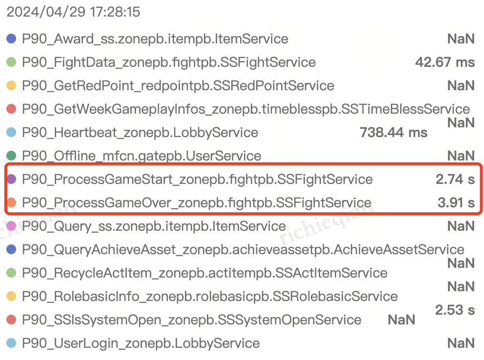

- 为什么[[RED/matchsvr]]的[[压测]]TPS一直停留在1100上不来
	- 怀疑两个地方
		- fightsvr、matchsvr的pod数不够
		      - 经过验证，并没有明显效果
		- matchsvr的result handler并行处理能里需要继续加强。从 300 加到 5000 的时候，fightsvr 的createtime 时延明显增大。
	- 将机器人数量降到 5000 的话，匹配 qps 仍然在 900+
	- 相比 3000w 机器人的时候zonepb.rolebasicpb.SSRolebasicService/RolebasicInfo（700ms->47ms） 和 pvppb.SSPVPService/CreateGame（250ms->90ms） 时延明显降低，必定存在某些关联
	- 
	- bot 数 从 5000 调到 1w 的时候
		- 1. node 匹配成功耗时明显增加
		- 2. tick内匹配成功量明显降低: 580->240