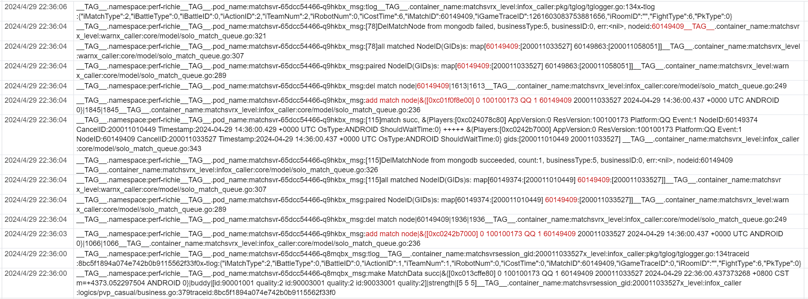

- [[RED/matchsvr]]压测记录 [日志](https://console.cloud.tencent.com/cls/search?region=ap-nanjing&topic_id=d11d1f16-2a04-484b-b832-2ed6a28c4239&queryBase64=X19UQUdfXy5jb250YWluZXJfbmFtZToibWF0Y2hzdnIiIEFORCA2MDE0OTQwOQ&time=now-h,now)
	- 
	- 出现了QueueSync里重复创建MatchNode的行为，原因是GetNodesFromMongo改成异步了之后mq.lastPrivateID在Sync里并发改变，导致数据被重复从mongo拉取
	  把mq.lastPrivateID的更新放到GetNodesFromMongo里就行