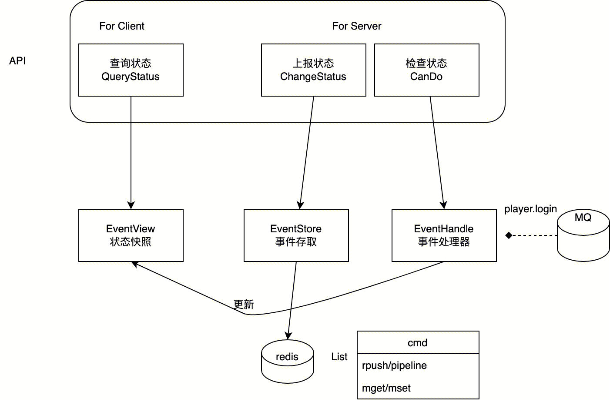

- PVP匹配与战斗工作流程 #RED/matchsvr [src](https://iwiki.woa.com/p/377031311) [[kevinlin]]在2020年的匹配重构方案
	- 💡里面有娱乐赛和段位赛的时序图
	- 设计概要
		- 解决原火影偶现的match/pvp start时序问题导致的未进入战斗问题
			- 由客户端提前监听pvp start消息解决
		- 解决弱网络下关键包未收到后未进入战斗问题
			- 下行notify消息在gate上做可靠性保证
			- 内部gRPC消息做重试处理
		- 解耦匹配数据依赖： 阵容，战斗数据，等复用
			- 由zone提供较为独立协议
		- 解耦玩家状态管理：是否进入匹配，战斗等状态，玩家当前状态是否允许匹配
			- 由statesvr管理各各种状态的上报及做互斥逻辑
- 玩家状态管理-statesvr概述 #RED/statesvr [src](https://iwiki.woa.com/p/1284250031) [[kevinlin]]
	- 设计的几大关注点
		- 微服务后，玩家状态是否要在大区中维护？ 匹配、房间、战斗等，有一些原本不经过大区，个人认为集中式维护更适合。
		- 状态的粒度问题，是否需要频繁同步和判定（如房间内部状态是否要关注）？结论是关注大的状态变化，忽略内部状态。
		- 状态修改的并发问题。同时多个服务可能并行修改状态，如何高效处理？基于redis List特性，并且设计读写分离方案。
		- 逻辑放在哪里？针对批量拉取玩家状态的行为常和玩家列表同时进行，在info中保存是比较直接的想法，但考虑到功能独立和后续发展/变更差异，独立出单独服务。
	- 设计思路
		- 基于gRPC同步关键状态，statesvr提供业务基础状态同步、获取和互斥判断能力。并且考虑到处理的效率，借鉴EventSourcing和CQRS的思路，设计了如下方案：
		- 