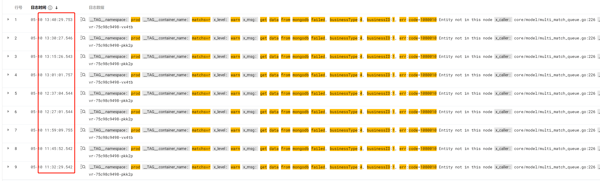
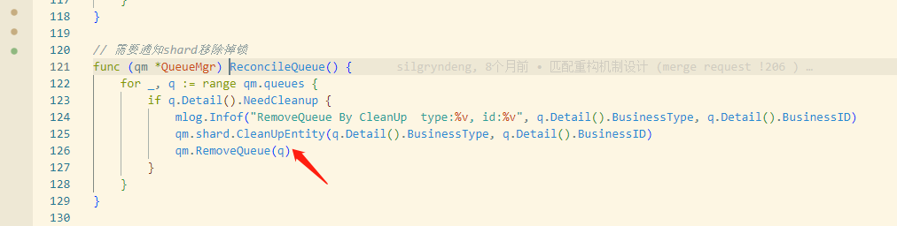

- [[RED/matchsvr]] #RED5测问题
	- matchsvr WARN日志的问题 [log](https://console.cloud.tencent.com/cls/search?region=ap-nanjing&topic_id=2534237e-c738-4534-ab3b-73836434dbb8&queryBase64=X19UQUdfXy5uYW1lc3BhY2U6cHJvZCBBTkQgX19UQUdfXy5jb250YWluZXJfbmFtZTptYXRjaHN2ciBBTkQgd2FybiBBTkQgJ2dldCBkYXRhIGZyb20gbW9uZ29kYiBmYWlsZWQsIGJ1c2luZXNzVHlwZTo0LCBidXNpbmVzc0lEOjEsIGVycjpjb2RlPTEwODAwMTAn&time=2024-05-10%2010:00:00.000,2024-05-10%2013:55:44.000)
		- 基本上都是因为10m中，shard释放锁之后，直接删除entity表。但是queue那边还在查这个entity表导致的。
		- 
		- 从log里可以看出，同一个匹配类型，每次发生的pod都不同，说明的确发生了迁移。而且会有**queue并发**的隐患。
		- 
		- 代码里先删除entity，再删除queue。应该改成先删除queue，再删除锁，避免上面warn发生的同时，还可以保证entity被别的shard抢到之后，不会**同时有两个queue在运行**。但是这个前提是RemoveQueue函数返回的时候，的确是删除了Queue。
		- 其实RemoveQueue目前是打上终结标记就返回，真正终结是在tick的时候判断，实际是个异步行为。如果要做得更好，removeQueue可以打完标之后加一个tick的延时，或者queue真正退出循环之后再返回。
- 用[[tc]]和[[iptable]]制造 [[mongodb]] 连接故障，网卡是docker0
  id:: 6642105c-5ab3-4f60-892f-f15505606d39
	- tc是Linux内核中的一个流量控制工具，可以用来模拟网络延迟、丢包、带宽限制等不稳定网络状况的延迟
	  ```bash
	  # 添加延迟100ms
	  sudo tc qdisc add dev docker0 root netem delay 100ms
	  # 删除延迟
	  sudo tc qdisc del dev docker0 root netem
	  
	  # 丢包率100%（模拟网络断开），10秒然后恢复。慎用，会导致ssh连接不上
	  sudo tc qdisc add dev docker0 root netem loss 100% && sleep 10 && sudo tc qdisc del dev docker0 root netem
	  ```
	- iptable
	  ```bash
	  sudo iptables -A INPUT -p tcp --destination-port 27017 -j REJECT
	  删除规则
	  ```