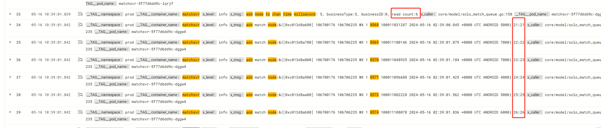

- [[mongodb]]使用killAllSessions命令可以清除掉session [src](https://www.mongodb.com/docs/manual/reference/command/killAllSessions)
- [[RED/matchsvr]]匹配超时问题记录 [日志](https://console.cloud.tencent.com/cls/search?region=ap-nanjing&topic_id=2534237e-c738-4534-ab3b-73836434dbb8&queryBase64=ZXJyb3IgQU5EIF9fVEFHX18uY29udGFpbmVyX25hbWU6bWF0Y2hzdnI&time=2024-05-16%2010:38:27.587,2024-05-16%2010:40:27.587)
  id:: 6656ea6f-36f1-49db-8556-1a34e8217323
	- __TAG__.container_name:matchsvr AND 100011041448
		- 根据GID和时间范围查出来具体的问题点为node id 8573
	- __TAG__.container_name:matchsvr  AND "add node to chan" AND 'businessType:5'
		- 查看Sync时从mongo获取数据量
	- __TAG__.container_name:matchsvr AND  8573
		- 通过tlog里的NodeID，查询添加节点的记录
	- __TAG__.container_name:matchsvr AND ('8573' OR '8575' OR '8576' OR '8577' OR '8574' OR '8572' OR '8571' OR '8570' OR '8569' OR '8568' OR '8567' OR '8566' OR '8565' OR '8564' OR 100011082228 OR 100011041448 OR 100011108078 OR 'add node to chan time millsecond')
		- 扩大查询范围，查看8573及其附近node的处理情况，可以发现数据读取是连续的，刚好绕过8573
	- 
	- 后面查看代码发现NodeID的生成虽然是有序的，但是无法保证插入mongodb的顺序与NodeID顺序保持一致。
	- 在从mongo同步数据的时候，8574已经写入mongo，而8573还没有，matchsvr下一次数据同步将会从8575开始，从而跳过了8573，从而在客户端表现为60s匹配超时。
	- 解决思路
		- 根因是node id的生成与实际写入并不在同一个事务内导致的。
		- 如果要做到事务性：利用mongo的事务（快照隔离级别？）。可能增加mongo负担，影响性能？mongo事务也是20年加入的新特性，有待验证
		- 如果按照尽量把nodeid做好的思路：利用mongodb的trigger，在写node请求到达mongo之后再计算自增id，这样应该会大幅降低顺序不一致的问题。至于会降到多少，有待验证。
		- 也可以考虑直接使用mongo的object id，这种uuid在写线程交错或者主备切换的时候，单调性会被打破，可能会导致有几秒的匹配超时。
		- 目前先按照探测node缺失（有可能是id顺序性问题，也有可能是用户主动取消匹配），下次从空洞起始位置开始重新捞取，实现对空洞补偿的逻辑。这是建立在空洞出现概率不高，并且人为取消匹配的概率也很低的假设上，如果后面实际线上空洞概率或者取消匹配概率比较高的时候，就要认真考虑前面的方案了。