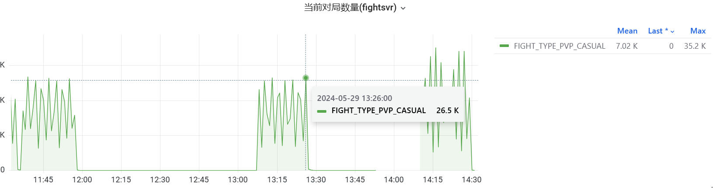

- 在监控修复了下面这个问题之后，能够看到[[RED/fightsvr]]同时对局数的限制对 [[RED/matchsvr]] 的TPS的影响
	- ((66559905-fa91-468b-bce2-44324b4e0cd3))
	- 当session-proxy不再报出`pods pool has no sub conns!`错误之后，TPS能到达1300：[压测记录](https://mfq.woa.com/project/RedServerPerf/perf-report/report/170283)
	- 当session-proxy会报出`pods pool has no sub conns!`错误，TPS监控就呈锯齿状：[压测记录](https://mfq.woa.com/project/RedServerPerf/perf-report/report/170499)
	- ❓但是为什么只有8000机器人的时候，会同时又2.7w个对局，仍然需要继续定位
	  
	  看一下CreateGame和AbortGame的代码，看同时在线数是怎么统计的
		- 💡后面咨询了 [[RED/kadinwang]]， [[RED/fightsvr]]在abort之后会保留对局一分钟，看能否把保留时间调小再重新压压看 #TODO
	- [[RED/fightsvr]] 的最大同时对局数配置
		- ```yaml
		  apiVersion: configurator.red.tencent.com/v1alpha1
		  kind: GenericConfig
		  metadata:
		    name: fightsvr-config
		  config:
		    max_games_allow: 4000
		  ```
		- fightsvr pod数 * max_games_allow * 90% = 总最大同时对局数
		- 💡如果obsvr负载高，session-proxy也有可能报出`pods pool has no sub conns!`错误，但这种情况，在fightsvr的resp log应该也能搜到，这是与超过最大对局数表现不同的地方。
- 提取[[mongodb]]导出数据的_id #常用工具
	- ```bash
	  while IFS= read -r line; do
	      oid_hex=$(echo "$line" | jq -r '._id."$oid"')
	      timestamp_hex="${oid_hex:0:8}"
	      random_value_hex="${oid_hex:8:10}"
	      incrementing_counter_hex="${oid_hex:18:6}"
	      
	      timestamp=$((16#$timestamp_hex))
	      random_value=$((16#$random_value_hex))
	      incrementing_counter=$((16#$incrementing_counter_hex))
	  
	      update_at=$(echo "$line" | jq '.update_at."$date"');
	  
	      echo "oid: $oid_hex, Timestamp: $timestamp Random Value: $random_value, Incrementing Counter: $incrementing_counter, update_at: $update_at";
	  done < entity_5_0 > id.txt
	  ```
- [[RED/matchsvr]]node空洞问题解决方案
	- 背景： ((6656ea6f-36f1-49db-8556-1a34e8217323))
	- 1. 可否依靠mongo的id，先查一下mongo uuid的顺序性问题
		- 大致可行，如果不发生主从切换，就不会有这种问题。可以把demo放到测试环境跑一下：大批量写入，同时大批量查询然后删除，看是否会出现漏网之鱼，最好后面能结合dba刻意触发主从切换。如果主从切换会远大于1s其实问题也不大，因为uuid时间戳也就1s的精度。具体问一下mongo主从切换的速度。
		- 但是这就会要求始终读写都走主
		- 而且可行性要持续验证，后面可以单独搞一个版本，长期跑压测验证
	- 2. 可否每两次使用一下相同的游标，尽量捞出上次Sync出现的空洞