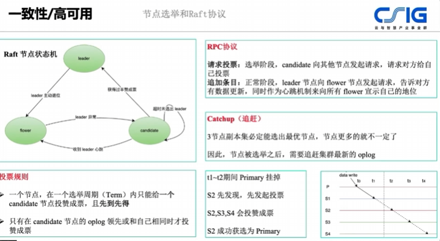

- [[raft]] 协议并不保证 [[mongodb]] 选主的时候会选出oplog最全的节点
	- [MongoDB - 全方位知识图谱 | TALK8直播课_Q-Learning (woa.com)](https://portal.learn.woa.com/training/netcourse/play?course_id=18170) 1:24:00开始
	  
	- [MongoDB - 全方位知识图谱 - 营销产品部研发K吧 - KM平台 (woa.com)](https://km.woa.com/articles/show/530536)
	- 针对 Raft 协议的这个问题，下来查询了一些资料，结论是：
		- Raft 协议确实不保证选举出来的 Primary 节点是最优的
		- MongoDB 通过在选举成功，到新 Primary 即位之前，新增了一个 **catchup（追赶）**操作来解决。即在节点获取投票胜利之后，会先检查其它节点是否有比自己更新的 oplog，如果没有就直接即位，如果有就先把数据同步过来再即位。