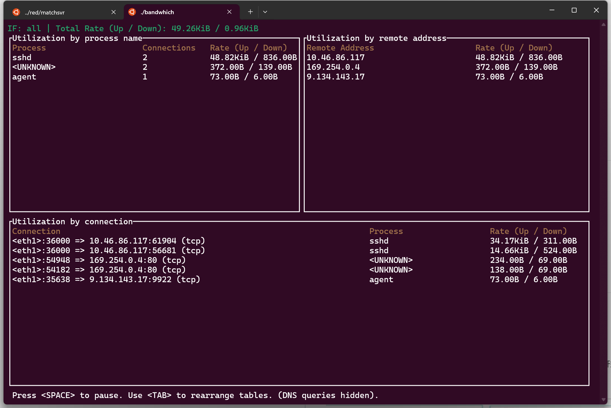

- [imsnif/bandwhich: Terminal bandwidth utilization tool (github.com)](https://github.com/imsnif/bandwhich) 跟iftop工具很像，但是更直观全面：有连接/地址/线程，3个维度 #常用工具
  ```bash
  bandwhich_version=v0.22.2 wget https://github.com/imsnif/bandwhich/releases/download/${bandwhich_version}/bandwhich-${bandwhich_version}-x86_64-unknown-linux-musl.tar.gz && tar zxvf bandwhich-${bandwhich_version}-x86_64-unknown-linux-musl.tar.gz 
  sudo ./bandwhich
  ```
  
- [[《LLMBook》]] #LLM
- [[《Generalized Isolation Level Definitions Atul Adya》]]