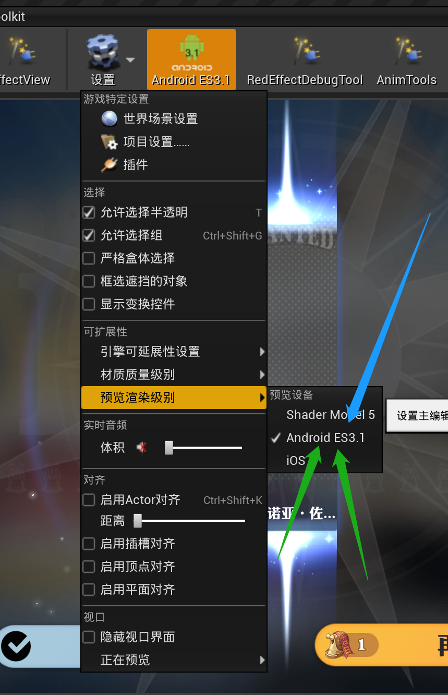

- 通过添加[red/game-cfg](https://git.woa.com/red/game-cfg)的分支，可以生成新的配置分组，在infra-test的env.yaml里修改`rainbow_group`为新的分组(分支)名即可 #RED/配置
  ```bash
  git clone git@git.woa.com:red/game-cfg.git
  git branch -b new_group
  git push --set-upstream origin new_group
  
  # 修改配置后记得修改version: game-cfg\config\version
  ```
- 电脑上运行RedApp
	- svn checkout [http://tc-svn.tencent.com/KungfuTeam/Red_proj/trunk/RedAppEditor](http://tc-svn.tencent.com/KungfuTeam/Red_proj/trunk/RedAppEditor) 建议下载到 SSD
	- 点击 "RedAppEditor\RedApp\StartEditor.bat"
	- 修改设置 {:height 607, :width 300}
	- 如果点击”SVN更新整个工程“很久卡住在 cleanup 不动，请点击回车说不定就开始动了
-