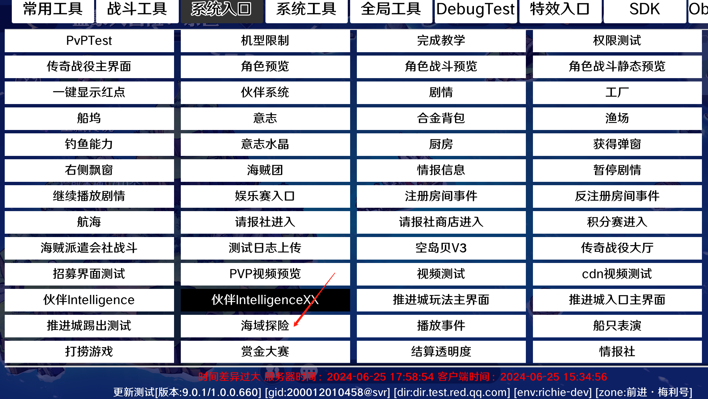
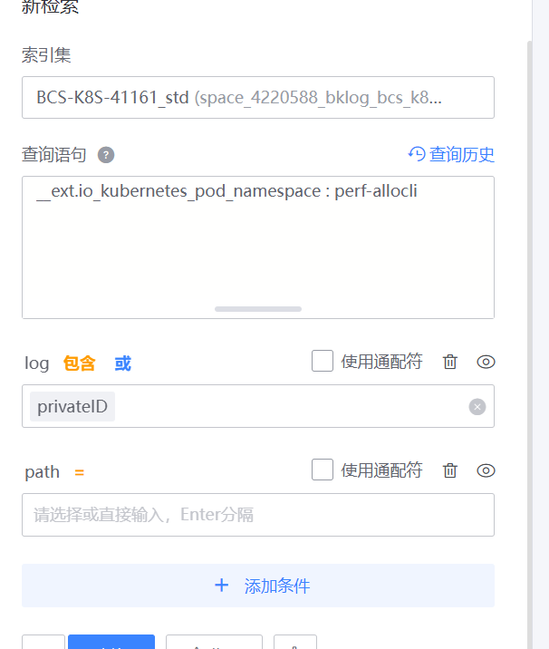

- #RED/matchsvr 进行PVP段位赛匹配流程
	- TryMatch -> roompb::EnterRoomNTF -> roompb::RoomInfoNTF -> ConfirmMatch -> fightsvr::PVPGameStartNtf
- #RED/海域探险 可以直接在客户端GM的系统入口直接进入
	- 
- #RED/matchsvr elo计算放到了zonesvr里
	- ```go
	  // Elo 实现 https://iwiki.woa.com/pages/viewpage.action?pageId=218945050 中描述的 Elo
	  // Ra 为A玩家当前的积分, Rb 为B玩家当前的积分, K 为控制积分变化大小的配置量， winType 表示A的输赢
	  // 返回值RA为A玩家进行比赛后的积分
	  func Elo(ra, rb int64, winType corepb.FightResultType, k int64) (rA float64) {
	  	Sa := func() float64 {
	  		switch winType {
	  		case corepb.FightResultType_E_FIGHT_WIN:
	  			return 1
	  		case corepb.FightResultType_E_FIGHT_DEUCE:
	  			return 0.5
	  		case corepb.FightResultType_E_FIGHT_LOSE:
	  			return 0
	  		}
	  		mlog.DPanic("not possible", zap.Any("winType", winType))
	  		return 0
	  	}()
	  	var Ea = 1 / (1 + math.Pow(10, float64(rb-ra)/1000))
	  	return float64(ra) + float64(k)*(Sa-Ea)
	  }
	  ```
- #RED/matchsvr pvp匹配机器人的概率还与pvp.xlsx的CommonHiddenScore里的fail_percent_for_new_player和fail_percent_for_old_player有关
- #RED/日志 [蓝鲸log-retrieval](https://bkm.woa.com/?bizId=100801#/log-retrieval) 来确认cls日志是否丢了
	- 
-
-