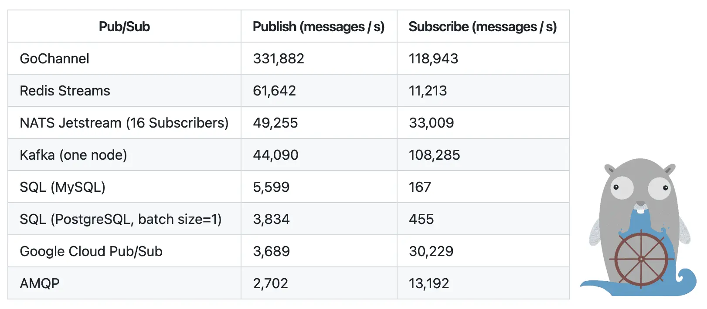

- 快速开发事件驱动应用的 Go 库 **watermill** [src](https://github.com/ThreeDotsLabs/watermill) #golang 
  这是一个能够高效处理消息流的 Go 库，即发布/接收消息并做出反应。它上手容易，支持 Kafka、RabbitMQ、HTTP 和 MySQL binlog 等消息中间件，适用于处理实时数据流、分布式事务和微服务通信等场景。
  
-