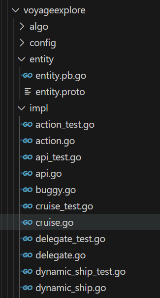

- #RED/actsvr 活动道具掉率 Act_item_drop.xlsx/ActDropPath
	- 针对特定产出渠道prod_name
		- drop_prob: 物品掉落概率
		- drop_count_weight: 如果确定物品掉落了，会根据权重占比，选择掉落数量
		- day_drop_limit: 每日最大掉落数量。为什么要有这个配置项？防止策划配错，加一道保险？据haii考证是沿用火影的配置
		- total_drop_limit: 历史总最大掉落数量
	- 在此之上还有一个活动维度的限制 Act_item_drop.xlsx/ActItem
		- day_got_limit
		- total_got_limit
- #Weekly
	- 海域探险上周策划体验之后塞了一些优化需求到这个迭代，多花了两天时间在上面
	- 另外处理了几个雪人活动的bug，梳理登记了一下ork任务
	- 开始做保护薇薇匹配活动重构，也把这个任务列到下个迭代
- #RED/paysvr  可以不给记log，但是不能多给
- #RED/海域探险 #RED/zonesvr #gameplay #ECS
	- 尝试拿海域探险类比ECS一下：
		- System
			- 围绕海域玩法的系统可以细分为：移动系统，技能系统，buff系统，事件触发系统
			- 任务系统可以细分为：巴基日记系统，派遣系统，（巡航系统？）
			- 副本/游戏系统：钓鱼，战斗，副本
			- 其他系统：阵容系统，动态船（假玩家？）系统……
		- Component（与上面System对应）
			- 位置、技能、buff、外观
			- 巴基日记、派遣记录
			- 对局（记录、状态）
			- 阵容、~~动态船（存疑，是不是也可以算一种只有外观和位置Component的Entity？）~~
		- Entity
			- 由以上Component组合出的一个实体
		- Event
			- 串联不同种类但却有相关性的Component变化时的联动反应
	- 后面跟shutao交流过程中发现，海域探险在最初开发的时候是遵循了一定的ECS的思想，但是最终呈现出的是一种单机实现
		- 基本上只抽象出玩家一种entity，其他**物件/NPC**也被归类为entity的component
		- 因为是单机实现，所以从后端代码执行上来看，完全是由客户端接口调用触发entity下属的component的变更，不存在多个entity之间的交互
		  id:: 66acf734-ec1b-47fb-b4a6-cb99f90a72af
		- 海域探险内部系统之间不存在mq/event的触发，全部是串行调用
			- 这个受限于海域探险只不过是zonesvr的一个子系统，在自身内部互相发event不符合现有设计惯例
			- 另外单机实现在一个actor下直接接口调用就好了，反倒比反复 【加锁->发送event->解锁】-> 【加锁->处理event->解锁】的效率高
	- 目前的思考是
		- 对于当前海域探险这种单机玩法，的确没必要通过event做串联，直接接口调用即可。
		  但是可能可以做的更巧妙一点，比如在某一类component发生变化的信号可以关联到另外一个系统的回调上？
			- 类似GUI编程的时候，把每一类的Component行为都内聚到各自System里，不同种类Component的关联关系作为独立的实体（connect）抽离出来
			  ```c++
			  // connect(fromComponentType, fromSignalType, toSystemMethod);
			  connect(SkillComponentType, SignalType_CD(<entity_id, skill_id>->speed), MoveSystem.SpeedUp);
			  connect(SkillComponentType, SignalType_CD(<entity_id, skill_id>->buf_id), BuffSystem.GetBuf);
			  ```
			- 回调链上的调用顺序该如何考虑？
		- 可以考虑把npc和物件从代码层面也抽象成entity。复用位置、技能、buff、外观的component代码。即使这样并不会像真的ecs那样提高代码运行效率，甚至可能还会有一些些退化。但是代码层次和隔离能做的更好一些？
		- 这样的话system.go的代码可以真正的按照各种component对应的system去细分了。其实从现有的代码组织方式来看是一直在朝这个方向努力的，只不过经历几次大的业务需求反复，后台疲于大规模删代码加代码，现实也就没有那么丰满了。
		  
		  <<<<<<< HEAD
		- 如果未来海域探险从zonesvr里剥离出来，是不是就可以真的把这些system抽成zonesvr里的那种平级的system，把代码解耦做的更彻底一些。然后互相真的通过event调用？（但是感觉仍然维持跨system接口调用还像也挺好的）
		  =======
		- 如果未来海域探险从zonesvr里剥离出来，是不是就可以真的把这些system抽成zonesvr里的那种平级的system，把代码解耦做的更彻底一些。然后互相真的通过event调用？（但是感觉仍然维持跨system接口调用还像也挺好的）
	- 20240808 #johnfu 强哥给了一些建议
		- 海域探险不用太在意ECS的实现。相对于面向对象编程，ECS的理念是一种数据驱动编程范式的极端，将EC数据和逻辑彻底解耦。
		- 对于通常的gameplay编程来说，event系统是一个基础的解耦工具，没必要特别回避。
		- 即使海域探险目前在zonesvr里event系统会受些限制，但是仍可以考虑在海域探险子系统内部实现一个消息队列chan/atomic slice，在一次rpc请求内使用chan loop把处理过程中生成的消息消费完再返回即可。如果事件处理有优先级要求的话，是不是可以用优先队列？是不是现在的eventcenter就是这么实现的？ #TODO
