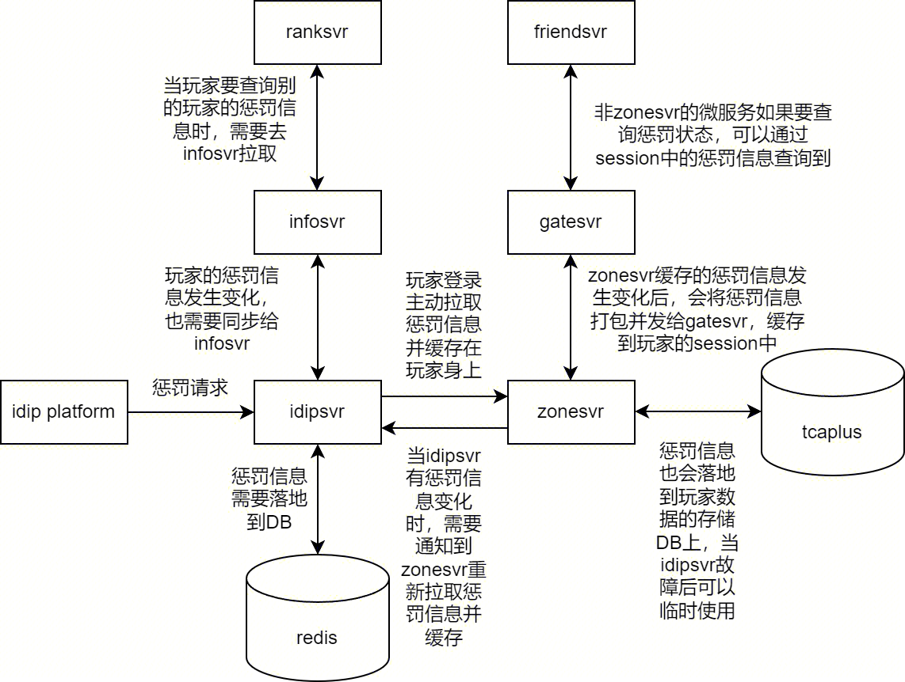
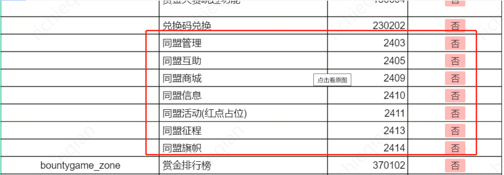

- #RED/特性开关 全局扫描使用feato的地方
	- ignore_open_ts_zone_ids
		- zonesvr/internal/pkg/systems/lobby/reporter/reporter.go
			- 获取每个小区注册人数上报给DIR
			- ```go
			  func (r *Reporter) getIgnoreOpenTsZoneIDs(ctx context.Context) map[int64]struct{} {
			  	ignoreOpenTsZoneIDs := map[int64]struct{}{}
			  	if ok, _ := system.PlayerToggle().Enabled(redfeato.PlayerContext{}, KeyIgnoreOpenTsZoneIDs); !ok {
			  		return ignoreOpenTsZoneIDs
			  	}
			  
			  	variant := system.PlayerToggle().GetFirstMatchedVariant(redfeato.PlayerContext{}, KeyIgnoreOpenTsZoneIDs)
			  	if variant == nil {
			  		return ignoreOpenTsZoneIDs
			  	}
			  
			  	zoneIDStrs := strings.Split(variant.Value, ",")
			  	for _, zoneIDStr := range zoneIDStrs {
			  		zoneID, err := strconv.ParseInt(zoneIDStr, 10, 64)
			  		if err != nil {
			  			mlog.Ctx(ctx).Warnf("invalid zone id: %v", zoneIDStr)
			  			continue
			  		}
			  		ignoreOpenTsZoneIDs[zoneID] = struct{}{}
			  	}
			  
			  	return ignoreOpenTsZoneIDs
			  }
			  ```
	- disable_change_user_name
		- zonesvr/internal/pkg/systems/lobby/system/service.go
			- ChangeName接口检查是否被禁止改名
			- ```go
			  func (s *Service) isChangeNameDisableByFeato(ctx context.Context, r *player.Player) error {
			  	if ok, _ := system.PlayerToggle().Enabled(redfeato.PlayerContext{}, KeyDisableChangeUserName); !ok {
			  		return nil
			  	}
			  
			  	variants := system.PlayerToggle().GetAllMatchedVariants(redfeato.PlayerContext{}, KeyDisableChangeUserName)
			  	var startTime, endTime time.Time
			  
			  	for _, v := range variants {
			  		if v.Name == "start_time" {
			  			startTime, _ = time.ParseInLocation("2006-01-02 15:04:05", v.Value, time.Local)
			  		} else if v.Name == "end_time" {
			  			endTime, _ = time.ParseInLocation("2006-01-02 15:04:05", v.Value, time.Local)
			  		}
			  	}
			  	mlog.Ctx(ctx).Debugf("disable_change_user_name config, start_time=%v, end_time=%v", startTime, endTime)
			  	if startTime.IsZero() || endTime.IsZero() {
			  		mlog.Ctx(ctx).Errorf("disable_change_user_name config error, start_time=%v, end_time=%v", startTime, endTime)
			  		return nil
			  	}
			  
			  	now := rolebasic.MustModel(r).Now(ctx)
			  	if now.After(startTime) && now.Before(endTime) {
			  		return util.ErrorWithPos(lobby.ErrOperationDeniedByFeato)
			  	}
			  	return nil
			  }
			  ```
	- disable_buddy
		- zonesvr/internal/pkg/systems/buddy/config/config.go
			- 判断buddy是否可用
			- ```go
			  func (bc *Buddy) CheckOpen(now time.Time) bool {
			  	if !bc.IsOpen {
			  		return false
			  	}
			  
			  	// 使用变量的方式，去掉指标统计
			  	// Enabled的方式很占CPU （why?）
			  	variants := system.PlayerToggle().GetAllMatchedVariants(redfeato.PlayerContext{}, "disable_buddy")
			  	if _, ok := lo.Find(variants, func(item *feato.Variant) bool {
			  		return item.Name == "buddyID" && item.Value == strconv.FormatInt(bc.Id, 10)
			  	}); ok {
			  		return false
			  	}
			  
			  	if bc.TheOpenTime == nil {
			  		return true
			  	}
			  	return now.After(bc.TheOpenTime.Time())
			  }
			  ```
			- 💡 [[tomwang]]: Enabled的方式很占CPU，所以disable_buddy没有调用Enabled
			  如果有机会的话，压测的时候测一下
				-
	- disable_match_biz_type
		- matchsvr/internal/pkg/api/open.go
			- 判断business_type是否可用
			- ```go
			  func (s *MatchService) checkBizTypeOpenByToggle(bizType int64) error {
			  	tctx := feato.ContextMap{"businessType": bizType}
			  	if ok, _ := s.Toggle.Enabled(tctx, "disable_match_biz_type"); ok {
			  		return util.ErrorWithPos(ErrBusinessTypeDisabledByFeato)
			  	}
			  	return nil
			  }
			  ```
	- match_robot_time
		- matchsvr/internal/pkg/logics/pvp_ladder/match_queue.go
			- pvp_ladder判断是否匹配机器人的时间，超过这个时间就匹配机器人
	- disable_change_guild_declaration，disable_change_guild_name
		- guildsvr/internal/pkg/systems/basic/impl/system.go
			- setGuildInfos -> isOperationDisableByFeato
	- disable_act
		- actsvr/internal/pkg/msapp/actsvr/service/actbase/actbase.go
			- 获取给点活动ID中已开放的活动
				- ```go
				  // actGetOpenedIDs 获取给点活动ID中已开放的活动
				  func (a *ActBase) actGetOpenedIDs(ctx context.Context, actIDs []int64) ([]int64, error) {
				  	if len(actIDs) == 0 {
				  		return nil, nil
				  	}
				  	actNames := []string{}
				  	for _, actID := range actIDs {
				  		actNames = append(actNames, fmt.Sprintf("%d", actID))
				  	}
				  	player, err := player.GetPlayerFromCtx(ctx)
				  	if err != nil {
				  		return nil, util.ErrorWithPos(err)
				  	}
				  	// 2. 从 DB 中获取有效活动信息
				  	if err := a.svr.PlayerRepo().Fetch(ctx, player, actNames); err != nil {
				  		return nil, util.ErrorWithPos(err)
				  	}
				  	openingActIDs := []int64{}
				  	for _, actName := range actNames {
				  		// 活动ID不存在，跳过
				  		id, _ := strconv.Atoi(actName)
				  		actConfig, ok := a.GetConfig().CommonConfig[int64(id)]
				  		if !ok {
				  			continue
				  		}
				  
				  		// 特性开关判定活动是否临时关闭
				  		if a.svr.FeatoToggle() != nil {
				  			featoCtx := feato.ContextMap{"actID": id}
				  			if enable, _ := a.svr.FeatoToggle().Enabled(featoCtx, "disable_act"); enable {
				  				mlog.Ctx(ctx).Warnf("disable by feato %v", actName)
				  				continue
				  			}
				  		}
				  
				  		var currState commonpb.ActState
				  		a.svr.WithServiceByName(actName, func(s core.Service) {
				  			// 查询接口，不做活动状态扭转
				  			//
				  			// 玩家一直在线情况下，随着时间的流逝，活动可能已经开启或者结束
				  			//   1. 未开启--> 已开启;
				  			//   2. 已开启--> 已结束.
				  			// 策划能接受, 只要玩家进一次活动入口就行.
				  			currState = a.getCurrState(ctx, s, player, actConfig) // 活动当前状态
				  		})
				  		if currState == commonpb.ActState_OPENING {
				  			openingActIDs = append(openingActIDs, int64(id))
				  		}
				  	}
				  	return openingActIDs, nil
				  }
				  ```
			- ProcessActFlow，会被RPC拦截器调用
		- 通过Enabled直接确认
- #RED/idip 全局系统开关 #RED/开关
	- actsvr/cmd/actsvr/main.go
		- ServerInterceptor
			- ```go
			  				if svr.IsDisabledByGid(actutil.FullSystemID(int32(actID)), sinfo.GetGid()) {
			  					return nil, util.ErrorWithPos(acterr.ErrSystemNotOpen)
			  				}
			  ```
	- actsvr/internal/pkg/msapp/actsvr/service/actbase/actbase.go
		- ActGetDetail 和 ActEntranceDetail会使用
		- 💡活动这里使用的是fullsystemid
			- ```GO
			  	// 检查单个活动的IDIP状态
			  	if a.svr.IsDisabledByGid(actutil.FullSystemID(int32(actID)), player.BasicInfo().GetGid()) {
			  		return util.ErrorWithPos(acterr.ErrSystemNotOpen)
			  	}
			  ```
		- ❓为什么跟特性开关调用的地方不一样
	- bountygamesvr/internal/pkg/bountygame/server/open.go
		- checkSystemOpen 1306
			- ```go
			  	// 检查IDIP是否限制
			  	if s.ssapiClient.IdipConfigMgr.IsDisabledByGid(SysID64, gid) {
			  		return false, nil
			  	}
			  ```
	- friendsvr/internal/pkg/api/grpc_server.go
		- checkSystemOpen 1201
			- ```go
			  // 首先判断idip全局限制
			  if s.FriendService.IsDisabledByIdip(sinfo.Gid) {
			  	return util.ErrorWithPos(ErrSystemNotOpen)
			  }
			  ```
	- guildsvr/internal/pkg/systems/systemopen/impl/system.go
		- CheckSystemOpen
	- mailsvr/internal/pkg/mail/api.go
		- checkSystemOpen
	- matchsvr/internal/pkg/logics/pvp_casual/business.go
		- BeforeMatch
			- zonepb.SystemID_Arena  1401  竞技
			- zonepb.SystemID_ArenaCasual 1406  竞技-娱乐赛
			- ```go
			  // BeforeMatch pvp 排位需要额外信息：排位积分等
			  func (b *Business) BeforeMatch(ctx context.Context, info *matchpb.MatchInfo) error {
			  	sinfo := session.FromContext(ctx)
			  	log := mlog.Ctx(ctx)
			  	if info == nil || len(info.Players) == 0 {
			  		return ErrInfoIsNilOrNoPlayerFound
			  	}
			  	if sinfo != nil {
			  		// 检查是否被全局限制了
			  		if b.provider.IsDisabledByIdip(int64(zonepb.SystemID_Arena), sinfo.Gid) || b.provider.IsDisabledByIdip(int64(zonepb.SystemID_ArenaCasual), s
			  			return ErrSystemNotOpen
			  		}
			  		// 检查是否被idip限制了
			  		params := []*idippb.CheckSystemParam{
			  			{BanType: int32(idippb.BanType_BAN_PLAY_GAME), BanOption: int32(zonepb.SystemID_Arena)},
			  			{BanType: int32(idippb.BanType_BAN_PLAY_GAME), BanOption: int32(zonepb.SystemID_ArenaCasual)},
			  		}
			  		err := logics.CheckIdipAuth(sinfo.IdipAuthInfoBytes, uint32(sinfo.Zone), params)
			  		if err != nil {
			  			return err
			  		}
			  	}
			  ```
			  代码这里感觉有点问题，如果IsDisabledByIdip应该与session没有关系，可以不判断sinfo是否存在❓
	- /matchsvr/internal/pkg/logics/pvp_ladder/business.go
		- BeforeMatch
			- zonepb.SystemID_Arena  1401  竞技
			- zonepb.SystemID_ArenaCasual 1406  竞技-娱乐赛
				- ❓这里感觉有问题呀，应该是 SystemID_ArenaLadder 1409
	- /raidsvr/internal/pkg/server/group_api.go
		- checkSystemOpen SystemID_Raid 5001
	- /raidsvr/internal/pkg/server/stateless_server.go
		- checkSystemOpen SystemID_Raid 5001
	- chatsvr/internal/pkg/chat/check.go
		- ClientCommonPreCheck  zonepb.SystemID_Chat zonepb.SystemID = 1101  聊天
		  id:: 66c9867b-a51c-428e-8249-da5d93c1542a
- #RED/idip 玩家惩罚开关 #RED/开关
	- ```go
	  	BanType_BAN_LOGIN        BanType = 0 // 封号
	  	BanType_BAN_CHAT         BanType = 1 // 禁言
	  	BanType_BAN_PLAY_GAME    BanType = 2 // 禁玩
	  	BanType_BAN_ADD_FRIEND   BanType = 3 // 禁止加好友
	  	BanType_BAN_SET_TEXT     BanType = 4 // 禁止修改文本
	  	BanType_BAN_SET_PIC      BanType = 5 // 禁止修改图片
	  	BanType_BAN_SILENCE      BanType = 6 // 静默发言
	  	BanType_BAN_RANK_UPDATE  BanType = 7 // 禁止上榜（禁止玩家继续更新排行榜，但是不让下榜）
	  	BanType_BAN_RANK_DISPLAY BanType = 8 // 隐藏排行榜(玩家从榜单上隐藏，但是数据需要更新)
	  ```
	- actsvr/cmd/actsvr/main.go
		- ServerInterceptor BAN_PLAY_GAME
			- ```go
			  // 检查玩家禁玩情况
			  		if len(sinfo.GetIdipAuthInfoBytes()) != 0 {
			  			authInfo, err := authcheck.DecodeAuthInfo(sinfo.GetIdipAuthInfoBytes())
			  			if err != nil {
			  				return nil, nil
			  			}
			  			params := []*idippb.CheckSystemParam{
			  				{BanType: int32(idippb.BanType_BAN_PLAY_GAME), BanOption: int32(actutil.SystemID())},
			  				{BanType: int32(idippb.BanType_BAN_PLAY_GAME), BanOption: int32(actutil.FullSystemID(int32(actID)))},
			  			}
			  
			  			results := authcheck.CheckMultiSystem(authInfo, uint32(sinfo.GetZone()), params)
			  			for _, result := range results {
			  				if !result.Result {
			  					return nil, util.ErrorWithPos(acterr.ErrSystemDisabledByIDIP.WithTipsMsg("", map[string]string{
			  						"reason":      result.Reason,
			  						"punish_time": strconv.FormatInt(result.PunishTime, 10),
			  						"end_time":    time.Unix(result.EndTime, 0).Format("2006-01-02 15:04:05"),
			  					}))
			  				}
			  			}
			  		}
			  ```
	- actsvr/internal/pkg/msapp/actsvr/service/actbase/actbase.go
		- BAN_PLAY_GAME
		- ActGetDetail  代码跟上面类似，也是通过session
		- ActDeliverReward  代码跟上面类似，也是通过session
	- bountygamesvr/internal/pkg/bountygame/server/open.go
		- checkSystemOpen
			- BanType_BAN_PLAY_GAME  zonepb.SystemID_BountyGame
			- ```go
			  	// 检查禁止玩法
			  	sinfo := session.FromContext(ctx)
			  	if sinfo != nil && len(sinfo.IdipAuthInfoBytes) != 0 {
			  		authInfo, err := authcheck.DecodeAuthInfo(sinfo.IdipAuthInfoBytes)
			  		if err == nil {
			  			params := []*idippb.CheckSystemParam{
			  				{BanType: int32(idippb.BanType_BAN_PLAY_GAME), BanOption: int32(zonepb.SystemID_BountyGame)},
			  			}
			  			results := authcheck.CheckMultiSystem(authInfo, uint32(sinfo.Zone), params)
			  			if results != nil && !results[0].Result {
			  				return false, util.ErrorWithPos(ErrSystemDisabledByIDIP.WithTipsMsg("", map[string]string{
			  					"reason":      results[0].Reason,
			  					"punish_time": strconv.FormatInt(results[0].PunishTime, 10),
			  					"end_time":    time.Unix(results[0].EndTime, 0).Format("2006-01-02 15:04:05"),
			  				}))
			  			}
			  		}
			  	}
			  ```
	- friendsvr/internal/pkg/api/grpc_server.go
		- checkSystemAuth  dippb.BanType_BAN_ADD_FRIEND 3 禁止加好友
			- AddFriend
			- AcceptNewFriend
			- AcceptAllNewFriends
	- guildsvr/internal/pkg/systems/systemopen/impl/system.go
		- CheckSystemOpen，同样是session，BanType_BAN_PLAY_GAME
	- mailsvr/internal/pkg/mail/api.go
		- checkSystemOpen session idippb.BanType_BAN_PLAY_GAME MailSystemID 1701
	- matchsvr/internal/pkg/logics/pvp_casual/business.go
		- BeforeMatch
			- BanType_BAN_PLAY_GAME zonepb.SystemID_Arena 1401 竞技
			- BanType_BAN_PLAY_GAME zonepb.SystemID_ArenaCasual 1406 竞技-娱乐赛
	- matchsvr/internal/pkg/logics/pvp_ladder/business.go
		- BeforeMatch
			- BanType_BAN_PLAY_GAME zonepb.SystemID_Arena 1401 竞技
			- BanType_BAN_PLAY_GAME zonepb.SystemID_ArenaLadder 1409 竞技-段位赛
	- ranksvr/internal/pkg/rank/ssapi.go
		- SSAPI.Upsert 和 SSAPI.BatchUpsert 控制玩家是否可以上榜 -> GetAuthResult
			- idippb.BanType_BAN_RANK_UPDATE idippb.BanType = 7 禁止上榜（禁止玩家继续更新排行榜，但是不让下榜）
			- idippb.BanType_BAN_RANK_DISPLAY idippb.BanType = 8 隐藏排行榜(玩家从榜单上隐藏，但是数据需要更新)
	- chatsvr/internal/pkg/chat/check.go
		- IsForbidden
			- const idippb.BanType_BAN_CHAT idippb.BanType = 1 禁言
			- const idippb.BanType_BAN_SILENCE idippb.BanType = 6 静默发言
	- zonesvr/internal/pkg/systems/accesscontrol/system/logic.go
		- ForbiddenIsLoginAble
			- const idippb.BanType_BAN_LOGIN idippb.BanType = 0 封号
	- actsvr/cmd/actsvr/main.go
		- ServerInterceptor
			- const idippb.BanType_BAN_PLAY_GAME idippb.BanType = 2 禁玩
			- actutil.SystemID()   actutil.FullSystemID(int32(actID))
			- ```go
			  			params := []*idippb.CheckSystemParam{
			  				{BanType: int32(idippb.BanType_BAN_PLAY_GAME), BanOption: int32(actutil.SystemID())},
			  				{BanType: int32(idippb.BanType_BAN_PLAY_GAME), BanOption: int32(actutil.FullSystemID(int32(actID)))},
			  			}
			  ```
		- ActGetDetail
			- const idippb.BanType_BAN_PLAY_GAME idippb.BanType = 2 禁玩
			- actutil.FullSystemID(int32(actID))
			- 这里是否需要判断actutil.SystemID() ❓
	- roomsvr/internal/pkg/room/common/util.go
		- CheckIdip
			- BanType_BAN_PLAY_GAME
			- ```go
			  func GetSystemIDsByGameMode(mode string) []int32 {
			  	modeMap := map[string][]int32{
			  		PVP:         {int32(zonepb.SystemID_ArenaLadder), int32(zonepb.SystemID_Arena)},
			  		JointBattle: {int32(zonepb.SystemID_JointBattle), int32(zonepb.SystemID_AdventureEntry)},
			  		SecretField: {int32(zonepb.SystemID_SecretField), int32(zonepb.SystemID_AdventureEntry)},
			  		ActTeam:     {int32(actutil.SystemID())},
			  	}
			  	return modeMap[mode]
			  }
			  
			  func CheckIdip(ctx context.Context, gameMode string) error {
			  	options := GetSystemIDsByGameMode(gameMode)
			  	sinfo := session.FromContext(ctx)
			  	if options != nil {
			  		var params []*idippb.CheckSystemParam
			  		for _, opt := range options {
			  			params = append(params, &idippb.CheckSystemParam{BanType: int32(idippb.BanType_BAN_PLAY_GAME), BanOption: opt})
			  		}
			  		err := CheckIdipAuth(sinfo.IdipAuthInfoBytes, uint32(sinfo.Zone), params)
			  		if err != nil {
			  			return err
			  		}
			  	}
			  	return nil
			  }
			  ```
	- zonesvr/internal/pkg/systems/systemopen/impl/system.go
		- CheckSystemOpen  BanType_BAN_PLAY_GAME
			- ```go
			  checkOpts := systemopen.WithSoOptions(opts...)
			  if !checkOpts.IgnoreCheckIdip {
			  	// 检查IDIP：玩家的禁玩情况
			  	results := idipproxy.MustSystem().CheckSystemAuth(ctx, r, []*idippb.CheckSystemParam{{
			  		BanType:   int32(idippb.BanType_BAN_PLAY_GAME),
			  		BanOption: int32(systemID),
			  	}})
			  	if results != nil && !results[0].Result {
			  		return util.ErrorWithPos(systemopen.ErrSystemOpenDeniedByIDIP.WithTipsMsg("", map[string]string{
			  			"reason":      results[0].Reason,
			  			"punish_time": strconv.FormatInt(results[0].PunishTime, 10),
			  			"end_time":    time.Unix(results[0].EndTime, 0).Format("2006-01-02 15:04:05"),
			  		}))
			  	}
			  }
			  ```
		- zonesvr/internal/pkg/systems/lobby/system/service.go
			- ChangeName
				- BanType_BAN_SET_TEXT
				- ```go
				  results := idipproxy.MustSystem().CheckSystemAuth(ctx, r, []*idippb.CheckSystemParam{{
				  	BanType:   int32(idippb.BanType_BAN_SET_TEXT),
				  	BanOption: int32(idippb.BanSetTextType_BanReName),
				  }})
				  ```
		- zonesvr/internal/pkg/systems/rolebasic/system/system.go
			- OnLogin BanType_BAN_SET_PIC BanSetPicType_BanPlatPic
- #RED/idip 同盟惩罚开关 #RED/开关
	- guildsvr/internal/pkg/systems/basic/impl/guild_model.go
		- SetIdipPunish、CancelIdipPunish、CheckIdipPunish、CleanUpIdipPunish
		- 由idip系统调用guildsvr的gm接口写入同盟惩罚数据到model
		- 这部分的检查都是基于model的数据
		- 是不是也能由idipsvr对接，然后guildsvr读本地idip配置
			- [[tomwang]]：其实现在idip判断形式有4种
				- 1. 系统级别，文件形式。
				- 2. 玩家级别，redis。因为数量多不适合文件存储，并且zonesvr有玩家上线和离线的概念，所以需要外部存储。#TODO 需要看代码再确认一下
				- 3. 公会级别，guildsvr model entity。工会数量比较多，guildsvr没有上线/离线概念，直接缓存即可。
				- 4. ranksvr，读取infosvr的存储。因为玩家查询排行榜的时候会查询其他玩家信息。
				- 详见 [【IDIP玩家惩罚信息缓存】新设计方案](https://iwiki.woa.com/p/4006940141)
				  
- #RED/特性开关 #RED/guildsvr 同盟的很多系统开关是依赖的2401，而不是具体的系统id，比如2403
	- 
	- 因为这些细项的同盟系统id本意是为了区分红点，感觉当初应该240103、240104的定义形式比较好❓当然现在也不太好去改了。