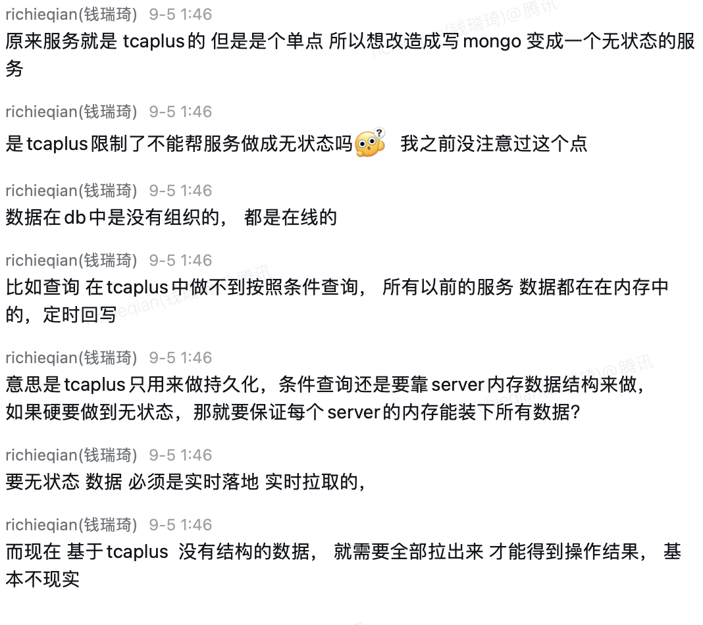

- #mongodb #raietren
	- {:height 544, :width 602}
- #RED/matchsvr #RED/roomsvr #RED/特性开关 关闭保护薇薇匹配business_type的时候，前端没有反应
	- CLIENT-[RESP]-[/roompb.CSService/CreateRoomV2]-[ab20306d-0974-4545-930f-0a02c1c49a58]__TAG__.container_name:gatesvrerror:rpc error: code = InvalidArgument desc = code=1100073 ErrorCode_MatchFailed @internal/pkg/actroom/teamroom/room.go:740 @internal/pkg/actroom/teamroom/api.go:172
	-
