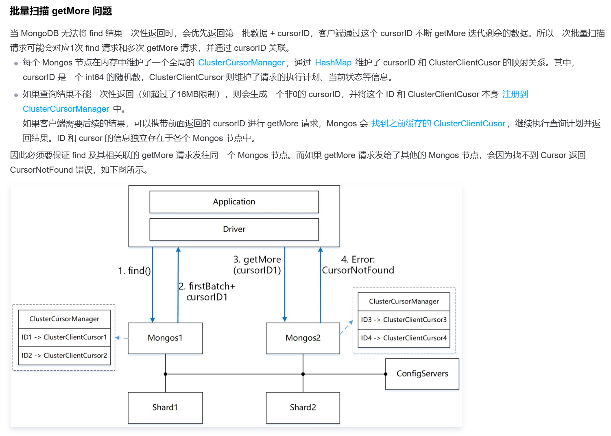

- #mongodb mongo sdk使用clb域名连接mongos的时候，如果clb没有开启会话保持可能导致CursorNotFound的问题。 
	- 但是mongo golang sdk里正常情况下应该不会出现问题，因为sdk的cursor里保存了连接信息，getMore应该会继续使用之前的连接 https://github.dev/mongodb/mongo-go-driver/blob/97912bd568ea76a2a1f6e32ab996434cc24982a4/x/mongo/driver/operation.go#L500
	- 但是如果连接出现异常，业务代码里又继续getMore就会出现这种问题
- #RED/Mongodb 如何预估连接分配的问题，先建立起来一个各job连接占比的曲线图，区分total和use
	- 影响mongo响应耗时的变量
		- 并发连接数
		  logseq.order-list-type:: number
		- 连接数增长速度
		  logseq.order-list-type:: number
		- 命令执行本身耗时
		  logseq.order-list-type:: number
	- 需要以mongodb为起始点，反推出给各个模块的压测指导意见，在涉及到mongo读写的地方，理想的qps(rpc/mq)是多少，最大能容忍的耗时是多少，replica是多少，用来计算出并发请求需要的总mongo并发连接数和单实例的并发连接数。以此来配置maxpoolsize，进行压测，收集压测期间mongo请求。
- #RED/Mongodb #案例
	-