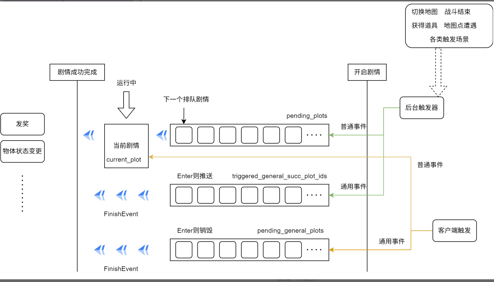

- #RED/海域探险 通用事件与普通事件
  id:: 671a6f08-08fe-4904-bffb-741df6973cdc
	- 通用事件一定会成功
	- 通用事件可能并发，最多保证同时有1个普通（大）事件+无穷个通用事件
	- {:height 364, :width 623}
	  id:: 671bba81-fe43-4987-acd9-7c8316a57782
	- ```protobuf
	  enum EventType {
	    EVENT_TYPE_UNKNOWN   = 0;   // 未知
	    MONSTER              = 1;   // 怪物
	    QUESTION_DIALOG      = 2;   // 问题对话
	    REWARD_BOX           = 3;   // 奖励宝箱
	    FISH                 = 4;   // 钓鱼事件
	    CLOUD_UNLOCK         = 5;   // 消云事件
	    LADYBUG              = 6;   // 小瓢虫商店事件
	    DIALOG               = 7;   // 对话分线剧情
	    TREASURE_MAP         = 8;   // 藏宝图事件
	    MOVE                 = 9;   // 移动事件
	    COLLECT_MAP_FRAGMENT = 10;  // 收集藏宝图碎片事件
	    SALVAGE              = 11;  // 沉船打捞事件
	    RELIC_SLATE          = 12;  // 遗迹石板事件
	    DUNGEON              = 13;  // 副本事件
	    SHIP_ROGUE           = 14;  // 海战肉鸽事件
	    GENERAL_EVENT        = 20;  // 通用事件 (客户端报使用100卡，临时修改为20)
	  }
	  ```
	- 剧情类型根据状态流转方式可以分为：
	  1. backend with event detail
	  2. backend shortcut
	  3. client with event detail
	  4. client shortcut
	  5. dungeon
	  6. client skill