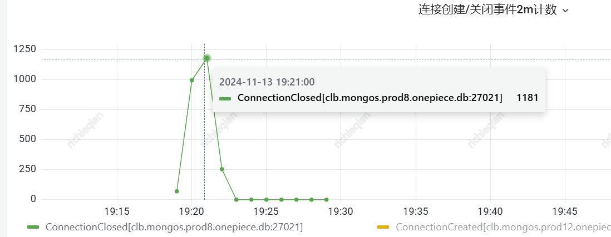
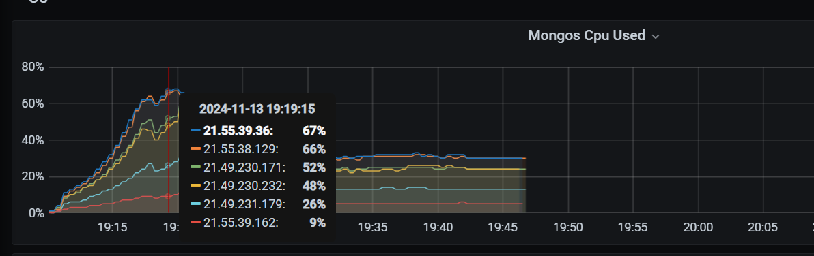
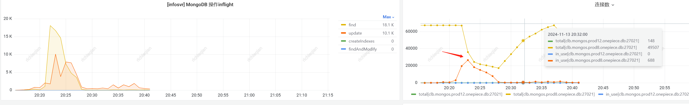

- mongo查询超时的种类 #mongodb #RED/Mongodb
	- 连接池不足，获取连接耗时过多
	- 连接池充足，单纯执行语句较慢，可能是mongo扛不住，这里是否熔断？
		- 
		   
		  这张图里，获取连接几乎不耗时，但是查询很慢，导致部分连接因为查询超时被关闭
		- 语句例子，全部都是mongos的慢查询 [url](https://monitor.gcs.woa.com/d/Z0__sFaSk/mongolog-new?orgId=1&from=1731496496219&to=1731496931303&var-gcs_app=onepiece&var-gcs_cluster=mongos.prod8.onepiece.db&var-Filters=attr.reslen%7C!%3D%7C329)
		  mongos的cpu也没有特别高
		   
		  ```
		   "batchSize": 200,
		      "filter": {
		          "basic_info.id": {
		              "$in": [
		                  100151338495,
		                  100151001670,
		                  100151011772,
		                  100151050749,
		                  100151127088,
		                  100151158805,
		                  100151167339,
		                  100151008991,
		                  100151110389,
		                  100151112401,
		                  100151124903,
		                  100151352209,
		                  100151352831,
		                  100151021733,
		                  100151034298,
		                  100151114018,
		                  100151139871,
		                  100151338212,
		                  100151350293,
		                  100151021665,
		                  100151025948,
		                  100151037337
		              ]
		          }
		      },
		      "find": "document",
		      "lsid": {
		          "id": {
		              "$uuid": "e3335dba-dcbc-4500-90c5-d8477309363b"
		          }
		      },
		      "projection": {
		          "_last_uic_test_unix": 1,
		          "_last_updated_unix": 1,
		          "basic_info.id": 1,
		          "scene_info": 1
		      }
		  }
		  ```
	- 也可能ctx到达mongosdk的时候几乎或者已经超时，这时会不断把连接关闭重建，表现出查询错误的效果。这里能否区分出ctx超时，和查询本身超时，和获取连接超时？
		- 如果mongo的慢查询都在1s以内，且连接获取耗时不超过1s，就不太可能是由于mongo导致的查询错误。如何保障连接获取不超过1s呢？固定足够的连接数，并且添加获取连接耗时过长熔断。再结合查询耗时3s熔断。避免因为查询本身超过5s，导致正常的ctx超时关闭连接。
- #mongodb 并发连接池预估
	- 说明并发连接数就到4w，mongo本身就扛不住了
	- 