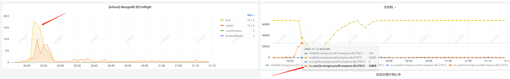
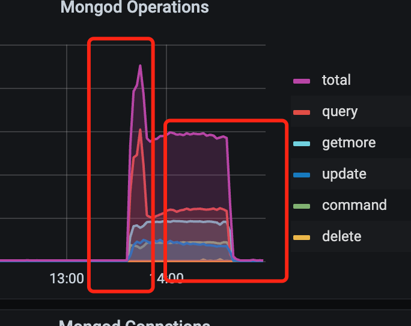
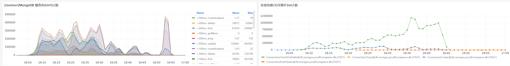
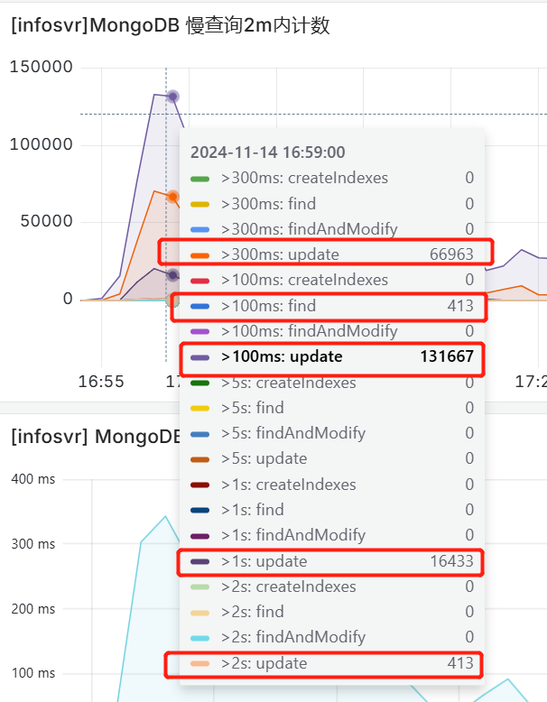
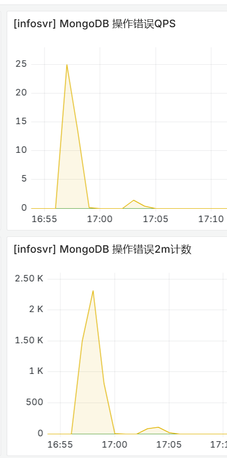
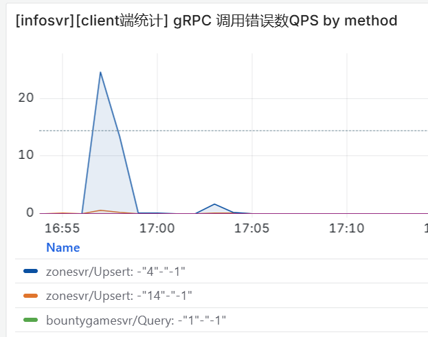

- #mongodb  in use的指标还是有意义的，虽然之前qps高的时候，in_use都很低，恰好说明没有慢查询
  
	- 当有慢查询出现的时候，inflight请求数和inuse连接数的量是能对上的，说明就是慢查询把管道占用了一部分，但远没有把管道都用完。最后只是有部分管道因为超时爆炸了，并不是管道不够用。
- #mongodb 固定poolminsize=poolmaxsize，有一个隐患，如果建立连接负载不均衡，后面很难有重新负载均衡的机会
- #RED/Mongodb #mongodb
	- 我改一下参数，可能对于prod8，这个参数太高，火影的是
		- setParameter:
		   taskExecutorPoolSize: 2 
		   ShardingTaskExecutorPoolMinSize: 4
		   ShardingTaskExecutorPoolMaxSize: 4
		- onepiece的是 80
			- #TODO 如果还改回80，是不是不用扩mongos了
	- 火影的压测过程
	  1，控制客户端连接数在一个合适的值
	  2，控制 ShardingTaskExecutorPoolMinSize/MaxSize ：4  关键作用
	  3，后端扩容
	  4，发现update有瓶颈，但所幸，对当时的规格来说update的需求并不高
		- 控制 ShardingTaskExecutorPoolMinSize/MaxSize ：4  关键作用
		    我昨天下午也改了，改成8.因为我们现在proxy数量相对少一些
- #RED/Mongodb #mongodb #RED/infosvr 慢查询问题定位
	- 压测记录 [魔方产品质量管理](https://mfq.woa.com/project/RedServerPerf/perf-report/report/269268)
	- 
	- _1731572010324_0.png)
	- 针对综合场景
	  1. 第一个红框：在写接近峰值的同时，读也到达尖峰，只读节点cpu接近100%，可能影响到了写同步的速度。为了验证，先扩容只读节点数，重新进行压测，看写的慢查询能否减少。
	  2. 第二个红框：需要掌握平峰时期（读请求回落一些，写达到峰值）8c shard *16、 16c shard * 16能承载的写qps。
- #RED/Mongodb 今天发现一例因为room的请求量过大，cpu被用满，ctx超时，反复关闭连接
	- [魔方产品质量管理](https://mfq.woa.com/project/RedServerPerf/perf-report/report/269316)
	- https://bkm.woa.com/grafana/d/wTKiUPRHk/ye-wu-tong-yong-jian-kong?orgId=1433&var-namespace=beta-prod&var-cluster_id=BCS-K8S-41549&var-job=zonesvr&from=1731571262000&to=1731574862000&var-app=roomsvr&var-instance=All
	- 
- #RED/Mongodb #RED/infosvr info调用方的ctx超时也会导致操作错误报错
	- #TODO 有没有办法区分出mongo慢查询超时，还是rpc ctx超时导致的错误？？？
	- #TODO zone为什么会调info超时？？？
	- [魔方产品质量管理](https://mfq.woa.com/project/RedServerPerf/perf-report/report/269329)
		- {:height 362, :width 317} {:height 562, :width 251}
		- {:height 321, :width 484}
-