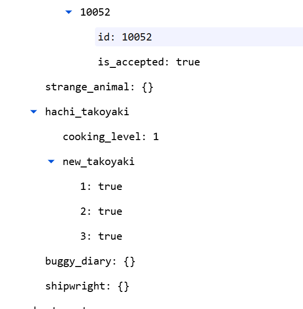
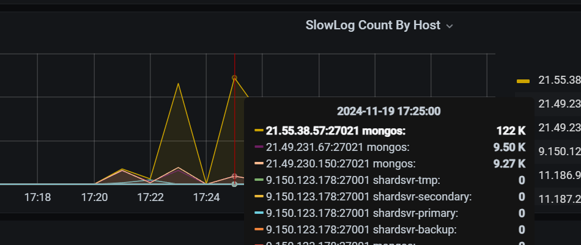
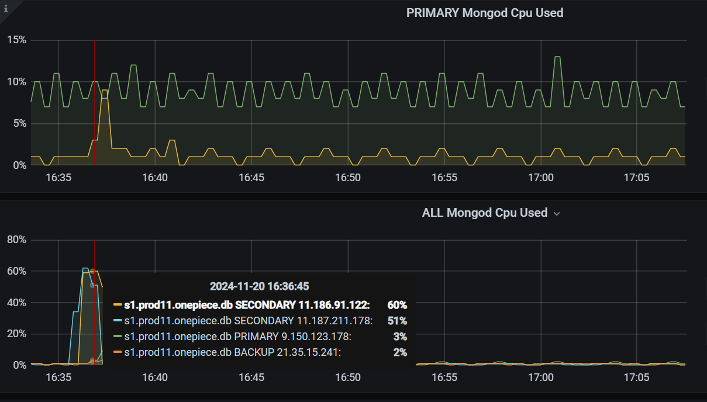
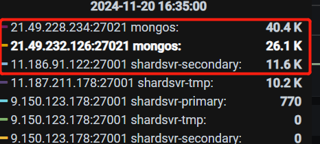
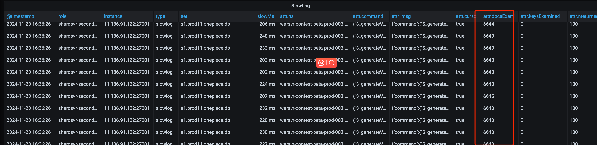
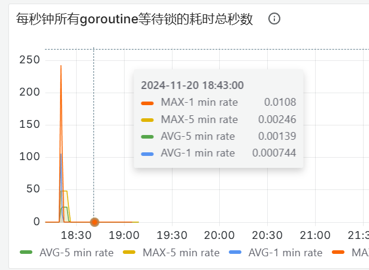

- #RED/海域探险 每次计算海域探险红点都会触发计算章鱼烧红点，章鱼烧红点计算时会在*厨艺等级==0*时，进行升级，产生写操作。所以即使重置海域探险，也会立马在第一章节写入第二章章鱼烧的数据。在补上了只在对应章节计算章节冒险故事的逻辑之后，就不会出现这种情况了。
	- ```go
	  // getHachiCookingLevel 获得小八章鱼烧当前厨艺等级
	  func (s *VoyagExploreSystem) getHachiCookingLevel(ctx context.Context, r *player.Player, pc *config.ParsedConfig) int64 {
	  	rModel := mustPlayerModel(r)
	  
	  	cookingLevel := rModel.getHachiCookingLevel()
	  	if cookingLevel == 0 {
	  		// 厨艺等级默认为 1 级
	  		mlog.Ctx(ctx).Debugf("get hachi cooking level, level: %v", cookingLevel)
	  		cookingLevel = rModel.levelupHachiCookingLevel()
	  		s.unlockNewTakoyaki(ctx, r, pc, cookingLevel)
	  	}
	  	return cookingLevel
	  }
	  ```
	- {:height 283, :width 388}
	-
- #RED/Mongodb #mongodb
	- 某一个mongos的慢查询特别多，可能代表pod到mongos的连接极度不均衡，所以对于match这种有热点pod的场景险，直接用mongos ip作为url是更优的方案
	  
- #RED/Mongodb #mongodb #RED/对位赛 [对位赛压测用例](https://mfq.woa.com/project/RedServerPerf/perf-report/report/273899)
	- https://monitor.gcs.woa.com/d/Z0__sFaSk/mongolog-new?orgId=1&from=1732091613000&to=1732093655000&var-gcs_app=onepiece&var-gcs_cluster=mongos.prod11.onepiece.db
	- https://monitor.gcs.woa.com/d/mongodbCluster/mongodb-cluster?orgId=1&from=1732091613000&to=1732093655000&var-interval=2m&var-gcs_app=onepiece&var-gcs_cluster=mongos.prod11.onepiece.db
	- @cyckercai(蔡晓丰)  蔡总帮忙看一下，mongos的cpu不高，mongod从节点cpu稍高一点60%，primary的cpu最高不到10%
	  但是有一定量的mongos和从节点的慢查询
	  
	  
	  
	  蔡总：
	  warsvr-contest-beta-prod-003.contest_headtohead_lobby
	  
	  对这个表的操作，扫描的数据量比较大
	  它的条件覆盖的数据行数比较多
	  这种操作本身慢一点可以接受的话，还需要控制一下并发量，以免同时执行的此类语句太多，把mongod cpu跑到比较高而影响了别的请求
	  就现在这个量，对别的请求是没有影响的。 @richieqian(钱瑞琦)  @maomaozhong(钟李茂)
	  
	  maomao：
	  我明白了，条件筛出的数据量太大了，然后又对筛出的所有数据有排序，最后才$limit 这样性能确实很差
- #mongodb #RED/Mongodb 如何搞明白获取连接超时、慢查询、业务cpu占用率、goroutine等锁耗时直接的关系？？？ #TODO
	- {:height 294, :width 435}