- #RED/Mongodb #mongodb 是否有办法从mongo监控指标上区分出ctx错误，还是查询错误，还是真正的慢查询
	- 查询错误
		- ```
		  __TAG__.namespace:beta-prod__TAG__.container_name:infosvrtraceid:9374cca41a5a8d0c1f1ae4ed5c693a3e__TAG__.pod_name:infosvr-c776946db-x7rw9x_func:git.woa.com/mfcn/ms-go/pkg/telemetry.(*metricMonitor).Finishedx_caller:pkg/telemetry/mongo.go:187x_time:2024-11-19T16:33:59.521+0800x_msg:==mongo-monitor==|==error==x_level:warndb_collection:documentdb_operation:updatedb_statement:{"update":"document","ordered":true,"lsid":{"id":{"$binary":{"base64":"QmGb4qvTRTueYVWnYqYXWg==","subType":"04"}}},"txnNumber":22273,"$clusterTime":{"clusterTime":{"$timestamp":{"t":1732005237,"i":1447}},"signature":{"hash":{"$binary":{"base64":"tHhWVDPTz7H+r/85ZL1OM+PgzeU=","subType":"00"}},"keyId":7426686332451160089}},"$db":"infosvr-0719-beta-prod-003","updates":[{"q":{"basic_info.id":200011105155},"u":{"$set":{"lobby_loadout.fight_buddy_choices":[{"buddy_id":90001001}],"_last_updated_unix":1732005237,"lobby_loadout.support_buddy_choices":null,"lobby_loadout.dial_choices":null,"basic_info.id":200011105155,"lobby_loadout.helper_buddy_choices":null,"lobby_loadout.warship_choices":null}},"upsert":true}]}duration_time_ms:1999.896464error_message: connection(21.49.230.232:27021[-643]) incomplete read of message header: context deadline exceeded: connection(21.49.230.232:27021[-643]) incomplete read of message header: context deadline exceededstatus:==error==
		  ```
		- ```
		  __TAG__.namespace:beta-prod__TAG__.container_name:infosvrtraceid:afdd7c05e40ad2593ad6820db310614f__TAG__.pod_name:infosvr-c776946db-l8llxx_func:git.woa.com/mfcn/ms-go/pkg/telemetry.(*metricMonitor).Finishedx_caller:pkg/telemetry/mongo.go:187x_time:2024-11-19T16:33:59.521+0800x_msg:mongo-monitor|errorx_level:warndb_collection:documentdb_operation:updatedb_statement:{"update":"document","ordered":true,"lsid":{"id":{"$binary":{"base64":"hU4UcOetSq+pIu0Gvay+XQ==","subType":"04"}}},"txnNumber":8881,"$clusterTime":{"clusterTime":{"$timestamp":{"t":1732005237,"i":1450}},"signature":{"hash":{"$binary":{"base64":"tHhWVDPTz7H+r/85ZL1OM+PgzeU=","subType":"00"}},"keyId":7426686332451160089}},"$db":"infosvr-0719-beta-prod-003","updates":[{"q":{"basic_info.id":200281149337},"u":{"$set":{"pvp_ladder_info.successive_win":0,"pvp_ladder_info.season_id":1,"_last_updated_unix":1732005237,"pvp_ladder_info.is_old_player":false,"pvp_ladder_info.fight_buddies":[{"id":90020001,"star":1},{"id":90030001,"star":1},{"id":90040001,"star":1}],"pvp_ladder_info.score":1500,"pvp_ladder_info.season_infos":[{"id":1,"fight_cnt":0,"win_cnt":0,"perfect_win_cnt":0,"highest_successive_win":0,"buddy_winnings":[{"buddy_id":90030001,"win_cnt":2,"fight_cnt":2},{"buddy_id":90040001,"win_cnt":2,"fight_cnt":2},{"buddy_id":90020001,"win_cnt":2,"fight_cnt":2}]}],"pvp_ladder_info.hidden_score":1...更多duration_time_ms:1999.774550error_message: connection(21.49.229.97:27021[-1088]) incomplete read of message header: context canceled: connection(21.49.229.97:27021[-1088]) incomplete read of message header: context canceledstatus:error
		  ```
	- 连接池错误
		- ```
		  __TAG__.namespace:beta-prod__TAG__.container_name:matchsvr__TAG__.pod_name:matchsvr-5ffc8489cf-rs488x_func:git.woa.com/mfcn/ms-go/pkg/telemetry.(*metricPoolMonitor).Eventx_caller:pkg/telemetry/mongo_pool.go:103x_time:2024-11-19T17:21:51.305+0800x_msg:mongo-monitor|error poolx_level:warnduration_time_ms:4550event_reason:timeoutevent_type:ConnectionCheckOutFailedconnection_error:context canceled
		  ```
		- ```
		  __TAG__.namespace:beta-prod__TAG__.container_name:matchsvr__TAG__.pod_name:matchsvr-5ffc8489cf-t8pcnx_func:git.woa.com/mfcn/ms-go/pkg/telemetry.(*metricPoolMonitor).Eventx_caller:pkg/telemetry/mongo_pool.go:103x_time:2024-11-19T17:21:51.305+0800x_msg:mongo-monitor|error poolx_level:warnduration_time_ms:4433event_reason:timeoutevent_type:ConnectionCheckOutFailedconnection_error:context deadline exceeded
		  ```
- #RED/Mongodb 为什么综合场景压测下，mail在固定连接数之后，会突然创建一些连接，但是后面连接数回到固定数量之后，又没有关闭连接的事件？是因为hpa！
	- [魔方产品质量管理](https://mfq.woa.com/project/RedServerPerf/perf-report/report/274669)
	- https://bkm.woa.com/grafana/d/wTKiUPRHk/e4b89a-e58aa1-e9809a-e794a8-e79b91-e68ea7?orgId=1433&var-namespace=beta-prod&var-cluster_id=BCS-K8S-41549&var-job=zonesvr&from=1732162742000&to=1732166408000&var-app=mailsvr&var-instance=All
	- 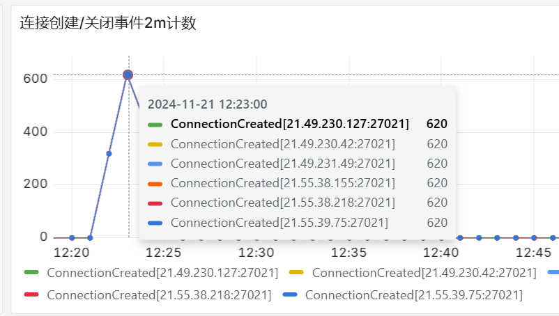{:height 293, :width 636}
	- 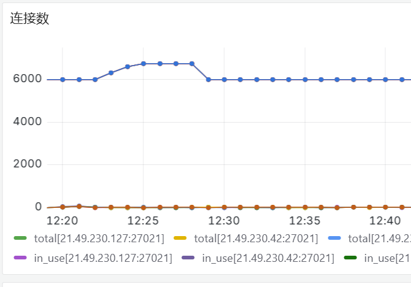
	- 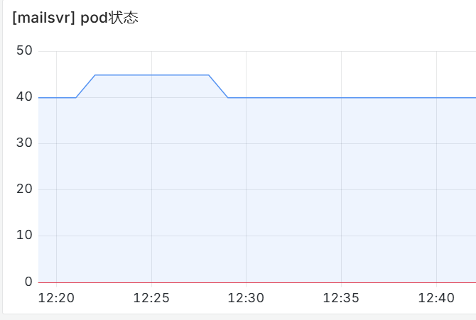
- #RED/Mongodb #mongodb 对mongos进行kill，验证mongo sdk连接层容灾能力
	- [业务通用监控 - RED通用监控 - Dashboards - Grafana](https://bkm.woa.com/grafana/d/wTKiUPRHk/e4b89a-e58aa1-e9809a-e794a8-e79b91-e68ea7?orgId=1433&var-namespace=beta-prod&var-cluster_id=BCS-K8S-41549&var-job=zonesvr&from=1732172090000&to=1732183183818&var-app=infosvr&var-instance=All)
	- 有查询错误和连接池closed和poolcleared
	  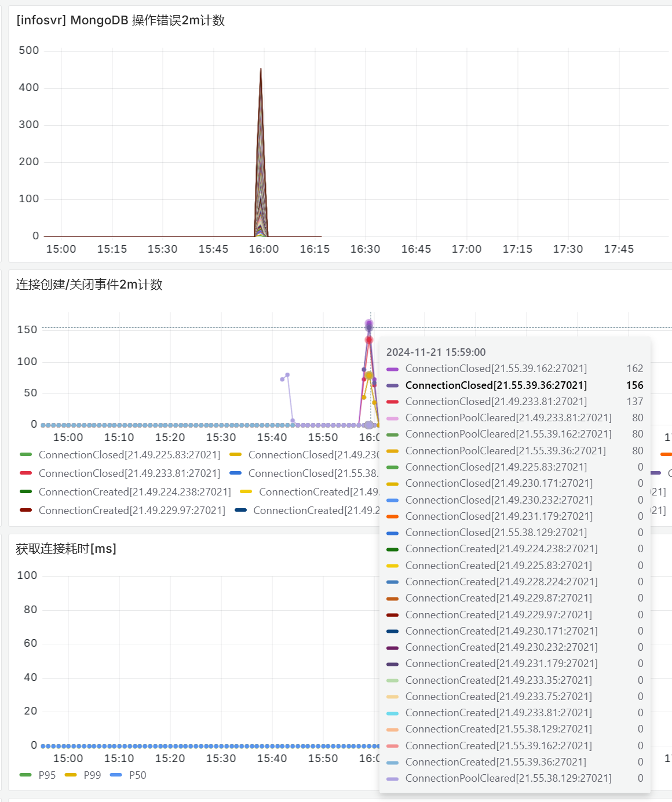
	- 被杀掉的mongos连接数降为0
	  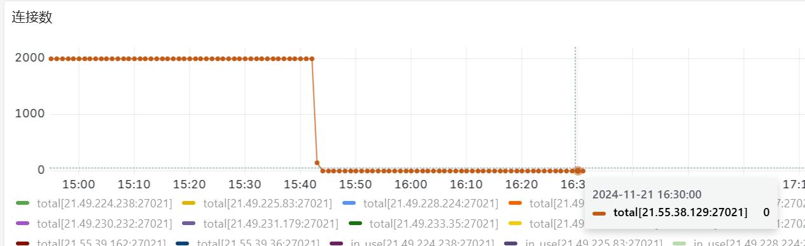
	- mongos恢复之后，连接数也恢复了
	  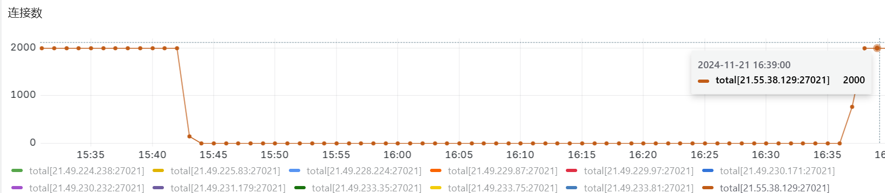 
	  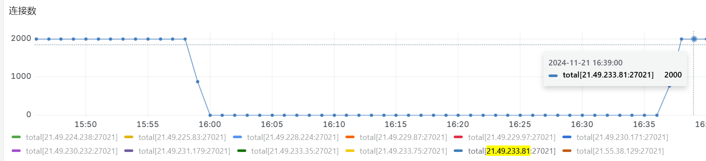
	- ~~但是不知道为什么有两个mongos的连接数比其他的少？~~ （先忽略吧 [[Sep 13th, 2025]]））
	  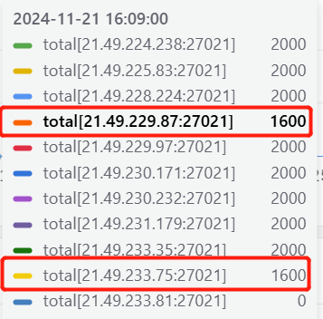
- #RED/Mongodb #mongodb [[RED/ranksvr]] 的for mongo优化过程：
	- 使用单shard的mongo prod10，每个shard节点cpu为32核，update qps>1w，导致出现大量慢查询，当时又没有固定连接池，所以很容易出现雪崩。当时为了不阻塞压测进度，对这里进行10%的写采样。
	  logseq.order-list-type:: number
	  [魔方产品质量管理](https://mfq.woa.com/project/RedServerPerf/perf-report/report/263623)
	  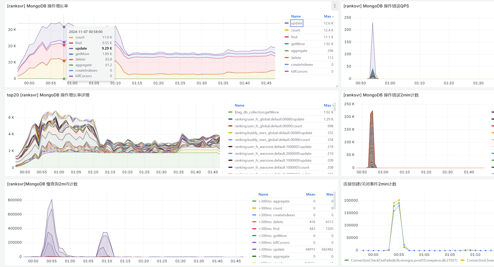
	- 简单按照rank key（zone id + rank type）分shard，使用多shard mongo prod15，每个zoneid又是一个独立的collection。
	  logseq.order-list-type:: number
	  写压力降下来了，读压力比较大，mongo从节点cpu占用90+%。
	  [魔方产品质量管理](https://mfq.woa.com/project/RedServerPerf/perf-report/report/274669)
	  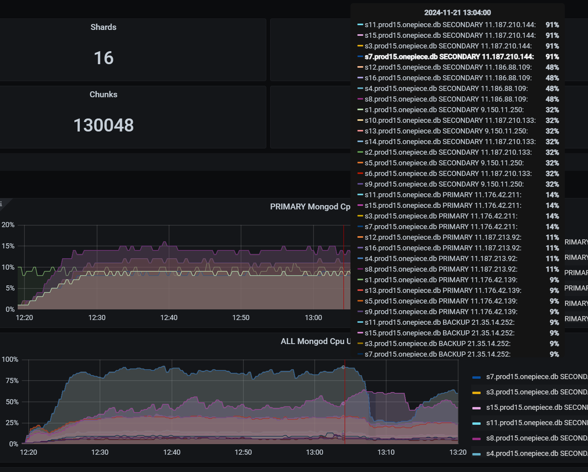{:height 607, :width 747}
	  [MongoDB Cluster - Grafana](https://monitor.gcs.woa.com/d/mongodbCluster/mongodb-cluster?orgId=1&from=1732162742000&to=1732166408000&var-interval=2m&var-gcs_app=onepiece&var-gcs_cluster=mongos.prod15.onepiece.db)
	- 做了一些小优化：count 排行榜长度在ranksvr做了缓存，aggregate做了一些数量限制
	  logseq.order-list-type:: number
	  [魔方产品质量管理](https://mfq.woa.com/project/RedServerPerf/perf-report/report/274679)
	- 第2和3步之后，多shard的mongo，每个shard节点cpu为8核，读压力很大，把从节点最终通过扩容从节点数量2->3，各从节点的最高负载基本上都降了一半
	  logseq.order-list-type:: number
	  [魔方产品质量管理](https://mfq.woa.com/project/RedServerPerf/perf-report/report/274730)
	  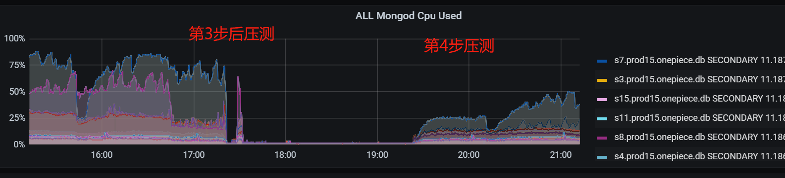
	  [MongoDB Cluster - Grafana](https://monitor.gcs.woa.com/d/mongodbCluster/mongodb-cluster?orgId=1&from=now-6h&to=now&var-interval=2m&var-gcs_app=onepiece&var-gcs_cluster=mongos.prod15.onepiece.db)
- #RED/matchsvr beta-prod压段位赛匹配的时候，match到room的路由有问题，导致创建房间都快速失败了。
  整个过程中没有告警出现，match主调出流量和room客户端侧rpc统计里都没体现出调用错误。
  这里还是有些风险的。
  [业务通用监控 - RED通用监控 - Dashboards - Grafana](https://bkm.woa.com/grafana/d/wTKiUPRHk/e4b89a-e58aa1-e9809a-e794a8-e79b91-e68ea7?orgId=1433&var-namespace=beta-prod&var-cluster_id=BCS-K8S-41549&var-job=zonesvr&from=1732181026000&to=1732182253000&var-app=matchsvr&var-instance=All)
  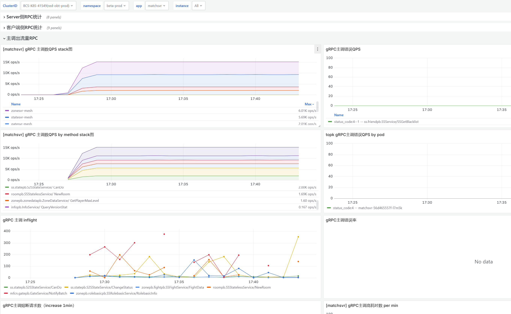 
  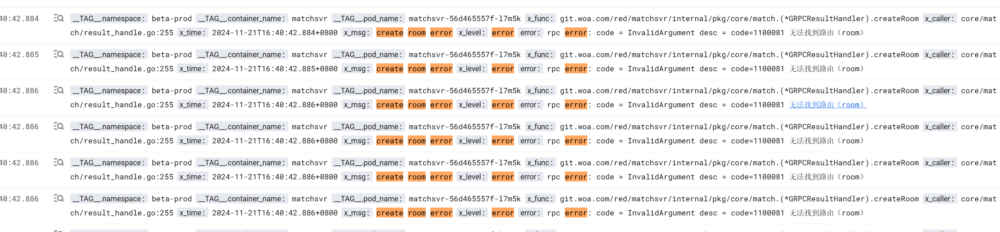
	- 对于match要添加一下room/game创建成功率，添加room/game创建失败告警 #TODO