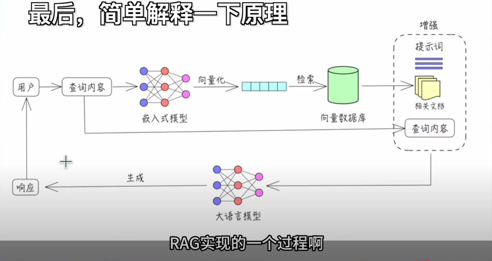
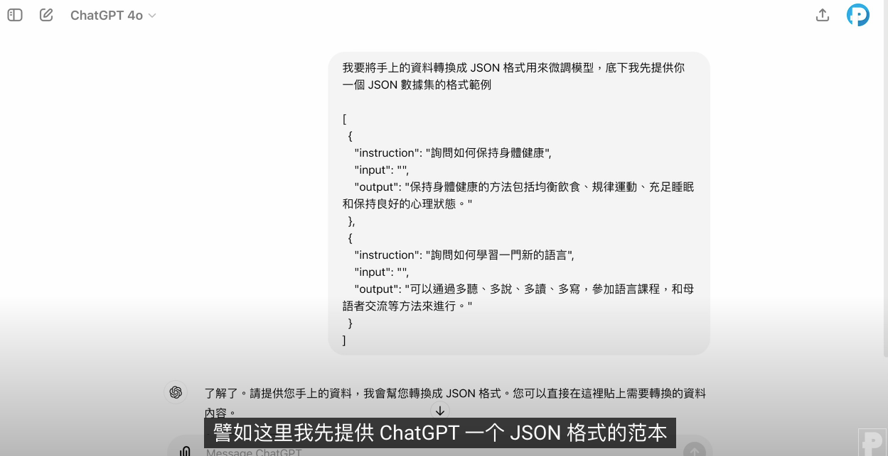
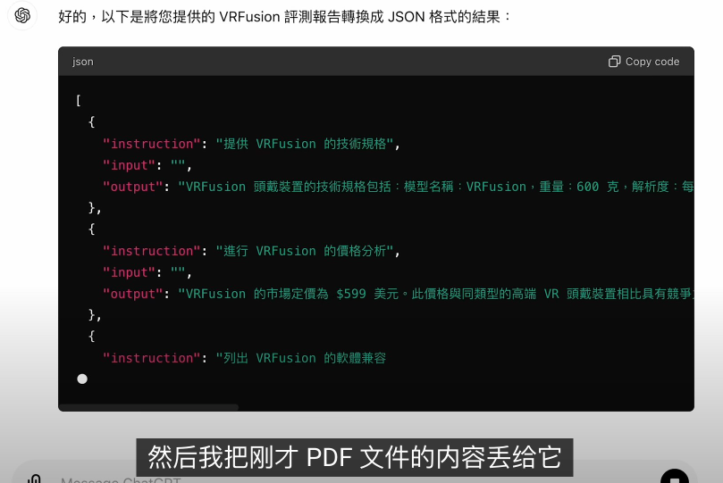

- 通过[[LLM]]/[[cursor]]快速生成学习路线图(learning roadmap)、知识图谱(knowledge graph) #PKM
	- {{video https://www.youtube.com/watch?v=U8FxNcerLa0}}
	- 视频介绍了如何结合Google Gemini深度研究和Obsidian知识图谱，通过AI自动化创建学习路线图和笔记系统，从而大幅提升学习效率并节省时间。
	  Detailed Summary for [Learn Anything Faster: Save 80% of Your Time with Gemini Deep Research & Obsidian [Guide & Setup]](https://www.youtube.com/watch?v=U8FxNcerLa0) by [Monica](https://monica.im)
	  
	    [00:00](https://www.youtube.com/watch?v=U8FxNcerLa0&t=0.68) 本视频介绍了如何利用Google Gemini深度研究和Obsidian知识图谱快速学习新主题，节省时间并提高学习效率。
		- 介绍了Obsidian知识图谱的自动生成及其学习路径的清晰结构。}
	- 结合Google Gemini深度研究和Obsidian，可以在几分钟内完成主题研究，显著节省时间。}
	- 解释了深度研究功能及其如何作为智能助手来优化信息搜索过程。}
	      
	  [02:52](https://www.youtube.com/watch?v=U8FxNcerLa0&t=172.04) 本视频介绍了如何利用Google Gemini进行深度研究，以节省学习时间并提高效率。
		- 用户可以通过提问来启动AI的研究计划，AI将根据问题生成初步计划。}
	- 以SpaceX的Starship为例，AI将制定详细的研究计划，包括目标、当前状态和技术规格。}
	- 用户可以根据需要编辑AI生成的研究计划，以便更好地满足个人需求。}
	- 在AI进行深度研究时，用户可以观察其在线搜索和信息整理的过程。}
	      
	  [05:32](https://www.youtube.com/watch?v=U8FxNcerLa0&t=332.44) 本视频介绍了如何使用Gemini深度研究和Obsidian工具高效学习，节省80%的时间。
		- 介绍了如何分析相关文献并生成报告，以帮助用户进行学习。}
	- 强调了该工具适用于任何学习领域或主题，非常适合快速获取知识。}
	- 展示了如何创建学习路线图，包括研究计划和学习内容的结构。}
	- 以SpaceX Starship为例，展示了如何获取最新的研究报告和相关信息。}
	      
	  [08:17](https://www.youtube.com/watch?v=U8FxNcerLa0&t=497.2) 本视频介绍了如何利用Gemini和Obsidian工具高效学习，节省时间并提升学习效果。
		- 介绍了Starship的详细信息，强调了信息来源的可靠性。}
	- 指出使用这些工具可以快速生成综合报告，提升学习效率。}
	- 强调Obsidian在学习中的重要性，帮助建立个人化的知识图谱。}
	- 提到通过书籍和视频学习如何有效笔记，提升学习质量。}
	      
	  [11:09](https://www.youtube.com/watch?v=U8FxNcerLa0&t=669.04) 本视频介绍了如何利用AI自动化学习笔记的创建过程，以提高学习效率。
		- 提取知识点并将其转化为学习笔记是学习的第一步。}
	- 使用Obsidian文件夹来管理学习资料，并介绍了如何操作这些文件。}
	- 通过AI的帮助，简化了创建索引笔记和建立链接的过程。}
	- AI成功生成了包含介绍和知识点链接的学习笔记文件。}
	      
	  [13:48](https://www.youtube.com/watch?v=U8FxNcerLa0&t=828.6) 本视频介绍了如何使用Google Gemini和Obsidian进行深度研究，以提高学习效率。
		- 在路标文件中添加回链，以便于后续使用。}
	- 如果出现问题，可以撤销之前的操作并重新尝试。}
	- 通过Obsidian查看和管理学习笔记，快速获取关键信息。}
	- 有了清晰的学习路线图，可以更快地掌握新概念。}
	- 分享了使用AI进行深度研究和构建知识图谱的过程。}
- 通过[[RAG]]给本地AI大模型[[LLM]]投喂数据创建私有AI知识库[[PKM]]
	- {{video https://www.youtube.com/watch?v=77990wI3LZk}}
	- {{youtube-timestamp 6:54}} 
	-
- [[LLM/fine-tuning]]模型微调 #ollama
	- {{video https://www.youtube.com/watch?v=JpQC0W91E6k&t=597s}}
	- 
	  
	- [[unsloth]]是一个训练和微调模型的工具 https://github.com/unslothai/unsloth #LLM/fine-tuning