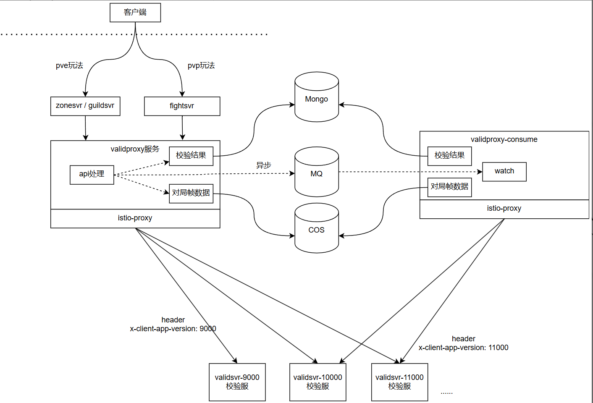
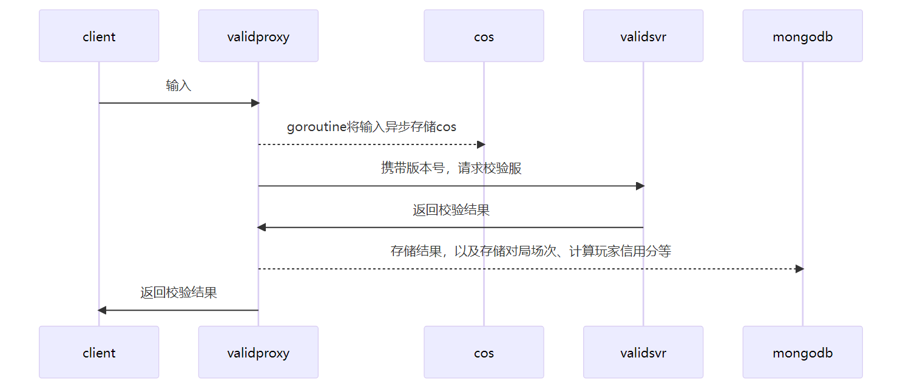
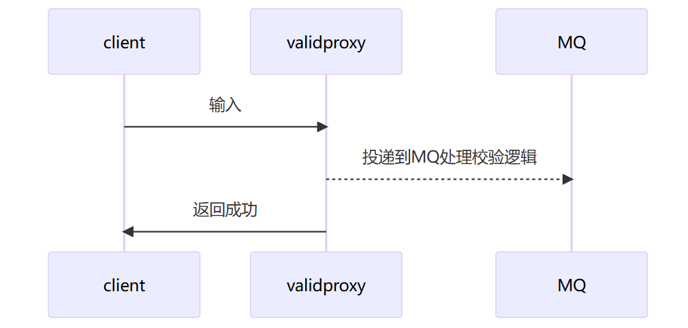

- #RED/matchsvr 对于3v3 [[多人匹配]]计算需要考虑以下问题
	- 组队情况下分边要考虑，真人平均分在两边和真人堆在一边两种情况
	- 如果真人平均分在两边的话，组队不能拆队
	- 组队匹配不能接受出现2:2:2的情况
- #RED/校验服 校验服架构示意图 [ref](https://iwiki.woa.com/p/1655155748)
	- 
	- 校验时序图
		- 同步校验调用
		  
		- 异步校验调用方案
		  
			- 异步校验的结果是如何影响到玩家的❓ #TODO
	- filter机制
		- 对于高信用玩家，校验时可以直接返回成功，做异步校验或随机抽样校验。当玩家信用下降到一定阈值，或者连续几场校验有作弊，则恢复同步校验。
		  
		  由于为了判断玩家信用需要高频读取mongodb，恐有性能问题，可以加一层LRU本地缓存，调用validproxy的mesh可以配成按照gid做一致性哈希，提高命中率。
	- 信用机制设计
		- 信用相关的数据存储在以玩家为key的db中
		  
		  信用分的影响可以通过idip或内部接口(如statesvr)调用实现, 尽量不要在业务中主动访问信用分相关逻辑
		  
		  在信用分较高时, 可能影响过同步校验(直接返回成功,转为异步校验)
		  
		  多人PVP时,可能需要以低信用玩家为准.