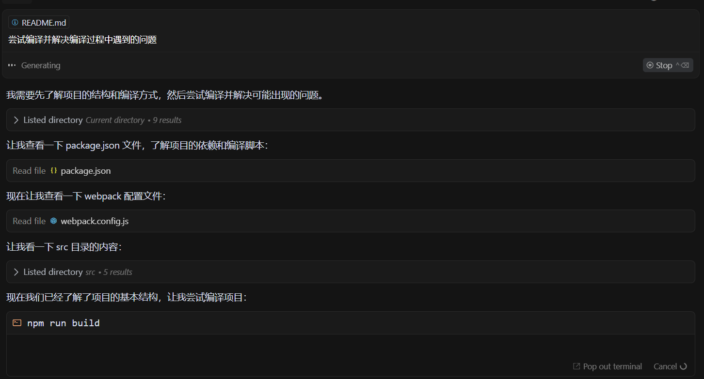

- #logseq-smart-composer 计划
	- 使用cursor生成readme, chat
		- submit: 给github仓库写一下readme，仓库的创意和实现主要来自于 @Web @https://github.com/glowingjade/obsidian-smart-composer
		- submit: 具体内容也参考 @Web @https://github.com/glowingjade/obsidian-smart-composer
	- 使用cursor生成基础代码, composer
		- submit: 参考 @https://github.com/glowingjade/obsidian-smart-composer 移植成一个完整可用的logseq插件
		- --中间出现了中断--
		- submit: 继续
	- 解决编译问题
		- Agent: 尝试编译并解决编译过程中遇到的问题
		  