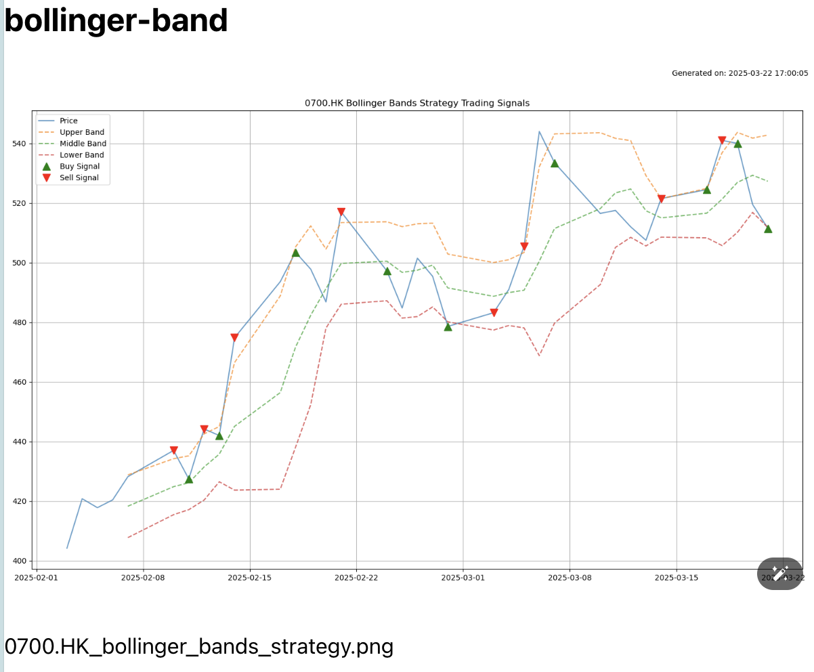
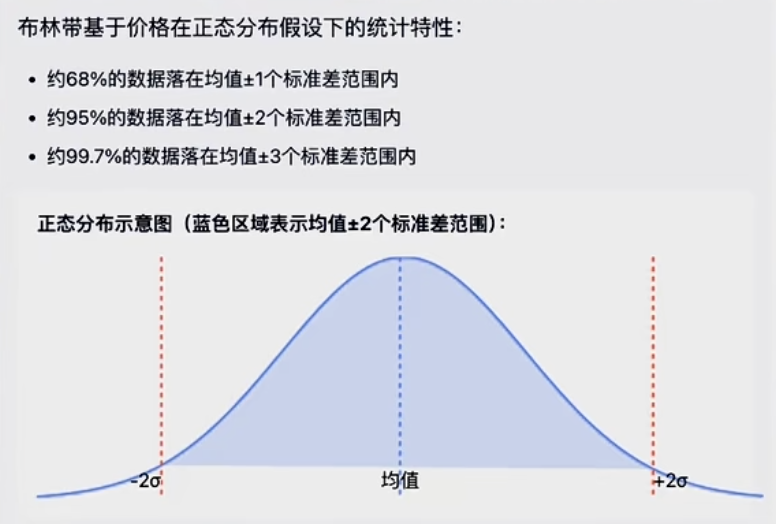
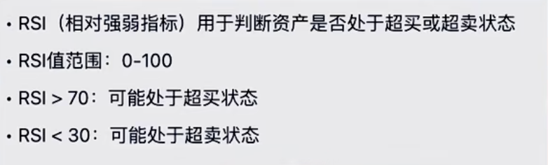

- https://finataotao.org/ （shutaosfriend shenshutao） 来自 [[@shutaoshen]] 的股市分析工具，里面提到 [[布林带]] #quant
	- {:height 625, :width 748} shutao网站里的0700布林带
	- [[布林带]]总结 from [monica](https://monica.im/share/chat?shareId=9uCFKSQoc8d6n6Vx) #card
	  id:: 67df0c84-9580-440f-8e85-21ffb5209c6d
		- # 什么是布林带？
		  
		  布林带（Bollinger Bands）是由金融分析师约翰·布林格（John Bollinger）在1980年代开发的一种技术分析工具，用于帮助投资者和交易者衡量市场波动性，并识别证券何时可能上涨或下跌。
		- ## 布林带的构成
		  
		  布林带由三条线组成，这些线随着价格变动而移动：
		- **中间线**：通常是20日简单移动平均线（SMA）
		- **上轨**：中间线上方两个标准差的位置
		- **下轨**：中间线下方两个标准差的位置
		  
		  这三条线共同形成了一个"带状"区域，随着价格波动性的变化而扩张或收缩。
		- ## 布林带如何帮助投资者
		- ### 1. 识别市场波动性
		- **带宽扩大**：表示市场波动性增加
		- **带宽收窄**（挤压）：表示波动性减少，通常预示着即将出现重大价格变动
		- ### 2. 判断超买超卖状态
		- 当价格接近或触及**上轨**时，可能表示证券处于**超买**状态，价格可能即将下跌
		- 当价格接近或触及**下轨**时，可能表示证券处于**超卖**状态，价格可能即将上涨
		- ### 3. 确定潜在支撑和阻力位
		- 下轨通常被视为潜在的**支撑位**，买家可能在此进场
		- 上轨通常被视为潜在的**阻力位**，卖家可能在此进场
		- ### 4. 趋势分析
		- 中间线的方向可以指示趋势强度：向上表示上升趋势，向下表示下降趋势
		- 在强劲趋势中，价格可能会持续贴近或突破上轨（上升趋势）或下轨（下降趋势）
		- ### 5. 交易策略应用
		- **布林反弹策略**：在区间市场中，价格从下轨反弹至中线，或从上轨回落至中线
		- **突破策略**：当价格在挤压后突破上轨或下轨，可能表示新趋势的开始
		- **均值回归策略**：基于价格倾向于回归到中间带的理念
		- ### 6. 设定价格目标
		- 当价格从下轨反弹时，上轨可能成为潜在的退出点
		- 当价格从上轨回落时，下轨可能成为潜在的目标位
		- ## 使用建议
		  
		  布林带虽然有用，但最好作为辅助指标，与其他分析方法（如成交量指标、动量振荡器等）结合使用，以确认信号并避免假信号。投资者可以根据不同的资产类型和市场条件调整布林带的参数设置，以提高其有效性。
	- 里面还有[[夏普率]]指标
- 尝试在mba上同步logseq到anki的时候发现，新装的 [[logseq-anki-sync]]插件无法识别其他机器同步到anki里的闪卡，这是什么情况？#TODO
- 关于[[布林带]] 这篇[小红书](https://www.xiaohongshu.com/explore/67c803da00000000290363c8)讲的挺简单易懂 ，还提到了[[RSI]]  还有[github代码](github.com/JakobWong/quant-learning)
	- {:height 298, :width 552}
	- 