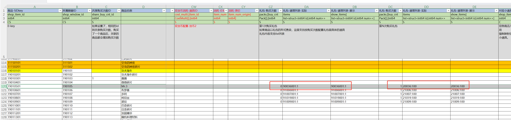
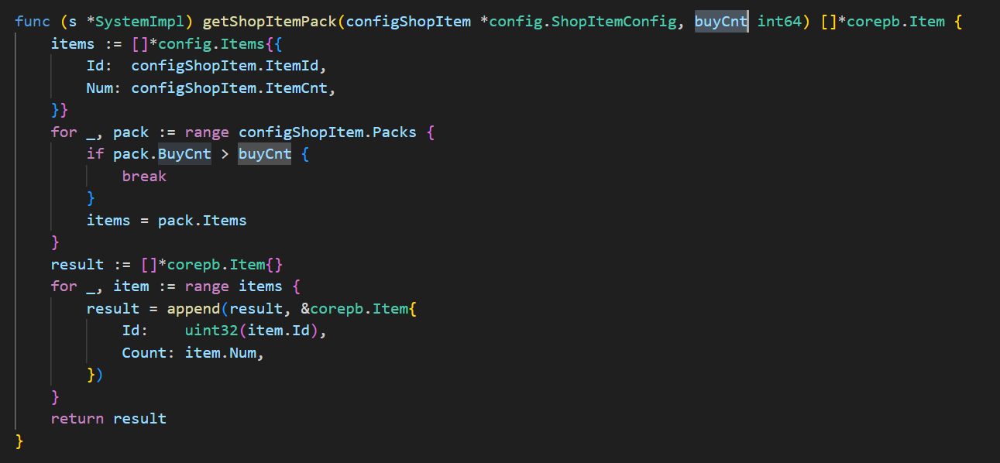
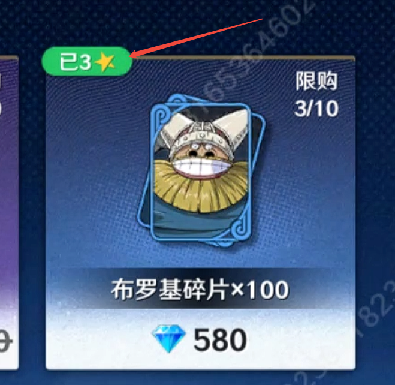

- #RED/zonesvr #RED/商城 初次购买伙伴的时候给的是碎片，还是整卡，还是直接给伙伴
	- 第一种：直接买伙伴
	- 第二种：直接买碎片
	- 第三种：第一次买伙伴，第二次买碎片。实际通过礼包配置项packs区分。
		- a. 商城购买伙伴，比如Mr3是直接给1星伙伴
		- b. 第二次购买Mr3，实际给的是碎片，但是商品配置仍然是Mr3那一行
		- 
		  配置项packs的优先级高于itemid、itemcnt：
		  
	- 读取伙伴和背包数据算出伙伴当前总共可以升到几星，现在商店返回已经有这个逻辑了，其实是客户端实现的。
	  
	-
-