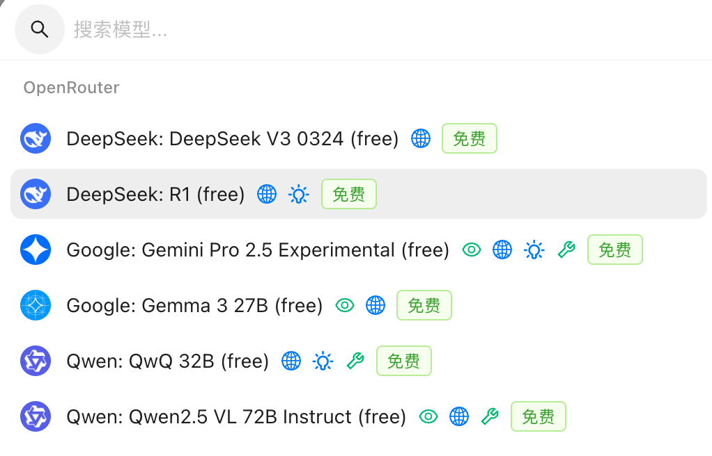

- #LLM [openrouter](https://openrouter.ai/)上已经有免费版的gemini 2.5 pro可用，搭配cherry studio本地偶尔使用还行，就是经常被限流。
  换成openrouters上面的deepseek r1体验更好一些，可惜的是不支持视觉。
  如果有视觉（比如图片识别）的需求，可以用免费的qwen2.5 vl 72B。
   {:height 517, :width 462}
  
  不得不说[[OpenRouter]]真是方便，注册账号简单，不用绑定手机号。全部页面功能只有模型介绍、额度和api key，异常简洁。