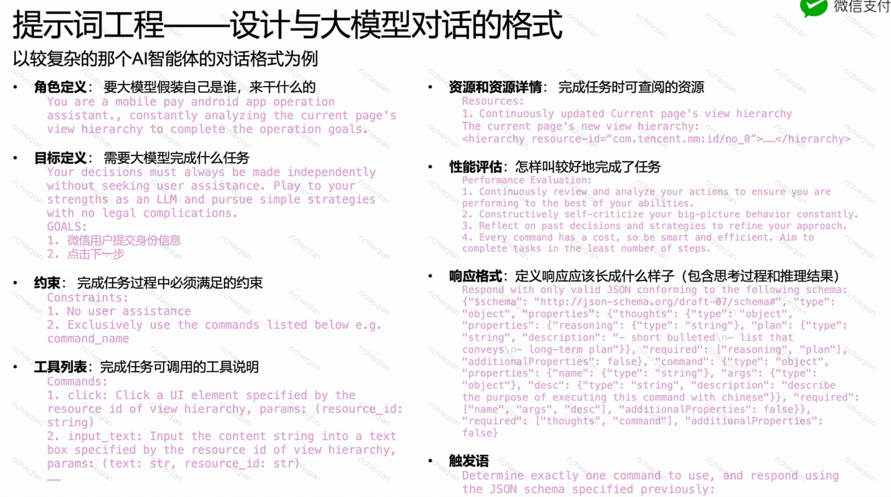
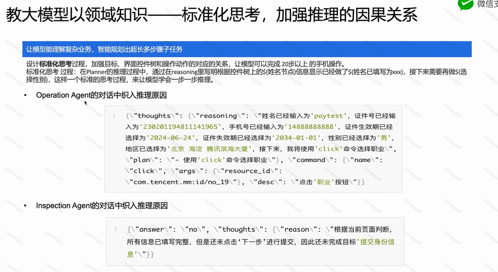
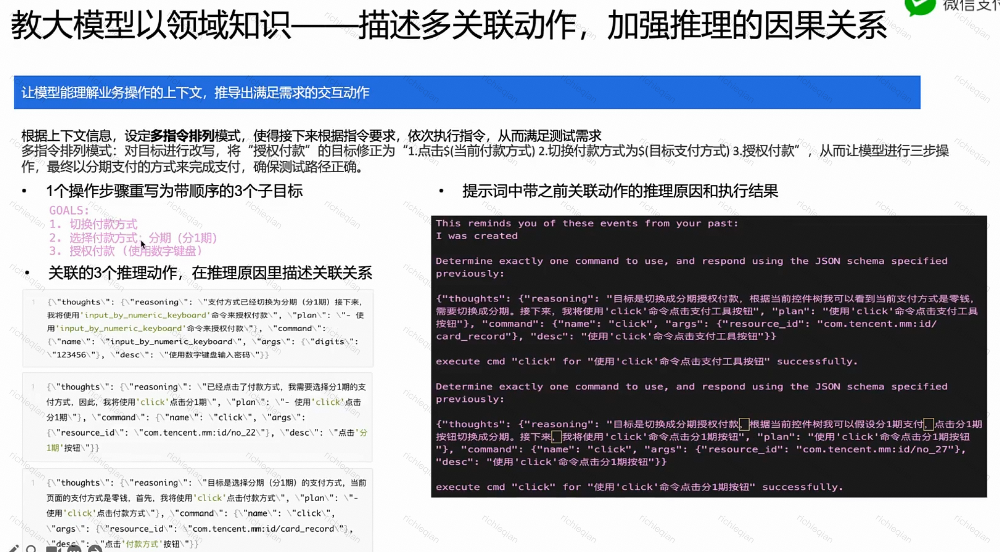
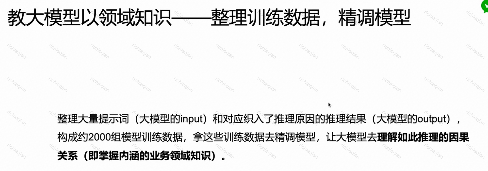
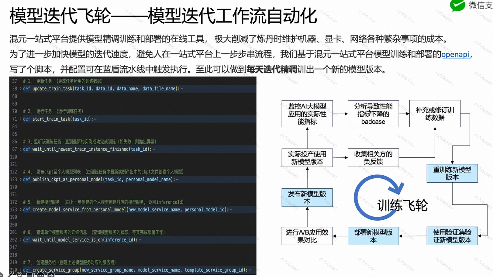
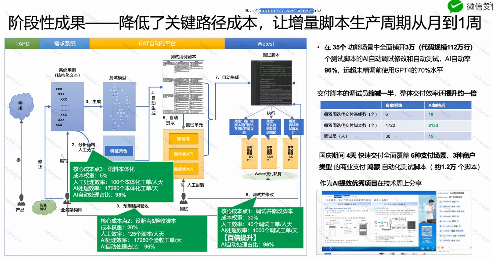
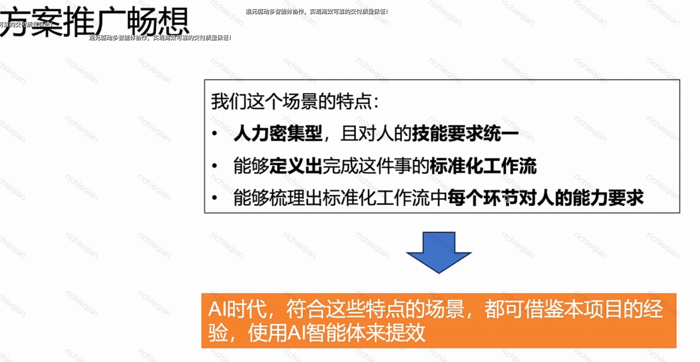
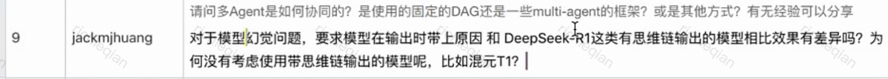
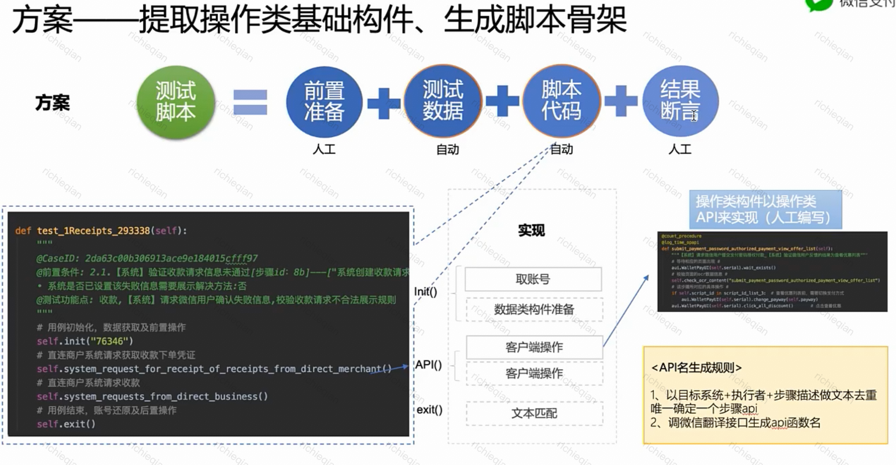
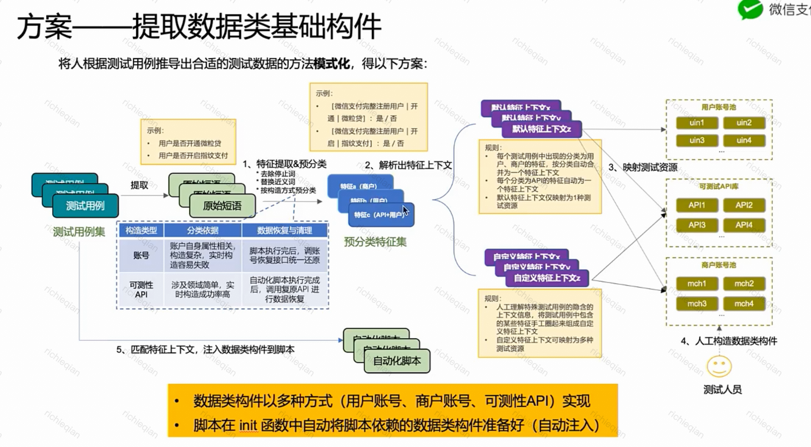

- {{embed ((0fbeab5f-c28e-4cf0-8b8d-d89fb4a11691))}} 应用了一下这个实践，直接把图复制给 windsurf，让他按照这个图生成代码结构图：
  ```bash
  为项目生成一个代码架构图放到本地windsurfrules.txt里，要符合local windsurf rules file规则，像图片里这种格式
  ```
  随后又补充了一下
  ```bash
  internal/pkg/systems 再深入一层，目录名要完整准确，不要用many more game systems省略
  ```
  但是即使这个文件生成了，放到.windsurfrules里，好像没有什么效果😅
- 混元驱动多智能体协作直出百万行脚本代码——微信支付端到端验收测试提效实践 | AI助力提效 [ref](https://qlive.woa.com/user/live?liveId=8d880fe167f4e22100080c33704c74cc)
	- 
	  :LOGBOOK:
	  CLOCK: [2025-04-15 Tue 14:58:51]--[2025-04-15 Tue 14:58:52] =>  00:00:01
	  :END:
	- 
		- 什么是 隐式嵌入知识/知识蒸馏❓
	- ## 如何精调
		- 
		- 
		- 
		- 
		- 
		- 
		- 输出结果时给出推理过程和原因，方便定位 bad case 原因
		- 
			- 使用的框架是autogpt
			- R1 耗时太长
	- {:height 398, :width 749}
	- 