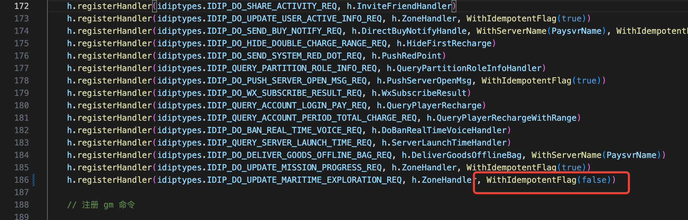

- [[RED/海域探险]]通过[[RED/idip]]修改物件信息
  
  物件id 10101497 
  
  地块 20011
  
  {"gid":200011019167,"zone":20001,"open_id":"12316536460236718231","name":"12316536460236","is_online":true}
  
  让箱子显示，并修改位置
  
  curl -vX POST -H 'Content-type:application/json' -d 'data_packet={"head":{"Cmdid":4237},"body":{"AreaId":991,"PlatId":1,"Partition":20001,"OpenId":"12316536460236718231", "ComponentId":10101497, "State": -1, "Pos": 20013, "Serial": "'$RANDOM'"}}' idip-richie-dev.test.red.woa.com/idip
  
  移动202章鱼
  
  curl -vX POST -H 'Content-type:application/json' -d 'data_packet={"head":{"Cmdid":4237},"body":{"AreaId":991,"PlatId":1,"Partition":20001,"OpenId":"12316536460236718231", "ComponentId":20208418, "State": 0, "Pos": 48019, "Serial": "'$RANDOM'"}}' idip-richie-dev.test.red.woa.com/idip
  
  AreaId有一定的规则：正式环境下：1-微信 2-QQ   测试环境：991-QQ 992-微信。
  
  走idip压测验证的时候，要把idipsvr handler里的幂等选项临时关掉
   
  
  https://iwiki.woa.com/p/846991527