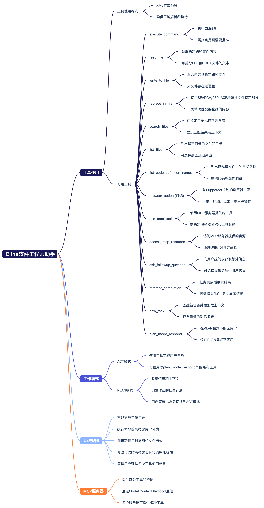

- [[cline]]与[[llm]]的通讯过程中，是直接将所有 [[LLM/MCP]] 工具的详细信息写入提示词的。[视频](https://youtu.be/IjISe8ThHvY?si=H9OIIZILK6fAVXEF&t=518)里展示了格式化后的内容长达6万多字符。cline是开源的，实际对应的原文[在这](https://github.com/cline/cline/blob/04d1f1d4e756e348af20d330ce804c28712af16e/src/core/prompts/system.ts)(共666行)，是prompt工程的优秀学习素材。
	- 让[monica](https://monica.im/share/chat?shareId=jb4eCIZZwQRCMO66)总结了一下这个github文件，并绘制了思维导图
		- 工具使用 - 展示了Cline支持的各种工具及其功能
			- 工具使用格式
			- 各种可用工具及其功能描述
		- 工作模式 - 介绍了Cline的两种主要工作模式
			- ACT模式：用于执行实际任务
			- PLAN模式：用于规划解决方案
		- 系统规则 - 列出了使用Cline时需要遵循的规则
		- MCP服务器 - 说明了MCP服务器的功能和与Cline的交互方式
		- {:height 1102, :width 622}
- 顺便让monica生成了这段文字的[小红书格式文案](https://monica.im/share/chat?shareId=Z6jijFyUVrIhhwGi)，这就发小红书去！