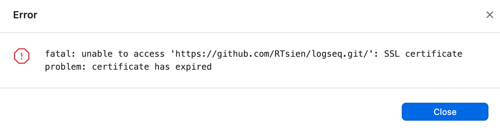
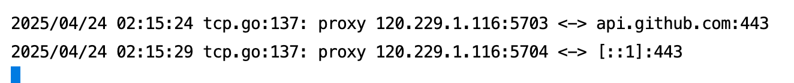
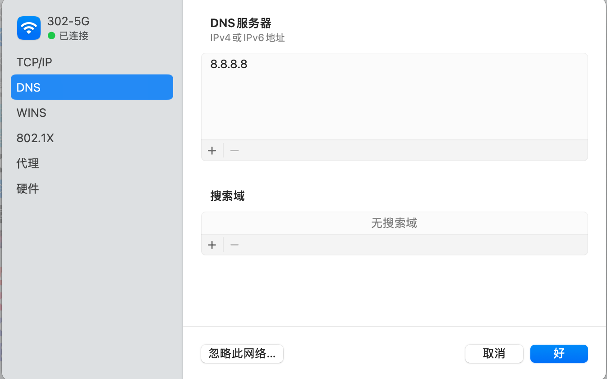
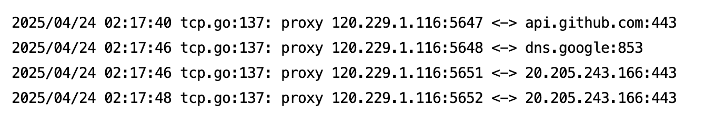

- github desktop出现pull/push报错的问题，然后shadowsocks调成全局就能成功，走pac就失败。定位问题花了些波折，charles和wireshark都用上了：
	- charles因为覆盖了shadowsocks的全局代理，找不到问题出在了哪个环节
	- wireshark没办法找到github地址相关的destination
	- 最后通过查看shadowsocks server上的log，发现是dns的问题，导致获取不到github正确的ip，随后改了dns就成功了。
		- 
		-  [::1]应该就是解析出错的地址
		- {:height 278, :width 456}
		- 调整dns之后正确获取了20.205.243.166地址
		- 
-