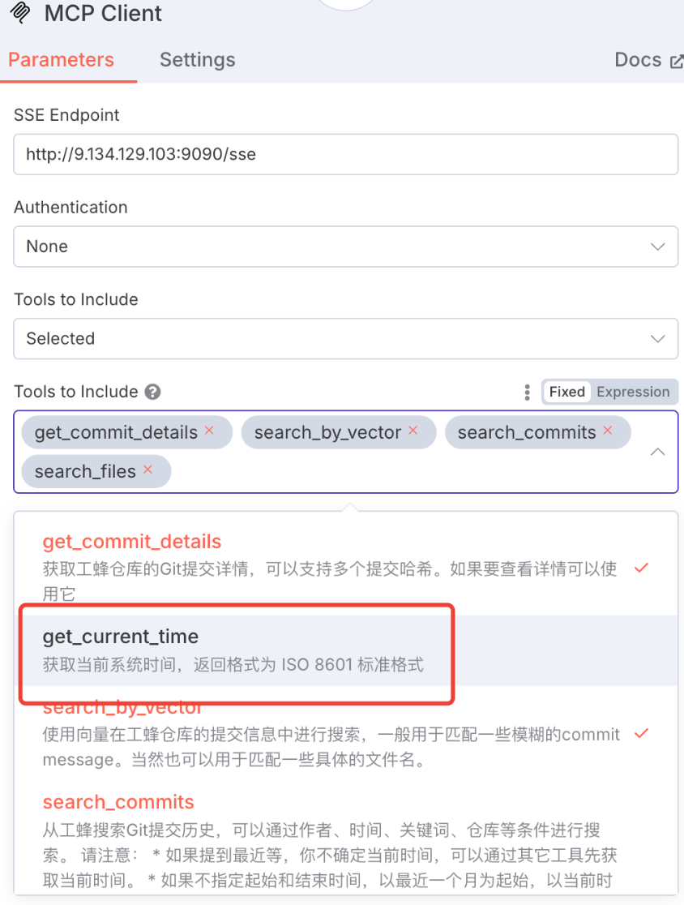
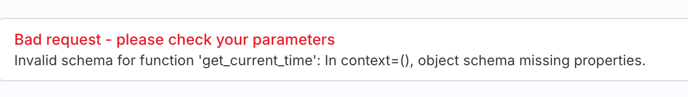
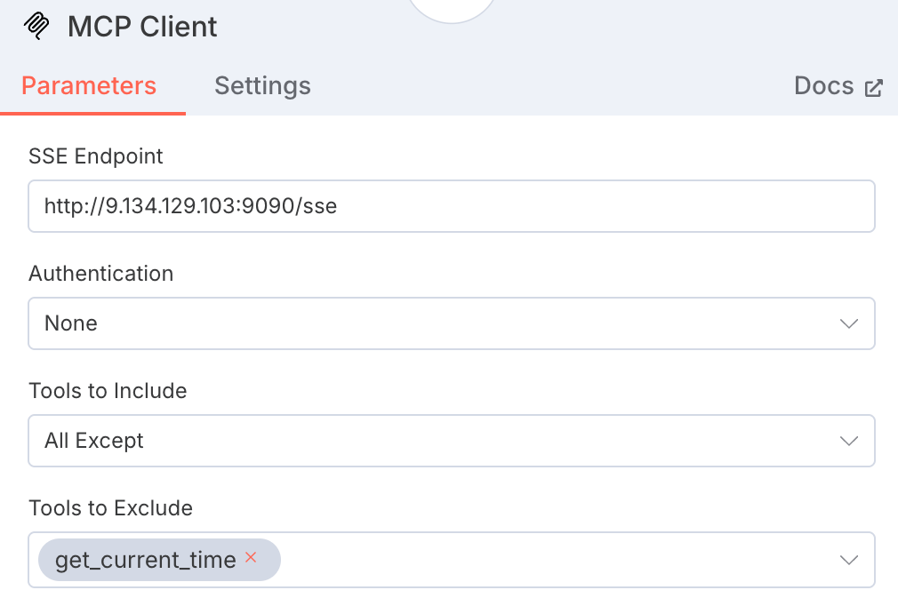

- n8n + mcp实践小计
	- 使用docker composer[安装](https://github.com/RTsien/n8n-hosting/tree/main/docker-compose/withPostgres)
	- 遇到的坑
		- {:height 413, :width 428}
		   {:height 109, :width 718}
		  开始问答的时候像上图这样报错，git-voyager的 get_current_time的属性描述不太符合n8n的要求，parameters即使没有，也要求有个空{}。最终在mcp client配置里排除这个工具解决了 {:height 307, :width 437}
		-