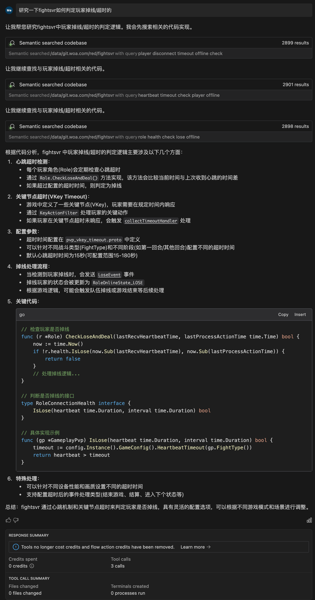
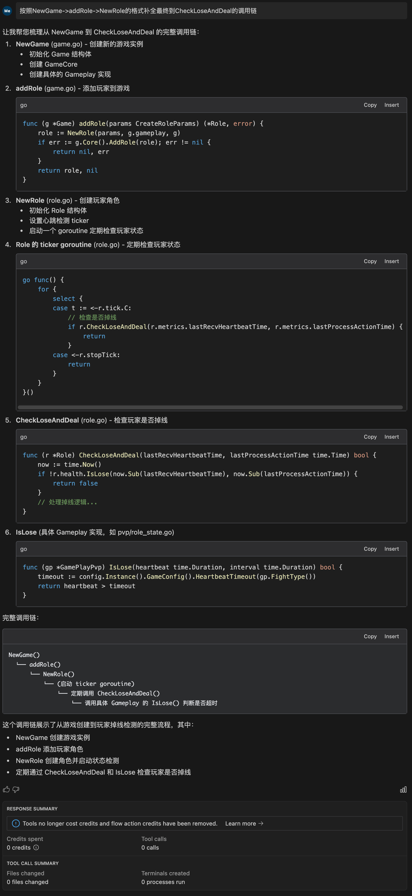

- #RED/fightsvr 战斗时如何判定玩家掉线
	- windsurf+swe-1的回答
		- {:height 1116, :width 466}
		-
		- 上面还是比较准确的，对于玩家从来没有进入过战斗的场景，核心在于
			- ```go
			  func (r *Role) CheckLoseAndDeal(lastRecvHeartbeatTime, lastProcessActionTime time.Time) bool {
			      now := time.Now()
			      if !r.health.IsLose(now.Sub(lastRecvHeartbeatTime), now.Sub(lastProcessActionTime)) {
			          return false
			      }
			      // 处理掉线逻辑...
			  }
			  ```
			- {:height 1167, :width 521}
- #RED/fightsvr pvp如何开战
	- 流程图由windsurf生成
		- {{renderer code_diagram,mermaid}}
		  collapsed:: true
			- ```mermaid
			  sequenceDiagram
			      participant C1 as 玩家1客户端
			      participant C2 as 玩家2客户端
			      participant S as 服务器
			      
			      %% 初始状态
			      Note over S: 状态: State_ROUND_END
			      
			      %% 玩家1发送2002消息
			      C1->>S: 发送2002(ROUND_BEGIN)
			      activate S
			      S->>KeyActionFilter: OnAction(玩家1, 2002)
			      KeyActionFilter->>S: 创建ActionReport
			      KeyActionFilter->>S: 启动超时计时器
			      deactivate S
			      
			      %% 玩家2发送2002消息
			      C2->>S: 发送2002(ROUND_BEGIN)
			      activate S
			      S->>KeyActionFilter: OnAction(玩家2, 2002)
			      KeyActionFilter->>S: 收集到所有玩家消息
			      KeyActionFilter->>S: 取消超时计时器
			      KeyActionFilter->>GameCore: dispatch(KeyActionEvent)
			      deactivate S
			      
			      %% 事件处理
			      activate S
			      GameCore->>GameCore: OnEvent(KeyActionEvent)
			      GameCore->>GamePlay: ProcessAction(2002)
			      GamePlay->>GameCore: 更新游戏状态
			      GameCore->>S: 状态变更为State_ROUND_BEGIN
			      
			      %% 广播状态更新
			      S-->>C1: 广播状态更新
			      S-->>C2: 广播状态更新
			      deactivate S
			      
			      %% 超时处理（备选流程）
			      alt 超时未收齐
			          KeyActionFilter->>S: collectTimeoutHandler
			          S->>GameCore: OnVkeyTimeoutSettle
			          GameCore->>S: 处理超时逻辑
			      end
			  ```
	- ```客户端2002消息 
	  → KeyActionFilter.OnAction (收集同步) 
	  → dispatch KeyActionEvent 
	  → GameCore.OnEvent (业务处理)
	  → 更新游戏状态
	  ```
	- **状态机驱动**：
		- Action处理不直接修改游戏状态
		- 真正的状态变更由Event处理通过状态机驱动
	- 2002消息的处理分为两个阶段：Action处理和Event处理。
	  Action处理负责消息的收集和同步，确保所有玩家都准备好；
	  Event处理负责实际的游戏逻辑和状态更新。这种设计分离了网络同步和业务逻辑，使系统更易于维护和扩展。
- #RED/fightvr action和event的 主要区别
	- **职责不同**：
		- Action处理：负责消息的收集、同步和验证
		- Event处理：负责状态转换和业务逻辑
	- **触发时机**：
		- Action处理：在收到网络消息时立即触发
		- Event处理：在所有玩家同步完成后触发
	- **并发控制**：
		- Action处理：需要处理并发，使用互斥锁保护共享状态
		- Event处理：在单线程中顺序处理，不需要额外的并发控制
	- **错误处理**：
		- Action处理：主要处理网络和协议层面的错误
		- Event处理：主要处理业务逻辑错误
	- **协作关系**：
		- Action处理是Event处理的前置条件
		- Action处理确保所有玩家都准备好后，才会触发Event处理