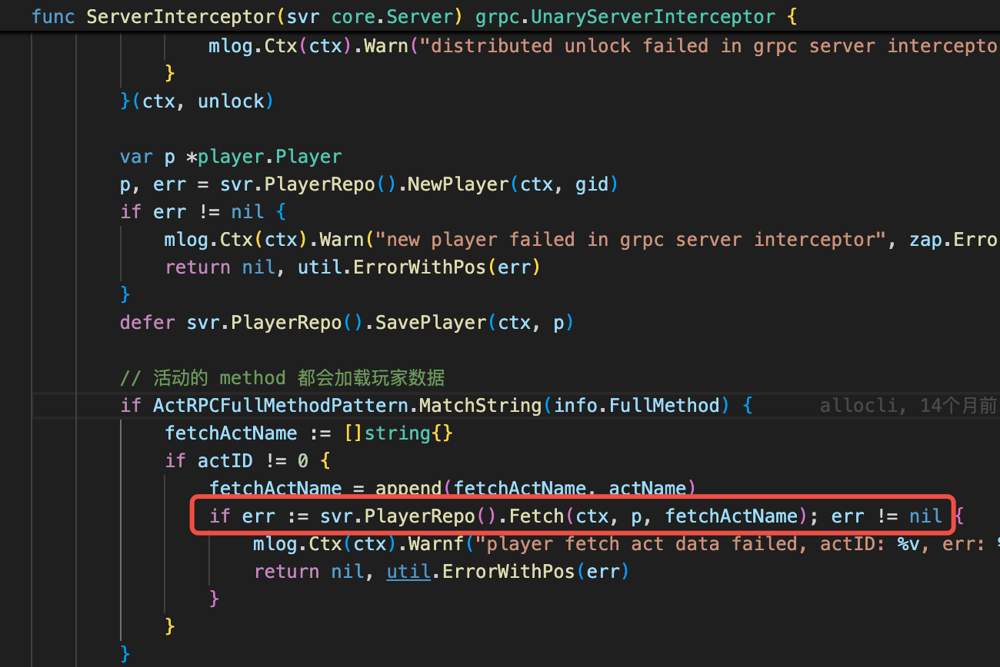
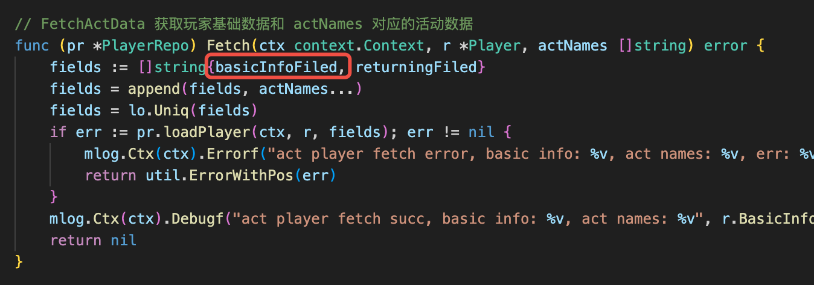
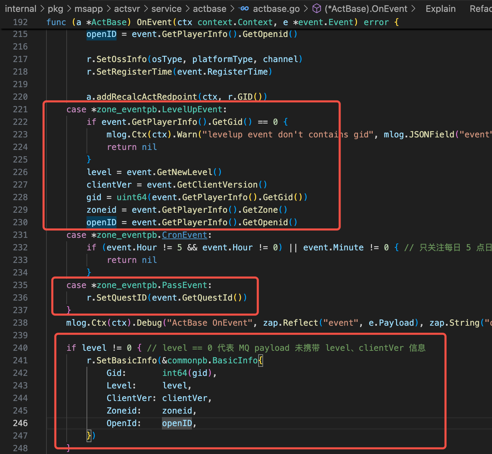
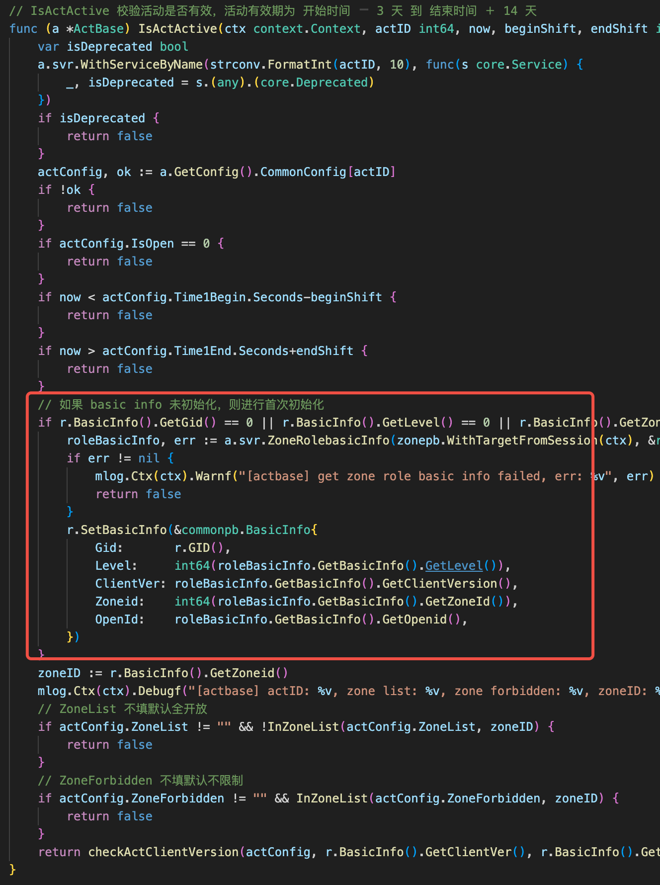

- #RED/actsvr 活动的开启条件，比如等级区间、最小通关id这些的校验，是通过ctx存储的Player结构体里的BasicInfo进行判断的。
	- BasicInfo的来源是tcaplus的存储，收到event的时候也会更新相应的信息。
	  collapsed:: true
		- 拦截器：
		  {:height 235, :width 477}
		- 获取每一个活动信息的时候，都会尝试获取BasicInfo：
		  {:height 207, :width 490}
		- 根据event更新数据：
		  {:height 431, :width 468}
		- 如果从未初始化，也会调用zonesvr直接查询获得：
		  {:height 555, :width 408}
		  上面的拦截器里在Fetch数据之后，就会间接调用这个函数：
		  `ServerInterceptor -> PreCheckActOpeningState -> IsActActive`
	- ProcessActiveActFlow先判断活动是否生效(IsActActive)->然后判断是否开启(ProcessActFlow, BasicInfo就在这里被使用)