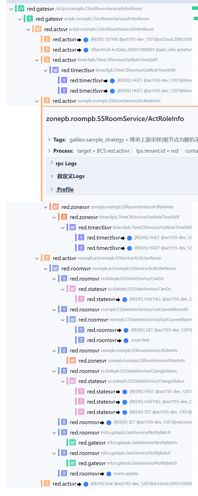
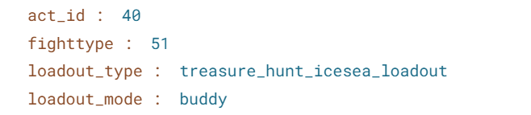
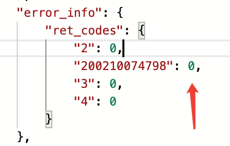
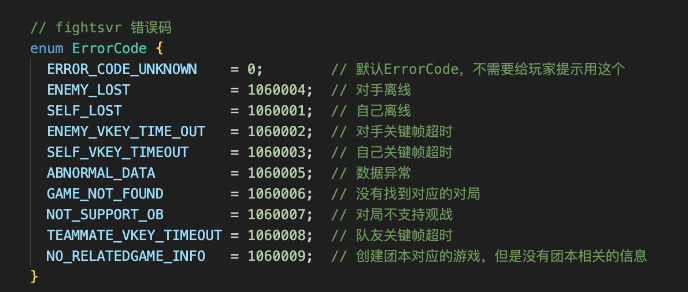
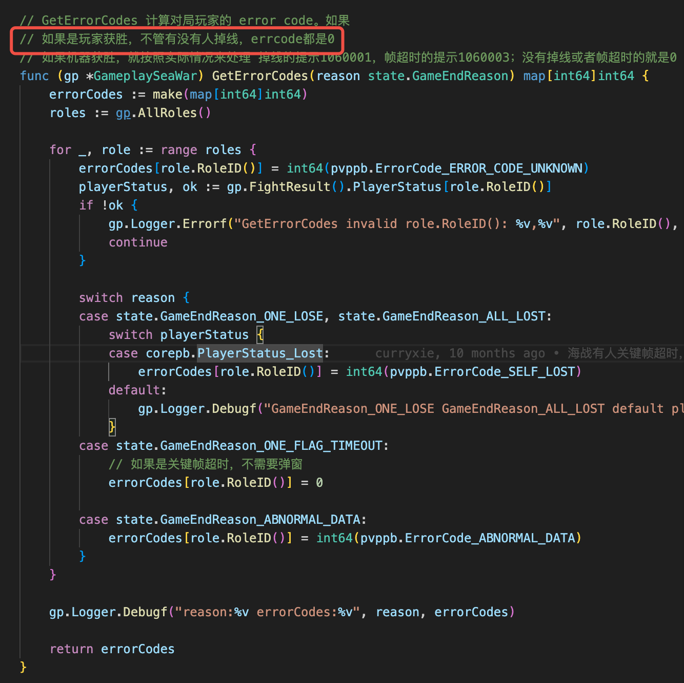

- #RED/roomsvr 活动房间，玩家进入房间的时候，会调用zonesvr上的阵容接口，这就要求必须在zone上实现阵容接口
	- {:height 552, :width 270}
	  ActRoleInfo入参：
	  {:height 117, :width 512}
- #RED/fightvr 客户端在pvp战斗里如果后台通知的zonepb.GameOverNtf是正常结算状态（retCodes），需要流程图来触发结算界面的显示。只有异常结算状态，才会立即进行处理。
	- {:height 157, :width 252}
	  {:height 236, :width 457}
	- 海战的和PVP的不一样，海战的收到结算包后直接打开了结算界面，PVP的只有异常才会显示异常提示，然后打开结算界面。从fightsvr的代码看，海战的确是不管有没有人掉线，获胜了，retCodes就是0。
	  {:height 466, :width 431}
- #RED/actsvr 战区排行榜抄148活动