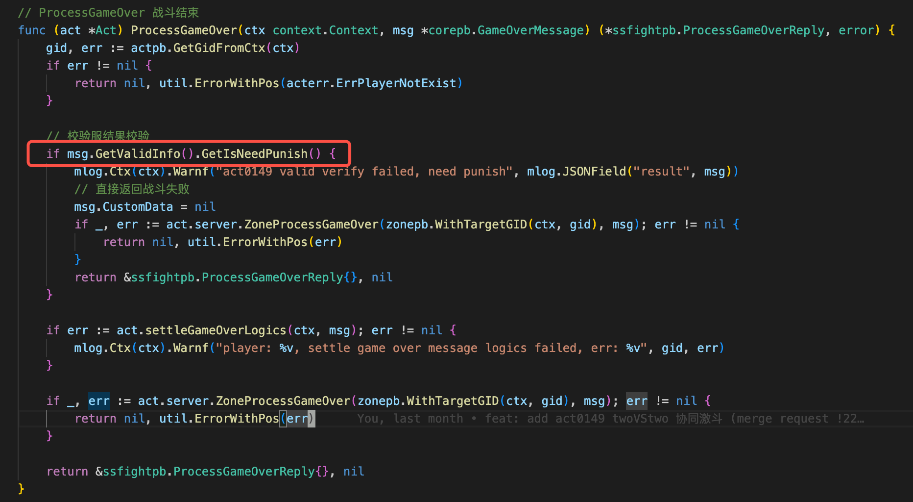

- #LLM/Prompt  gemini做的提示词工程研究
	- 网页式 https://gemini.google.com/share/e2dad471e4ae
	- 互动式 https://gemini.google.com/share/9980903a2874
	- 多智能体框架 https://gemini.google.com/share/15c419bb87d5
		- 一个智能体的“信念”不是单一的。它们是LLM的静态预训练知识、从外部数据库检索的最新信息（RAG），以及对当前对话的结构化记忆（即对话状态）的动态组合。
- #RED/校验服 pvp如果同步/半同步发现作弊，整个对局都作废，不论作弊方还是正常方。如果开战需要消耗道具的话，需要小心处理。
  
- #分布式事务 https://gemini.google.com/share/670eec557149 gemini总结的 分布式存储系统的一致性与隔离性 报告
-