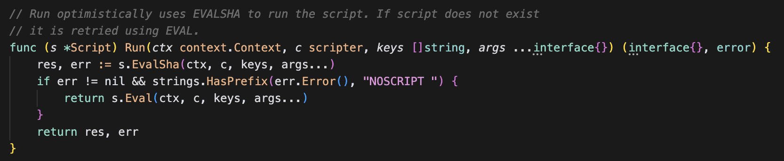
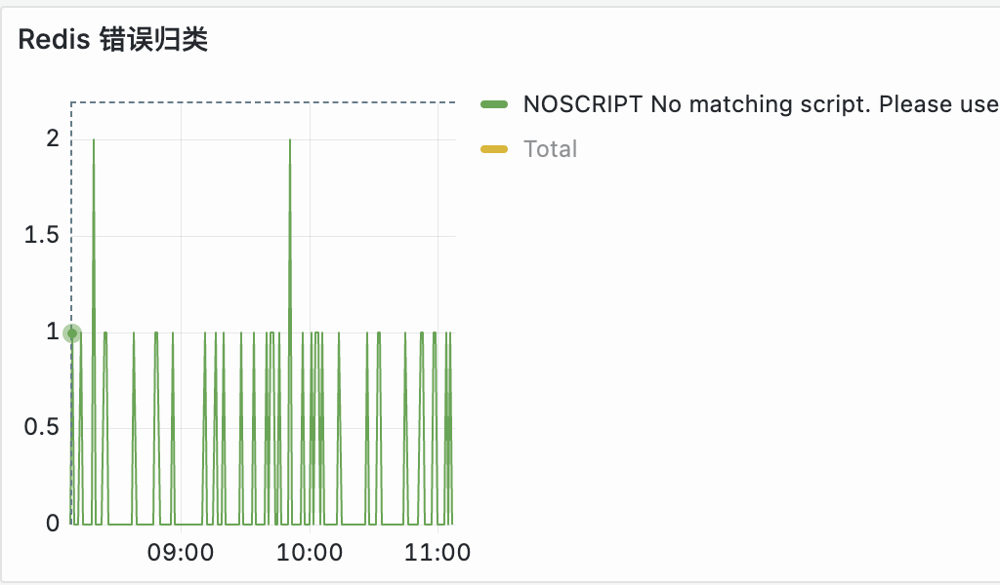
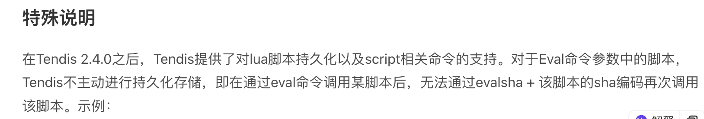

- #RED/redis feato使用evalsha的地方了，是ms-go的redis 锁unlock的时候会先尝试EvalSha，然后用Eval。
  看监控没有eval的错误，业务层面的确应该没有什么风险。
  
  {:height 206, :width 372} 
  报错的redis是tendis存储版，看他们的文档是说普通的eval命令不会自动缓存脚本，所以evalsha一直没办法命中缓存也算解释得通。。。
  http://tendis.cn/#/Tendisplus/%E5%91%BD%E4%BB%A4/eval?id=%e7%89%b9%e6%ae%8a%e8%af%b4%e6%98%8e
  {:height 79, :width 557}