- 写作和输出是更应该锻炼的能力，可以加速知识记忆和内化，比死记硬背更能塑造长期记忆
  {{video https://youtu.be/uVjmBVJvP8s?si=4Xz8lPuRetabjc9g}}
  对于大环境无法改变，那就要想找个人该如何突围。面对高考大而全，侧重记忆力的考察时，核心就是如何**高效**地去记忆**核心知识**：错题艾宾浩斯，每日 review 总结，高效课堂笔记（记下不理解的点，然后马上假设自己已经掌握，并不再纠结，课后通过 ai 对话来研究）。
  找到擅长且热爱的事，留足时间和空间，让长板越来越长。
  锻炼统筹规划和项目管理能力，先从艾宾浩斯和各学科时间自我分配为起点。重要紧急四象限。
  广泛阅读，持续写作。
  养成早起做自己喜欢的事的习惯。短期内可能会觉得最好的时光没有用来学习是种浪费，但是放在二三十年的时间长度，最好的时间做自己最喜欢的事，对睡眠时间的自我校正，对兴趣-热情-努力-成果的自我实现循环的打造却是终身受益价值连城的。自我实现的正向循环，就是人生的意义所在。
	- 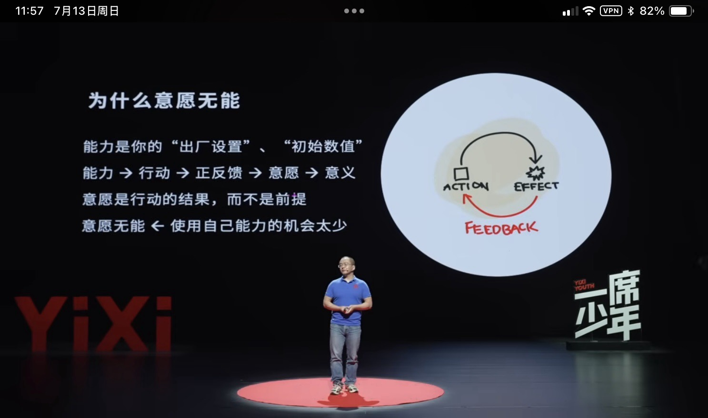   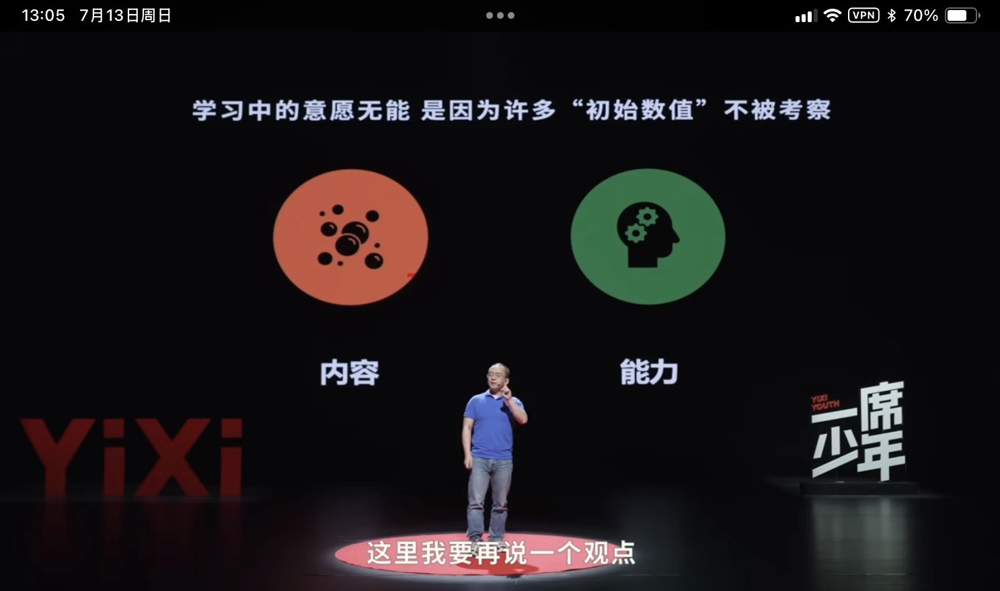   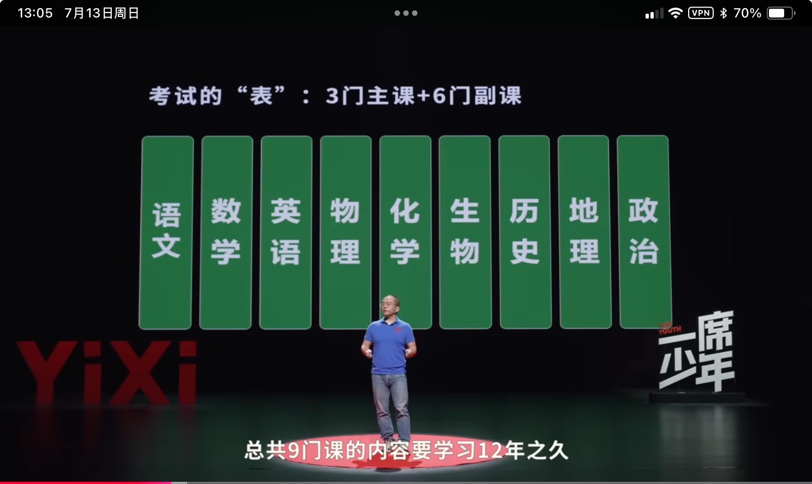   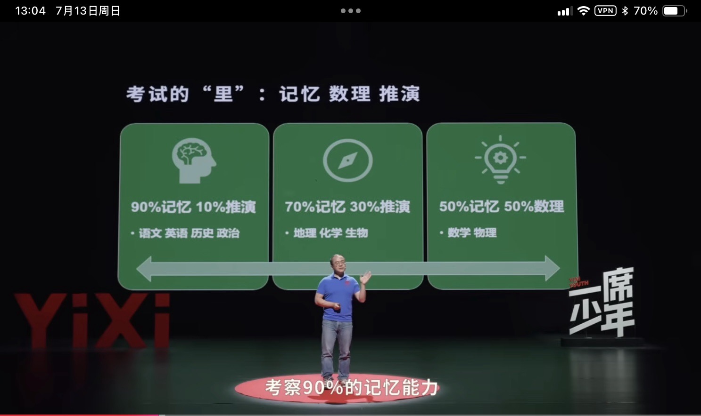  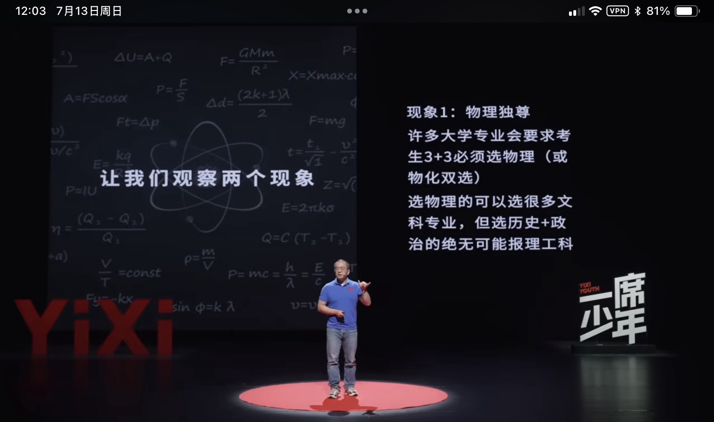  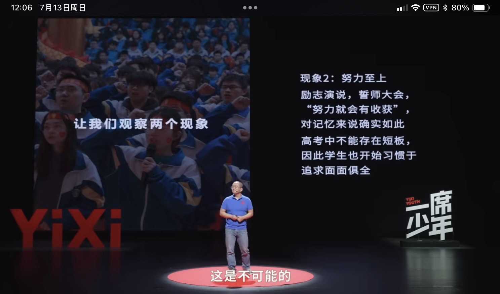  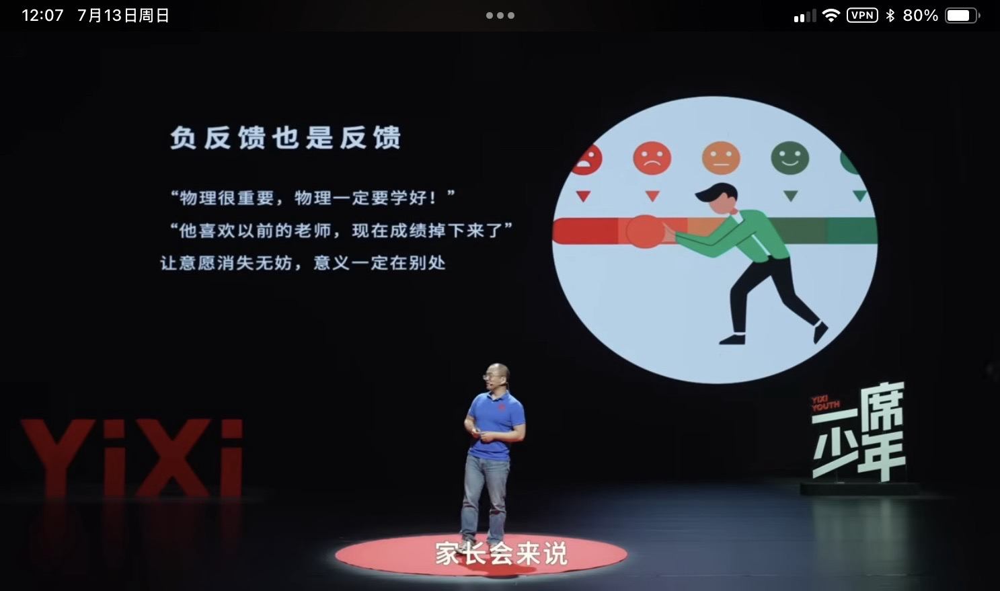  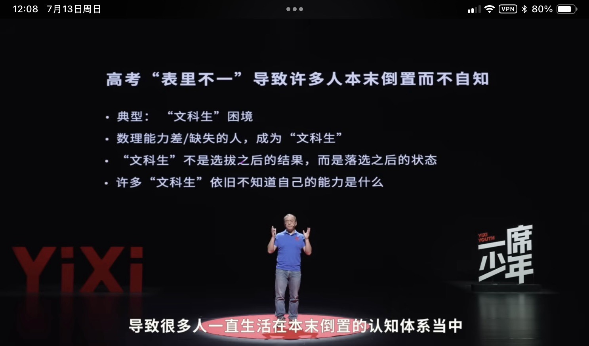  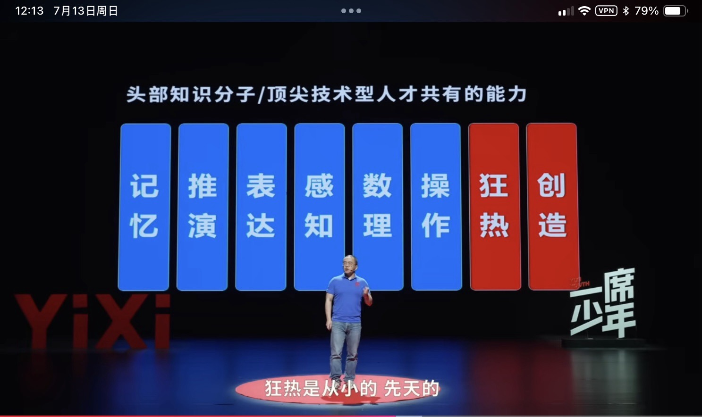 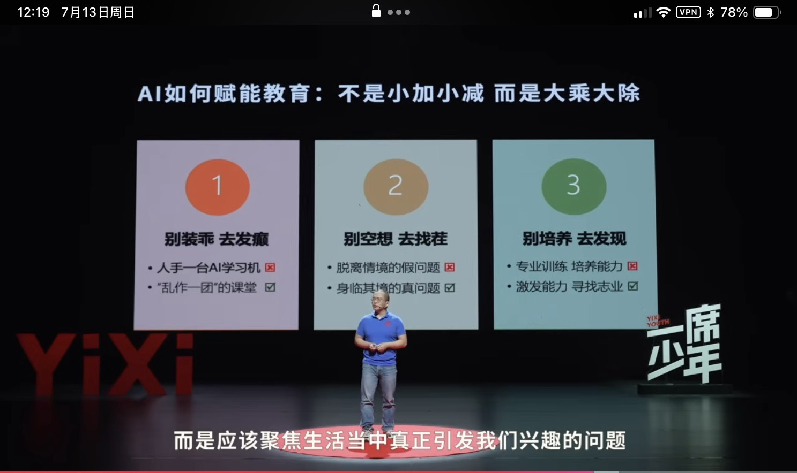  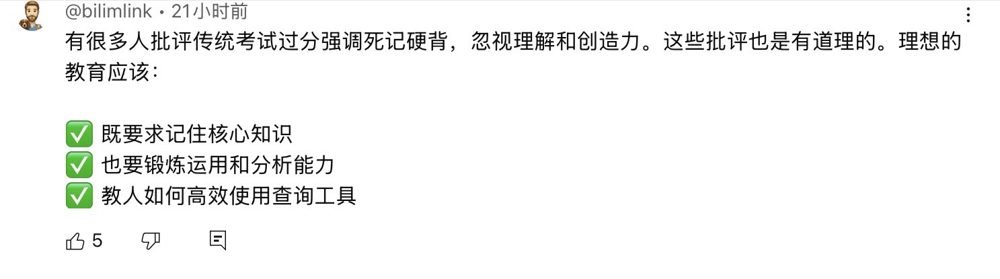  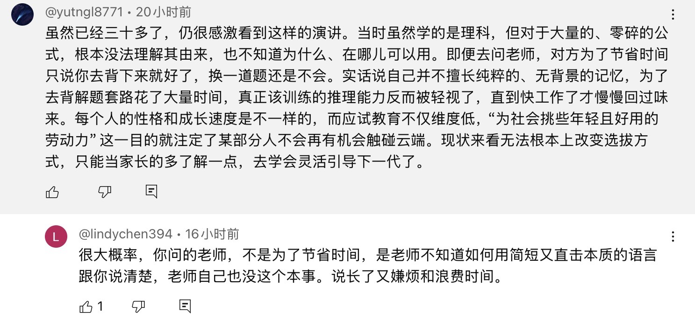
	  :LOGBOOK:
	  CLOCK: [2025-07-13 Sun 12:40:08]
	  :END:
	-