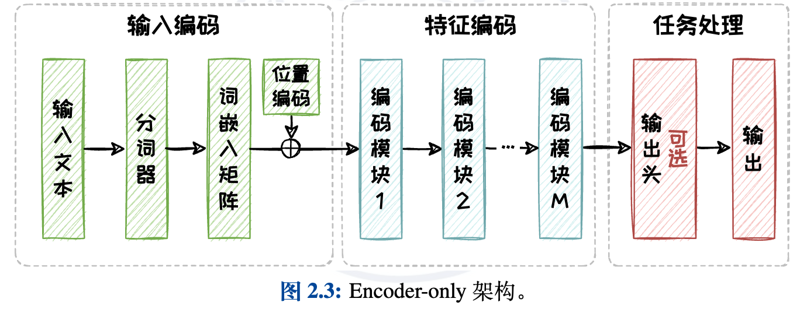
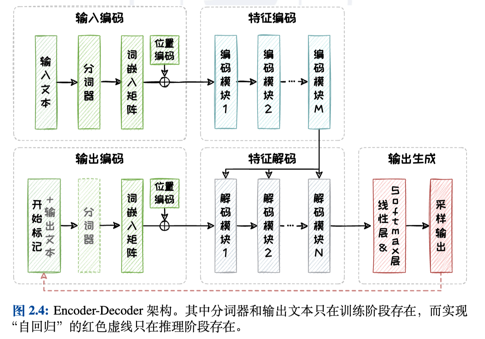
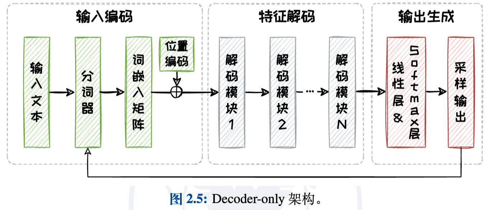

- #LLM 主流模型架构 [ref](https://ima-media-prod.image.myqcloud.com/2/f2DaW8YF8zYnFlfpda0fYP/file_manager/cdb87cd02fb46126f3ef.pdf)
	- Encoder-only：bert
		- 仅选取了 Transformer 中的编码器（Encoder）部分
		- {:height 217, :width 540}
	- Encoder-Decoder：T5、bart
		- Encoder-only基础上引入了一个解码器（Decoder），并采用交叉注意力机制来实现编码器与解码器之间的有效交互
		- 
	- Decoder-only：gpt
		- Decoder-only 架构摒弃了 Encoder-Decoder 架构中的编码器部分以及与编码器交互的交叉注意力模块
		- 