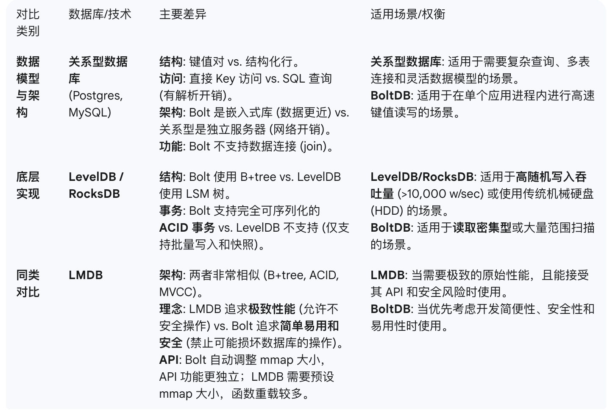
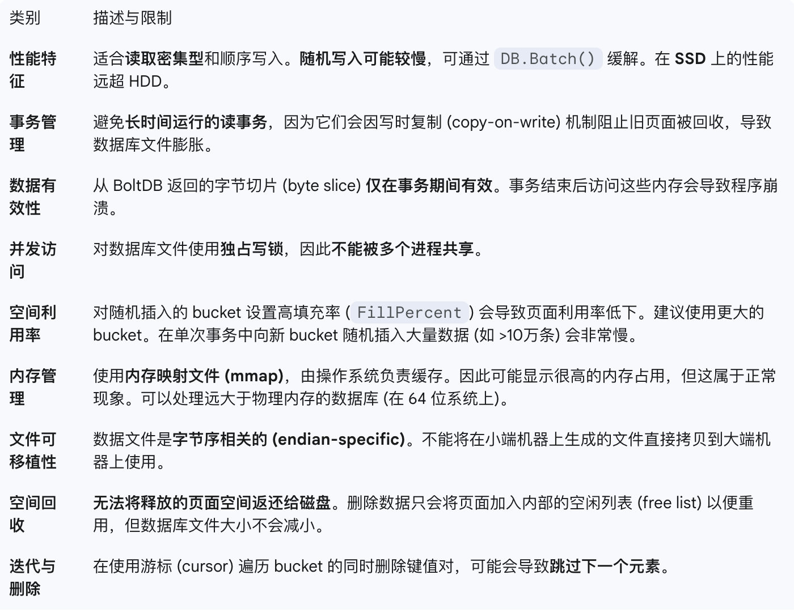

- [[gatesvr的热迁移实现]] #RED/gatesvr
- #LLM/技巧 让claude code分析代码实现，用表格生成
	- > Q: analyze the graceful shutdown/restart flow, describe with chart is prefered
	  > A: I'll analyze the graceful shutdown/restart flow in the gatesvr codebase and create a visual chart to describe the process.
- #LLM/技巧 可以让gemini总结知识库，然后生成anki卡组（csv格式）
- #etcd [[bbolt]]]的技术特点： 使用b+树，而不是leveldb的lsm树
	- 
	- 
- #数据库 https://github.com/tidwall/buntdb 基于b树的多索引内存数据库
	- 相比google/btree会多出来value的序列化和反序列化的成本，但是足够简单通用
	- ```go
	  db, _ := buntdb.Open(":memory:")
	  db.CreateIndex("last_name_age", "*", buntdb.IndexJSON("name.last"), buntdb.IndexJSON("age"))
	  db.Update(func(tx *buntdb.Tx) error {
	  	tx.Set("1", `{"name":{"first":"Tom","last":"Johnson"},"age":38}`, nil)
	  	tx.Set("2", `{"name":{"first":"Janet","last":"Prichard"},"age":47}`, nil)
	  	tx.Set("3", `{"name":{"first":"Carol","last":"Anderson"},"age":52}`, nil)
	  	tx.Set("4", `{"name":{"first":"Alan","last":"Cooper"},"age":28}`, nil)
	  	tx.Set("5", `{"name":{"first":"Sam","last":"Anderson"},"age":51}`, nil)
	  	tx.Set("6", `{"name":{"first":"Melinda","last":"Prichard"},"age":44}`, nil)
	  	return nil
	  })
	  db.View(func(tx *buntdb.Tx) error {
	  	tx.Ascend("last_name_age", func(key, value string) bool {
	  		fmt.Printf("%s: %s\n", key, value)
	  		return true
	  	})
	  	return nil
	  })
	  
	  // Output:
	  // 5: {"name":{"first":"Sam","last":"Anderson"},"age":51}
	  // 3: {"name":{"first":"Carol","last":"Anderson"},"age":52}
	  // 4: {"name":{"first":"Alan","last":"Cooper"},"age":28}
	  // 1: {"name":{"first":"Tom","last":"Johnson"},"age":38}
	  // 6: {"name":{"first":"Melinda","last":"Prichard"},"age":44}
	  // 2: {"name":{"first":"Janet","last":"Prichard"},"age":47}
	  ```