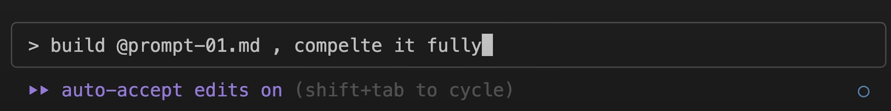

- 六边形占领格子的demo #RED https://claude.ai/public/artifacts/ac28bb3c-f67a-4113-93c0-3e33a192c838
- #n8n 可以跟claude code结合一下？或者让claude code直接编写n8n工作流xml？或者使用n8n mcp。
  id:: 68c838e2-ea68-4991-8a52-c674ad47d454
	- https://github.com/czlonkowski/n8n-mcp 下面两个视频都是用的这个n8n mcp，官方本身提供了[提示词](https://github.com/czlonkowski/n8n-mcp/blob/main/README.md#-claude-project-setup) #[[LLM/my mcp list]]
	- [Claude Code can build any AI Agent in n8n… just watch](https://www.youtube.com/@DavidOndrej) 这个视频竟然没有给出来使用的提示词。。。
		- 
	- [Claude Code Can Build N8N Workflows For You!](https://www.youtube.com/@leonvanzyl) 这个视频给出了他打磨过的[提示词](https://github.com/leonvanzyl/n8n-workflows/tree/main/2025/claude-code)
		- 还是用了playwright的方式直接操控网页创建工作流
- [[n8n]]可以拿来干什么呢？
	- 通过聊天机器人告诉n8n获取豆瓣最近高分电影
	- 把流水线打包成mcp？
	- 用来监听tapd webhook，检查bug单，尝试分析并给出报告
	- 【剪映爆肝时代结束🤯！我用n8n和飞书多维表格和剪映小助手搭建了AI员工，一键视频剪辑、声音克隆，效率飙升87倍，比人工剪的好太多了，快来围观！-哔哩哔哩】 https://b23.tv/cT5kTw2
	- 【🚀 n8n零代码构建NanoBanana图像工厂web应用！-哔哩哔哩】 https://b23.tv/6pusXGd
	- 【【红杉访谈】n8n创始人深度解析转型之路，如何打造AI自动化通用层-哔哩哔哩】 https://b23.tv/EXaN84e
	-
	- Claude opus 直接生成页面，调用 n8n 的 webhook
	- [學會 n8n 為你省下 80% 時間！(EP.2) 這個 AI 助理只認你這個主人，不但使命必達且全天候待命！](https://www.youtube.com/@papayaclass)
	  id:: 68c981fb-b706-4ec4-b7fa-9567e777dd8a
		- 可以结合iphone捷径，直接语音跟n8n流水线对话
		- iphone捷径触发对话，n8n里面接入多项专用mcp，就可以成为专用增强助理