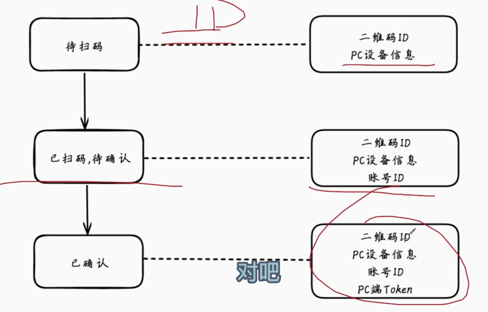
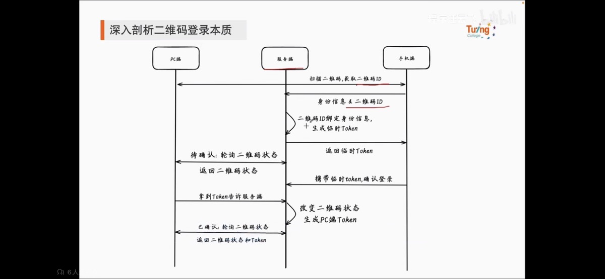

- [[Zettelkasten本质上是一种渐进式总结方法]] [ref](https://blog.jimmylv.info/2020-06-03-zettelkasten-in-action/) #卡片盒笔记 #学习方法
- 在重点知识的反复重复与关联中能不断挖掘出新东西，不断的强化基础太重要了 #灵感 #学习方法
- 通过不断增强的成就感，来激发学习的惯性 #学习方法
	- 先学会如何学习，再研究如何[[培养习惯]]。
	- 习惯的养成需要掌控[[多巴胺]]，而学习获得的成就感就是掌控多巴胺的重要武器。
	- 越学越有心得，越学越想学，习惯自然就养成了。
- [[多巴胺]]会降低记忆力？#学习方法
	- 原文 [Asap Science 双语精读丨每天都在学还是觉得效率低？如何学习得更快](https://dict.eudic.net/webting/videoplay/46f95040-f949-11ed-80ea-005056866eda?ua=/eusoft_ting_en_iphone/9.7.0/35E73269-3F60-4860-956C-23565895C4B6_mac_02:00:00:00:00:00/)
	- This finding highlights how reward motivation promotes memory formation, via the release of **fewer** neurotransmitter dopamine in the hippocampus prior to learning. 感觉这句话应该是错的，应该是更多的多巴胺分泌促进了记忆。
	  id:: 6493e8c0-22bb-4a1d-b995-7d15562d4ef6
	- 最终找到了原版youtube视频，看了一下其实是feel-good，并不是fewer
		- {{video https://youtu.be/B9SptdjpJBQ?t=198}}
		- {{youtube-timestamp 200}}
	- [[卡片盒笔记]]和[[艾宾浩斯]]([[anki]])仍然是主线
	- 辅助：
		- 保持水份，保证睡眠，多运动
		- 重复的时候加点微小的变化
		- 手写笔记
		- 助记符
		- 大声念出来
		- 奖励机制
- id:: 6494671b-60ef-4856-8b11-c10196bf75e9
- [如何在六个月学会任何一门语言？](https://dict.eudic.net/webting/Play?id=d8d8d9ee-8efb-11e8-b55b-000c29ffef9b&order=0&ua=%2Feusoft_ting_en_iphone%2F9.7.0%2F35E73269-3F60-4860-956C-23565895C4B6_mac_02%3A00%3A00%3A00%3A00%3A00%2F) #学习方法 #英语
  id:: 64946cd6-7fc4-40c3-9689-2da71f2c832c
	- Attention, meaning, relevance and memory.
	- principles
		- So, the first rule, first principle for learning a language is focus on language content that is relevant to you, which brings us to tools. [[贴近需求，为我所用]]
		  logseq.order-list-type:: number
		- So the second principle for learning a language is to use your language as a tool to communicate right from day one. [[现学现用]]
		  logseq.order-list-type:: number
		- When you first understand the message, then you will acquire the language unconsciously. So, comprehension works. Comprehension is key and language learning is not about accumulating lots of knowledge.
		  logseq.order-list-type:: number
		- In many, many ways it's about physiological training. Because we have filters in our brain that filter in the sounds that we are familiar with and they filter out the sounds of languages that we're not. Speaking takes muscle.
		  logseq.order-list-type:: number
		- And the final principle is state. Psycho-physiological state. If you're sad, angry, worried, upset, you're not going to learn. Period. If you're happy, relaxed, in an Alpha brain state, curious, you're going to learn really quickly. 
		  logseq.order-list-type:: number
		  And very specifically you need to be tolerant of ambiguity. If you're comfortable with getting some, not getting some, just paying attention to what you do understand, you're going to be fine, you'll be relaxed and you'll be learning quickly.
	- actions
		- Number one: Listen a lot.
		  logseq.order-list-type:: number
		- The second action is that you get the meaning first, even before you get the words. [[先理解含义，而不是搞明白每个单词]]，手势和表情都能帮方理解
		  logseq.order-list-type:: number
		- The third action: Start mixing. You probably have never thought of this but if you've got 10 verbs, 10 nouns and 10 adjectives, you can say 1000 different things. [[多造句]]
		  logseq.order-list-type:: number
		- Focus on the core. [[核心单词]]
		  logseq.order-list-type:: number
		- So you get yourself a language parent, who's somebody interested in you as a person who will communicate with you essentially as an equal, but pay attention to help you understand the message. [[如果没有这种懂外语的亲朋好友，就需要找在线外教]]
		  logseq.order-list-type:: number
		- The sixth thing you have to do, is copy the face. [[听别人说外语的时候也要看脸，模仿口型和表情]]
		  logseq.order-list-type:: number
		- Well most people learning a second language sort of take the mother tongue words and the target words and go over them again and again in their mind to try and remember them. Really inefficient. What you need to do is realise that everything you know is an image inside your mind, it's feelings. So I call it " one same box, different path" . You come out of that pathway and you build it over time, you become more and more skilled at just connecting the new sounds to those images that you already have, into that internal representation. [[将声音与画面在内心建立关联，而不是英语单词与汉语单词]]
		  logseq.order-list-type:: number
- 快慢指针的作用
	- 把不需要的值去掉，需要的值通过慢指针紧密排列 #算法
- 那如何做好应试呢？这也是我在寻找的答案，我现在可以做的就是以[[如何高效刷算法题]]为研究对象，通过自身实践寻找高效的应试方法。#个人思考 #应试学习法
- 问面试官问题：问招聘期望的岗位所在团队规模，业务阶段，和入职之后首要解决的问题。如果还能问，就问一下对面试比较好的点和需要进步的地方。 #面试
- [[书单]]
  《思辨与立场》作者：理查德.保罗、琳达.埃尔德著 #TODO
  《学会提问》作者：尼尔.布朗、斯图尔特.基利著 #TODO
- [字节二面：如何实现二维码扫码登录？问倒一大片。。-哔哩哔哩](https://b23.tv/PjAwtDP) #系统设计 #card
  card-last-interval:: 4
  card-repeats:: 1
  card-ease-factor:: 2.6
  card-next-schedule:: 2023-06-28T02:59:57.919Z
  card-last-reviewed:: 2023-06-24T02:59:57.919Z
  card-last-score:: 5
  id:: 64947d2d-4b1c-44ca-9b54-2c46e8b716e4
	- {:height 331, :width 521}
	- 已扫码，待确认：我是谁
	- 已确认：我是我
		- 下图里的临时token只能使用一次，保证扫码和确认登陆来自同一个设备
	- 
- [【原子习惯】养成好习惯的最有效方法（放弃目标，建立系统）-哔哩哔哩](https://b23.tv/NQ1zTma)
  先不要定目标，要找到简洁有效的[[方法]][[培养习惯]]  #原子习惯
- 梁漱溟他认为人要解决与物的关系，与人的关系，与自己的关系问题 [weread.qq.com](https://weread.qq.com/review-detail?reviewid=78721157_7F7hRESzP&type=4)
	- 解决与物的关系要用西方科技
	- [[解决与人的关系要回到中国儒学]]
	- [[解决与自己的关系要用印度哲学]]
- [【【Java面试】尴尬，七年经验闻所未闻，简述Mysql的二阶段提交原理？|Mic聊架构-哔哩哔哩】](https://b23.tv/BnM2Q0q)
	- #redolog #binlog #mysql #二阶段提交 #TODO 做一下笔记
- 小学，初中，知识点少，不看笔记，单纯靠脑力记忆就能基本完成学习任务。知识量少，就有机会通过做一定量的习题形成长久记忆，考个好分数。
  到了高中，单纯的记忆，而且往往是短时记忆，无法保证让自己对知识的理解持续堆叠。而且知识量大，如果单纯靠做题来形成长期记忆，需要的题量也更大，陷入题海战术精疲力尽。
  记忆往往是模糊的，断层的，面对稍有生疏的旧知识，估计短时间内靠脑力只能重新把之前做过的推导和总结重走一遍，这就是原地踏步，边学边忘，知识理解始终处于低级阶段，无法应对更复杂的问题。如果有了好的笔记输出，即使记忆模糊，也能快速回顾笔记，在之前精妙的理解上继续积累更高级的知识理解，这样能够规避题海战术。 #个人思考 #学习方法 #应试学习法
- [【山里闭关9天，我悟出了成功的秘密：o|-哔哩哔哩】](https://b23.tv/dopPAUb)
	- [[劳逸结合并不是社会的常态，要自己创造条件]]
	- [[放过自己，享受睡够觉的快乐]]
	  id:: 64948909-925c-4bb0-9abb-e21435ff7b70
	- [[不是成事后才有快乐，而是过程中就要有快乐]]
	- [[不要透支对生命的热爱，持续的进步]]
- N.对《Atomic Habits [[原子习惯]]：建立好习惯打破坏习惯的简单方法 英文原版》的想法 [链接](https://weread.qq.com/review-detail?reviewid=12000383_7xfi7RFxX&type=4) #培养习惯
	- 先在心里想象自己想要成为什么样的人，养成需要的习惯，每完成一次，就增加了身份认同，成就感随之而来。
	- [[要回避坏习惯，而不是靠意志力单抗。]]意志力是有限资源，一旦耗尽，结果往往是报复性的。（意志力这本书）
	- 好习惯可以伴随人为设置的奖励，而坏习惯可以约定惩罚。
	- 习惯跟踪器，每次记录就是一次小的奖励。但是连续记录本身也是一个需要养成的习惯。当连续记录本身变成一个目标是，“动作”可能变形，比如补记，比如计划量只完成一半。
	- 古德哈特定律，「当一个指标变成目标，它将不再是一个好的指标」。
	- [[习惯被养成是因为同一种行为被重复了多次。]]——多重复才是王道。
- [[dfs]] vs [[backtrack]] vs [[bfs]] #算法
	- [[dfs深度优先，使用LIFO(stack)，后进先出，遍历图]]
	- [[回溯算法backtrack，递归隐式使用栈(stack)，遍历树]]
	- [[bfs显式使用队列，FIFO，先进先出，不使用递归。]]队列里存储的是访问到最前端的顶点。
- 深度优先像是一个人走迷宫，广度优先像是一组人朝不同方向走迷宫。广度优先适合最短路径问题。#算法 #算法4
- [[卡片盒笔记]]和[[思维导图]]，都是尽量不设边界 #方法 #个人思考
	- [[卡片盒不设内容边界，不对内容强行分类]]
	- [[思维导图不对结构设定边界，随时都能根据金字塔思维的不同思维方式，方便地调整结构，建立关联]]
- 回溯算法，相当于全排列多叉树，深度优先遍历+剪枝 #backtrack #算法 #labuladong
- 早起做了一个topcode里pdd的[[leetcode]]题，早晨大脑比较耐心一些，不过看到第二道题的时候就完全没有耐心了。一天只做一道题就好，贵精不在多。特别要注意的是套路知识和具体题目反复交叉验证，增强知识网络连接。#方法
- 送礼不是越贵越好（原因：价格没有上限）。
  送礼的核心：投其所好（如做不到不如直接打钱）。
  友好度可以刷（常惦记着对方）。
  只加好友没有用，雪中送炭会有用。
  研究和做艺术不需要人际关系，但出售需要。
  营销的本质是信仰，是商品能提供的价值。
  商品不在商品本身，而是其中所含的情感价值和情绪价值。
  送礼本身是功利性的，金钱代表的不止是金钱，是尊严、是人情，金钱不流动起来没有价值，流动起来就变成了利他行为。
  要考虑清楚用金钱购买的商品，本质上是对商品背后的内容有所需求，很多时候购买是一种囤积行为，有害。
  利他和利己是相互的，奖励别人的利他行为就是利己行为的循环，利他的最终目的是利己。
  初五迎财神，当中的财神实质上是一个人的乐善好施，是其积极参与经济活动，肯用物质的方式肯定别人的价值，他就能挣到钱。
  初六送穷鬼，送的并不是具体的人，而是自己错误的理财观念，比如迷信银行（股票、基金、保险等）能给自己带来金融上的活力，迷信（豪车、房子、彩礼）能为自己产生附加作用，本质上是破铜烂铁，以为上述消费能为自己带来交配权，因此实质上是一种为交配权买单的行为；但[[实际上交配权是一种被过度放大了的社会性需求，而非真正的生存性需求，不值这么多钱。]]
  价值观并非简单地判断是否正确，而要看这种价值观是否对自身有利，是否适合知道自己所属人群的生产生活。
  练摊是为三十岁以上的失业青年提供了一条可选择的道路，并不适合所有职业的人群，要清楚自己的位置、经历、社会背景和真实需求。
  [[送礼在于用物质肯定他人的劳动价值、权利价值和声望价值。]]
  [[为社交行为投资是非常良善的投资行为，不仅仅是简单的利益交换，这个行为背后是有利于社会整体效率提升、有利于人类社会进步的。]]
  在这个社会中，越利他，自己的路就越不会垮，背后的目的在于给予别人一些需要的东西。
  别人的痛苦也是我们的痛苦，国家危难、匹夫有责。
- 回顾对书的划线，也要同时回顾一下上下文，这样才能用自己的语言转换成有效的文献笔记 #卡片盒笔记
- 还是听每日英语听力更舒服，短小的音频，先精听，再看文本，再精听 #英语 #学习方法
	- 实现 接收->反馈->强化 的循环，类似机器学习的神经网络训练
	- 相信大脑的泛化和推理能力（大脑会借助已有知识或者忘掉一部分知识，防止过拟合，建立错综复杂的内容连接网）
- 一到关键时机就熬夜，这个应该是压力导致的，越是有压力越是要放松。听歌，运动，早睡。先做好一两个事再说。 #熬夜 #早睡 #放松
- [[pay receipt]]如何[[跳单]] #云支付 #高可用 #项目经验 #card
  card-last-interval:: 4
  card-repeats:: 1
  card-ease-factor:: 2.36
  card-next-schedule:: 2023-06-28T03:04:46.450Z
  card-last-reviewed:: 2023-06-24T03:04:46.451Z
  card-last-score:: 3
  id:: 649490da-6421-4983-8545-bf8b15c52137
	- 跳单表与订单不同库
	- 新增订单：默认库写失败，写跳单库，并在跳单库写跳单表
	- 历史订单：读和更新，先去跳单库读跳单表，确定读写哪个库。如果跳单库异常，读和更新不可用
	- 保证新订单高可用。历史订单高可用同时受默认库和跳单库影响。
- 为什么[[mysql]]使用[[B+树]]而不是二叉树？ #card
  card-last-interval:: 4
  card-repeats:: 1
  card-ease-factor:: 2.6
  card-next-schedule:: 2023-06-28T03:05:32.974Z
  card-last-reviewed:: 2023-06-24T03:05:32.974Z
  card-last-score:: 5
  id:: 6494917d-0972-4ef9-8db4-7aef89410d1a
	- 因为可以降低层高，减少磁盘重新寻址次数。
	- 如果使用二叉树这种多层级结构，会导致磁盘的多次读取，每读取下一层数据，都是一次磁盘重新寻址。[zhuanlan.zhihu.com](https://zhuanlan.zhihu.com/p/158205230)
- [【自己知识的积累才是工作的剩余财富】](https://help.flomoapp.com/thinking/pkm.html)
	- 剩下暂时用不着的内容何必要整理好，不是在浪费时间吗？我们只需要快速的找到知识，而不是把整理的过程当做目的。
	- 我们写笔记、做知识管理都不是为了写文章发公众号，而是要做出正确的决策。
	- **其次，输出是为了获得高质量的反馈，而不是为了获得他人的关注。**
- 《[[卡片盒写作法]]》不要想着跳过当前通用的方法，执着于直接研究最新最酷的方法。判断新方法是否真的有效，需要对通用方法的熟练掌握，才能判断出哪些是真的方法，哪些是假的方法。#卡片盒笔记
- 笔记驱动，而不是博客驱动。自我命题的博客，带来的是紧张的时间，匆忙的阅读和拷贝，知识孤立，写后就忘。 #知识管理 ((64948909-925c-4bb0-9abb-e21435ff7b70))
- [km.woa.com](https://km.woa.com/group/47322/articles/show/488472?kmref=vkm_push)
  [[度量]]需要根据不同视角进行分层，管理层、研发工程师、改进人员关注的指标存在差异。#软件工程
	- 面向管理人员：需要快速发现异常并找到原因。
	- 面向开发人员：需要具备任务处理过程中的偏差展示与提醒。
	- 面向改进人员：需要关联影响因素分析，找到最关键的改进点。
- 回顾对书的划线，也要同时回顾一下上下文，这样才能用自己的语言转换成有效的文献笔记 #卡片盒笔记
- [km.woa.com](https://km.woa.com/articles/view/570313)
	- c重写go来支持simd操作。
	- simd 单指令多数据
	- 还不能很好的理解下面的具体含义，需要找一下cgo的资料
	- 引用：
	- 调用C函数的时候，必须切换当前的栈为线程的主栈，这带来了两个比较严重的问题：
	- 线程的栈在Go运行时是比较少的，受到P/M数量的限制，一般可以简单的理解成受到GOMAXPROCS限制； 由于需要同时保留C/C++的运行时，CGO需要在两个运行时和两个ABI（抽象二进制接口）之间做翻译和协调。这就带来了很大的开销。
	- #go
	- **高性能c代码方法：**
	- 1）loop unrolling
	- 2）SIMD
	- 3)减少cache miss
	- 4)减少函数调用开销
	- 5)减少分支
	- 6)Strength reduction
- 投资配比 [www.youtube.com](https://www.youtube.com/watch?v=YdXG2oMhns0) #方法
	- 25% 指数基金 500w
	- 15% 公司个股 300w
	- 50% 房地产 1000w
	- 10% 现金及其他 200w
	- 当前配比：
		- 0w 0% -> 适当买入指数基金
		- 60w 7%
		- 800w 92%
		- 10w 1% -> 提高现金储备
	- 参考书目：Millionaire Teacher (calibre)
- 得分清突破舒适区和作死 [mp.weixin.qq.com](https://mp.weixin.qq.com/s/786GNK21iOjZ442dK22eaA) #方法
	- 年龄越大，越要做自己擅长的事
- 在没规律的人生中做些规律的事，让身心沉静下来 #自省 #个人思考
- [youtu.be](https://youtu.be/ZuItzDktDiI) 3:00
	- 听英语博客，要听有意义有趣的内容，要愿意听下去，并且听完有文本可以对照，然后再多听一遍或者几遍 #英语 #方法
- [youtu.be](https://youtu.be/4zXTyc2ZjXM) 8:00
	- 为什么[[早起]]？ [[早起是和时间田忌赛马]]
	- 个人解读：[[早起打扰最少，压力最小，跟深夜学习越学越上瘾异曲同工]]
	- 1 早起先喝一大杯水
	- 2 出去散步，稍微运动一下，醒神
- [mp.weixin.qq.com](https://mp.weixin.qq.com/s/1LVSQTRDcYRCmDLaRemgiA)
	- [[生活中的政治正确就是低调，做坏事骗人才需要虚张声势。]]
- There's definitely a sense that the world's kind of a dangerous and unpredictable place.#英语
- She needs a **respite** after a long journey. #英语 #card
  card-last-interval:: 4
  card-repeats:: 1
  card-ease-factor:: 2.6
  card-next-schedule:: 2023-06-28T03:07:15.025Z
  card-last-reviewed:: 2023-06-24T03:07:15.026Z
  card-last-score:: 5
  id:: 64949708-333d-47af-b48e-2adf779a88c6
	- 在长途旅行后，她需要休息缓冲下。
- [[方法]]学的挺多的了，开始实践吧。
	- 英语：[[艾宾浩斯]]背单词，语法
	- 算法：leetcode [[艾宾浩斯]]
	- 健身：哑铃 训记
	- rust/存储：边学，边实践，github业务项目
- **Most often** we procrastinate when **faced with** something we do not want to do. #英语 #card
  card-last-interval:: 4
  card-repeats:: 1
  card-ease-factor:: 2.6
  card-next-schedule:: 2023-06-28T03:09:31.593Z
  card-last-reviewed:: 2023-06-24T03:09:31.594Z
  card-last-score:: 5
  id:: 6494972a-7af9-4673-8764-40247f999553
	- 面对不想做的事情，我们经常拖延
- 如果“建筑师”更重要建议就多坚持。自我实现满足感更重要就建议换合适的目标、丰富生活内容。超越同龄人的优越感更重要就早日认清现实的多样。 [如何评价王垠的《相对论推导练习》？ - 知乎]([www.zhihu.com](https://www.zhihu.com/question/558302771))
- 把大部分事情安排到早上做，最早可以倒推到4点半，这样效率会高很多。晚上就要10点半之前睡了。
- 今天我们学习一个短语，叫做be behind in sth.动词你也可以换成fall，介词用with也可以。所以还可以说be behind with sth.fall behind in sth.或者fall behind with sth.都是一个意思，表达：be late in paying money or completing work“付款或者完成工作的时候晚了”； eg: She’s fallen behind with the payments.她付费迟了。/她付费晚了。/她付费逾期了。 eg: He was terribly behind in his work.他工作进度严重落后。/他积压了很多工作还没有完成。 #英语
- 学[[语法]]应该先搞清楚整体框架，然后再去试图记住特例的细枝末节 #英语 #学习方法
- You’d think the dreamers would find the dreamers, and the realists would find the realists, but more often than not, the opposite is true. #英语
	- more often than not = usually，much of the time
- 打[[乒乓球]]真舒服，用youtube王楠教学视频里用乒乓球拍前半部打球，进攻稳了很多 #运动
	- https://www.youtube.com/watch?v=XwUC5TfmztE&t=692s
- to admit that one is wrong, usually when doing so triggers great embarrassment or shame #英语
	- “承认自己之前说错了/做错了，（尤其是承认自己错了会带来极大的尴尬、羞辱感的时候）”；
- 认真学习在线文章，还是要有思维导图，能系统化的记忆，有图形的骨架在那里，会比看完不做[[笔记]]，深刻很多。而且用[[思维导图]]很容易做类比，加入自己的理解。
  id:: 649498e0-44a7-4c60-b6ab-720553a69432
	-
- 今天晚上听了 暖心小孩的课，关键词还是：培养自信，拆解目标，降低难度，夸得细节，时刻表达爱。[mooc.oa.com](http://mooc.oa.com/my/course/1138) #家庭 #儿童教育