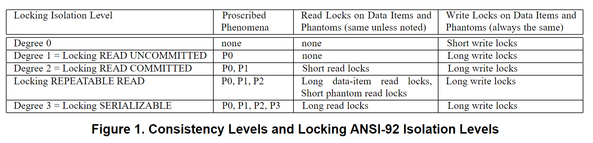

file:: [Generalized_Isolation_Level_Definitions_Atul_Adya_1712920119306_0.pdf](../assets/Generalized_Isolation_Level_Definitions_Atul_Adya_1712920119306_0.pdf)
file-path:: ../assets/Generalized_Isolation_Level_Definitions_Atul_Adya_1712920119306_0.pdf

- Our specifications allow a wide range of concurrency control techniques, including locking, optimistic techniques [20, 2, 5], and multi-version mechanisms [9, 24].
  ls-type:: annotation
  hl-page:: 1
  hl-color:: yellow
  id:: 66191bc4-d65c-4bc8-a2de-3f2508f9aab1
- The goal of this work was to provide improved concurrency for workloads by sacrificing the guarantees of perfect isolation #英语语料
  ls-type:: annotation
  hl-page:: 1
  hl-color:: green
  id:: 66191d84-c752-449f-871c-ce4cf54c08ea
- set the stage for 为...奠定了基础 #英语语料
  hl-page:: 1
  ls-type:: annotation
  id:: 66191f25-bd89-4537-9989-36dd49eb0c64
  hl-color:: green
- Optimism can outperform locking in some environments, such as large scale, widearea distributed systems [2, 15]
  ls-type:: annotation
  hl-page:: 1
  hl-color:: yellow
  id:: 661920ea-85b9-4418-bcbf-f1a284faa516
- It is undesirable for the ANSI standard to rule out these implementations. For example, Gemstone provides serializability even though it does not meet the locking-based rules given in [8]. [8]就是 [[《A critique of ANSI SQL isolation levels》]]
  hl-page:: 1
  ls-type:: annotation
  id:: 66192191-03bf-4952-9086-8fb56cdb5a82
  hl-color:: yellow
- Furthermore, our specifications handle predicate-based operations correctly at all isolation levels.
  hl-page:: 1
  ls-type:: annotation
  id:: 661923b1-7a4f-4ee6-8697-de84819959a4
  hl-color:: yellow
	- 这里的"谓词"通常指的是在程序设计中，用来判断某种条件是否满足的函数或表达式。所以，这句话在说他们设计的规格或系统，无论在什么隔离级别下，都能正确执行和处理这些基于谓词的判断或操作。
- It is difficult to prove completeness for lower isolation levels, but we can easily show that our definitions are more permissive than those given in [8].
  ls-type:: annotation
  hl-page:: 2
  hl-color:: yellow
  id:: 6619248b-864a-406e-a0c9-6b7786187694
	- [8]就是[[《A critique of ANSI SQL isolation levels》]]
- Furthermore, unlike our specifications, their definitions do not take predicates into account.
  ls-type:: annotation
  hl-page:: 2
  hl-color:: yellow
  id:: 661927e6-9bc3-4f7c-b57b-49d96d211a20
	- 怎么理解这句话❓where条件？
- The original proposal for isolation levels [13] introduced four degrees of consistency, degrees 0, 1, 2 and 3, where degree 3 was the same as serializability. That paper, however, was concerned with locking schemes, and as a consequence the definitions were not implementation-independent. However, that work, together with the refinement of the levels provided by Date [11], formed the basis for the ANSI/ISO SQL-92 isolation level definitions [6]. The ANSI standard had implementation-independence as a goal and the definitions were supposed to be less constraining than earlier ones. The approach taken was to proscribe certain types of bad behavior called phenomena; more restrictive consistency levels disallow more phenomena and serializability does not permit any phenomenon. The isolation levels were named R EAD UNCOMMITTED, READ C OMMITTED, REPEATABLE READ, and S ERIALIZABLE ; some of these levels were intended to correspond to the degrees of [13].
  ls-type:: annotation
  hl-page:: 2
  hl-color:: yellow
  id:: 66192da7-ac02-489f-821f-3caa2955e6b9
	- 4个被广泛接受的隔离级别
	- [13] Granularity of locks and degrees of consistency in a shared data base
		- Jim Gray Raymond A. LorieG. R. PutzoluI. L. Traiger
		- Morgan Kaufmann Publishers Inc. eBooks 1998-07-01
		- 💡degrees 0, 1, 2 and 3，仍然是**基于锁实现**描述的
	- [11] Introduction to Database Systems
		- C.J. Date
		- Foundations of database design 2006-01-13
		- 💡对[13]的定义进行改进
	- [6] ANSI X3.135-1992, American National Standard for Information Systems -Database Language -SQL, Nov 1992.
		- 💡期望实现无关，但是最终通过异象来描述，异象定义仍然是**基于锁实现**
- The work in [8] analyzed the ANSI-SQL standard and demonstrated several problems in its isolation level definitions: some phenomena were ambiguous, while others were missing entirely. It then provided new definitions. As with the ANSI-SQL standard, various isolation levels are defined by having them disallow various phenomena
  ls-type:: annotation
  hl-page:: 2
  hl-color:: yellow
  id:: 66192f86-b40e-41ad-b96f-11f76b457574
	- 尝试通过异象定义隔离级别。但实质上定义的时候是基于锁实现的。
	- 4个异象
	  hl-page:: 2
	  ls-type:: annotation
	  id:: 66193096-34f5-46bc-8a14-e708e818e627
	  hl-color:: yellow
	  P0: w1 [x] ... w 2 [x] ... (c 1 or a1 )
	  P1: w1 [x] ... r 2 [x] ... (c 1 or a1 )
	  P2: r1 [x] ... w 2 [x] ... (c 1 or a1 )
	  P3: r1 [P] ... w 2 [y in P] ... (c1 or a1 )
	- [8] [[《A critique of ANSI SQL isolation levels》]]
		- BerensonHal BernsteinPhil GrayJim MeltonJim O'NeilElizabeth
		- Sigmod Record 1995-05-22
		- Histories consisting of reads, writes, commits, and aborts can be written in a shorthand notation: 
		  "w1[x]" means a write by transaction 1 on data item x (which is how a data item is "modified'), 
		  and "r2[x]" represents a read of x by transaction 2. 
		  Transaction 1 reading and writing a set of records satisfying predicate P is denoted by r1[P] and w1[P] respectively. 
		  Transaction 1's commit and abort (ROLLBACK) are written "c1" and "a1", respectively.
	- Proscribing P0 (which was missing in the ANSI-SQL definitions) requires that a transaction T 2 cannot write an object x if an uncommitted transaction T 1 has already modified x. This is simply a disguised locking definition, requiring T 1 and T 2 to acquire long write-locks. (Long-term locks are held until the transaction taking them commits; short term locks are released immediately after the transaction completes the read or write that triggered the lock attempt.) Similarly, proscribing P1 requires T 1 to acquire a long writelock and T 2 to acquire (at least) a short-term read-lock, and proscribing P2 requires the use of long read and write locks.
	  hl-page:: 2
	  ls-type:: annotation
	  id:: 66192e9b-b4ba-4873-9bab-fffedc4d6190
	  hl-color:: yellow
		- #TODO 验证一下mysql在READ UNCOMMITTED隔离级别，会避免P0发生吗（update上行锁，记得是有开关的）
		- P1: 脏读，读到未提交的写
		- P2: 不可重复读，写覆盖了未提交的读
		- P3: 幻读，写覆盖了未提交的（符合查询条件的）集合读中的一部分，比如像集合中插入一个未出现过的符合查询条件的元素
	- Phenomenon P3 deals with the queries based on predicates. Proscribing P3 requires that a transaction T 2 cannot modify a predicate P by inserting, updating, or deleting a row such that its modification changes the result of a query executed by an uncommitted transaction T 1 based on predicate P; to avoid this situation, T1 acquires a long phantom read-lock [14] on predicate P.
	  ls-type:: annotation
	  hl-page:: 2
	  hl-color:: yellow
	  id:: 66193200-6a63-4caf-8090-9ad1253a7934
	- we refer to this approach as the preventative approach.
	  ls-type:: annotation
	  hl-page:: 3
	  hl-color:: yellow
	  id:: 661932e9-88fe-4afa-9242-c03ea4b581f6
	- Figure 1 summarizes the isolation levels as defined in [8] and relates them to a lock-based implementation. Thus the READ UNCOMMITTED level proscribes P0; R EAD COMMITTED proscribes P0 and P1; the REPEATABLE READ level proscribes P0 - P2; and S ERIALIZABLE proscribes P0 - P3.
	  hl-page:: 3
	  ls-type:: annotation
	  id:: 66193328-5034-4964-adaa-e645591b633a
	  hl-color:: yellow
		- 
		- proscribes 排斥 #英语语料 #card
		  id:: 661f7d3c-78fb-43f1-991a-fd347ccacf12
		-
- We now show that the preventative approach is overly restrictive since it rules out optimistic and multi-version implementations. 
  ls-type:: annotation
  hl-page:: 3
  hl-color:: yellow
  id:: 661933ad-8ed5-4e3b-91e8-2bb088442936
- The authors in [8] wanted to ensure that multi-object constraints (e.g., constraints like x + y = 10) are not observed as violated by transactions that request an isolation level such as serializability. They showed that histories such as H1 and H 2 are allowed by one interpretation of the ANSI standard (at the SERIALIZABLE isolation level) even though they are non-serializable: 
  hl-page:: 3
  ls-type:: annotation
  id:: 66194acb-cb39-467d-bf7f-fd891dbcc280
  hl-color:: yellow
  H1: r1(x, 5) w1(x, 1) r2(x, 1) r2 (y, 5) c2 r1(y, 5) w1(y, 9) c1 
  H2: r2(x, 5) r1(x, 5) w1(x, 1) r1 (y, 5) w1(y, 9) c1 r2(y, 9) c2 
  In both cases, T 2 observes an inconsistent state (it observes invariant x + y = 10 to be violated). These histories are not allowed by the preventative approach; H 1 is ruled out by P1 and H 2 is ruled out by P2. 
  Optimistic and multi-version mechanisms [2, 5, 9, 20, 22] that provide serializability also disallow non-serializable histories such as H1 and H 2 . However, they allow many legal histories that are not permitted by P0, P1, P2, and P3. Thus, the preventative approach disallows such implementations. Furthermore, it rules out histories that really occur in practical implementations.
	- 来自 [[《A critique of ANSI SQL isolation levels》]]
	  > We now argue that a broad interpretation of the three ANSI phenomena is required. Recall the strict interpretations are:
	  A1: w1[x]...r2[x]...(a1 and c2 in either order) (Dirty Read)
	  A2: r1[x]...w2[x]...c2...r1[x]...c1 (Fuzzy or Non-Repeatable Read)
	  A3: r1[P]...w2[y in P]...c2....r1[P]...c1 (Phantom)
	  
	  >  H1: r1[x=50]w1[x=10]r2[x=10]r2[y=50]c2 r1[y=50]w1[y=90]c1
	  H1 is non-serializable, the classical inconsistent analysisproblem where transaction T1 is transferring a quantity 40 from x to y, maintaining a total balance of 100, but T2 reads an inconsistent state where the total balance is 60. 
	  The history H1 does not violate any of the anomalies A1, A2, or A3. In the case of A1, one of the two transactions would have to abort; for A2, a data item would have to be read by the same transaction for a second time; A3 requires a phantom value. None of these things happen in H1.
	- 💡异象A是P的严格版，即范围场景(comit/rollback的前/后组合)更窄。严格版(异象A)的ANSI SQL会允许H1和H2的发生。
	  而使用更宽泛的异象定义P，就会不允许H1和H2发生，已经是一个进步了。
	  但是乐观控制、多版本实现会允许一些虽然违反P0, P1, P2, P3但不影响可串行化的例子，后面的段落有具体举例。
	- [2] Efficient optimistic concurrency control using loosely synchronized clocks
		- AdyaAtul GruberRobert LiskovBarbara MaheshwariUmesh
		- Sigmod Record 1995-05-22
		- 💡作者本人的文章，讲了一种乐观并发控制方法，而且没有使用多版本机制
-