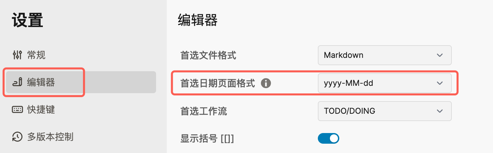
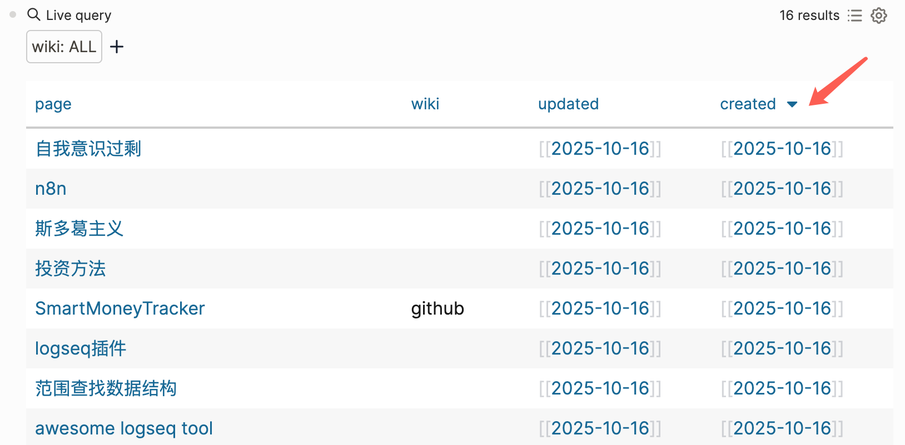

wiki::
updated:: [[2025-10-16]]
created:: [[2025-10-16]]

- 首选日期页面格式最好使用 yyyy-MM-dd的格式
  
- 这样在使用Update Property Mini插件的时候，可以自动插入对应格式的日期到page property
  ```
  updated:: [[2025-10-16]]
  created:: [[2025-10-16]]
  ```
- 最终目的是为了在`query`列表里对created/updated进行正确的(字母序)排序
  