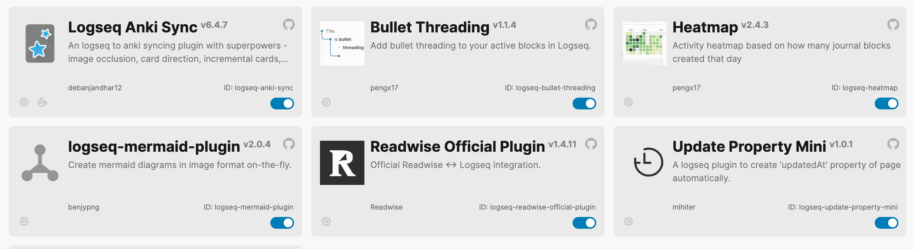

wiki::
updated:: [[2025-10-16]]
created:: [[2025-10-16]]

- 当前使用（🌟代表使用对于提率的贡献度）：
	- logseq-anki-sync 🌟🌟🌟🌟🌟
	- logseq-bullet-threading 🌟🌟🌟🌟🌟
	- logseq-heatmap 🌟🌟🌟
	- logseq-mermaid-plugin 🌟🌟🌟🌟
	  id:: 68efc8a3-2dbe-4f44-be14-a80cd646f041
	- logseq-readwise-official-plugin 🌟🌟🌟🌟
	- Update Property Mini 🌟🌟🌟🌟
	- ~~logseq-awesome-links 🌟🌟🌟~~
	- ~~logseq-tabs🌟🌟🌟~~
	- ~~logseq-woz-theme 🌟🌟🌟🌟🌟~~
- 