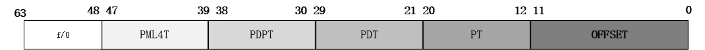

- #linux #linux内存管理机制 #内存分页
- [src](https://zhuanlan.zhihu.com/p/327860921)
- 64位系统支持的虚拟内存地址空间 #card
  id:: 64ae1847-afd9-4202-bea1-a52c2ccd75a2
	- > 在x64体系中只实现了48位的virtual address寻址，理论上48位地址长度可以管理512TB的地址空间，不过x86_64四级页表模型只使用了256TB的虚拟地址空间。其中高16位（48-64位）将填充第47位相同的内容（这种方式类似于符号扩展），这样可以将地址空间分成高128TB的内核空间和低128TB的用户空间
	- 💡高16位内存地址只能为0xFFFF 或者 0x0000，因为第47位之可能为0或者1。刚好把内存空间分布在64位内存空间的前128TB和后128TB。
	- {{embed ((649833e9-0975-485c-883f-7c950db6a561))}}
- 64位系统支持的虚拟内存地址空间 #多级页表 #card
  id:: 64c265ee-2627-4b89-886c-323c760dcd37
	- 由于在x64体系结构中，普通页大小仍为4KB，然而数据却表示64位长，因此一个4KB页在x64体系结构下只能包含512项（2^9）内容。所以为了保证页对齐和以页为单位的页表内容换入换出，在x64下每级页表寻址部分长度定位9位：
	   x86_64线性地址划分
		- 1）PML4T(Page Map Level4 Table)及表内的PML4E结构，每个表为4K，内含512个PML4E结构，每个8字节
		  2）PDPT (Page Directory Pointer Table)及表内的PDPTE结构，每个表4K，内含512个PDPTE结构，每个8字节
		  3）PDT (Page Directory Table) 及表内的PDE结构，每个表4K，内含512个PDE结构，每个8字节
		  4）PT(Page Table)及表内额PTE结构，每个表4K，内含512个PTE结构，每个8字节。
		  5）OFFSET：页内偏移量
	- 同x86 32位一样，系统使用CR3存储页表的基地址，即PML4T的物理基地址。x86_64支持多种页面大小：
		- 1）4K页面：使用PML4T，PDPT，PDT和PT 四级页转化表结构；
		  2）2M页面：使用PML4T，PDPT 和PDT三级页转化表结构；
		  3）1G 页面：使用PML4T和PDPT二级页表转化结构。
		  详细的地址转换过程，在下面的linux 系统分页机制实现再阐述。